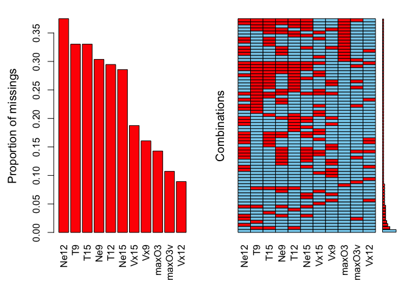
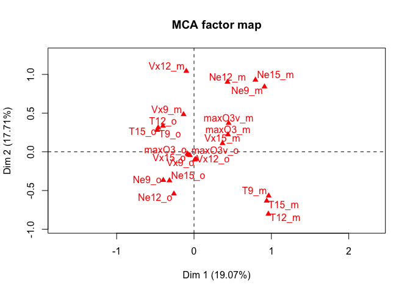
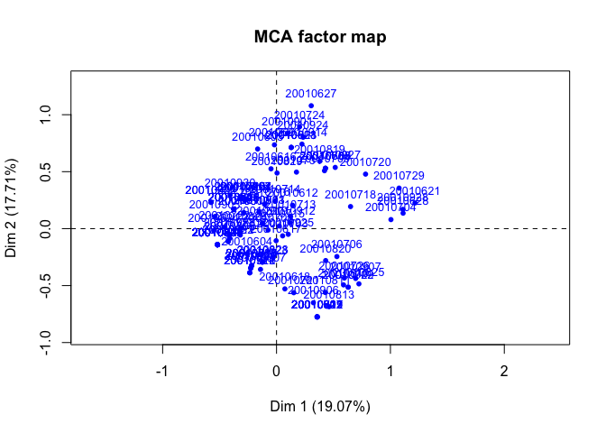
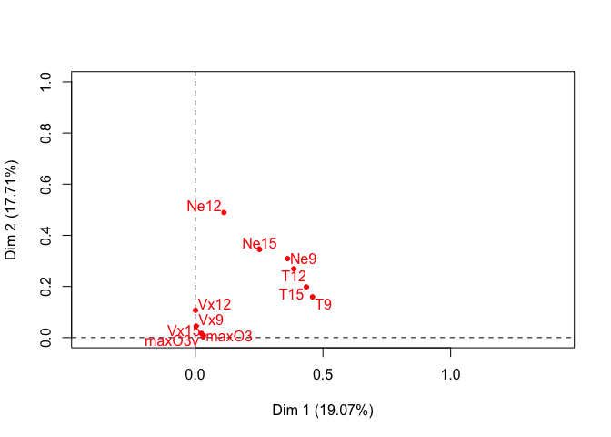
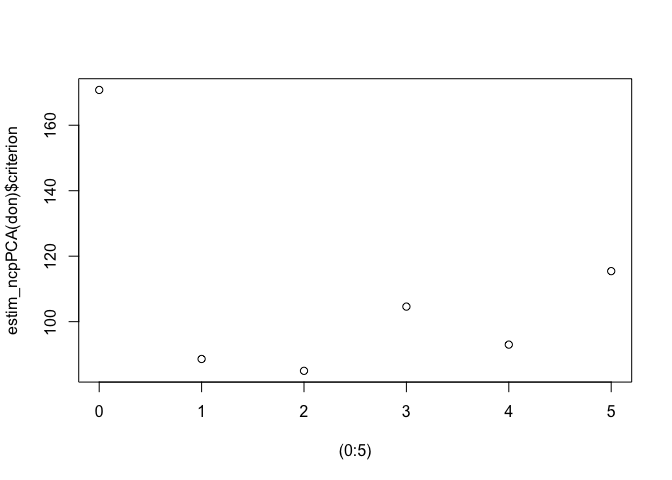
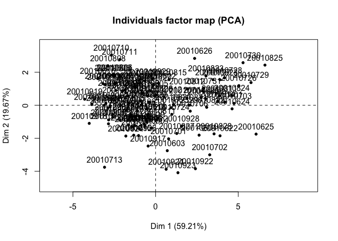
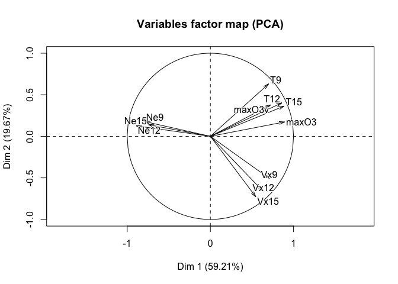
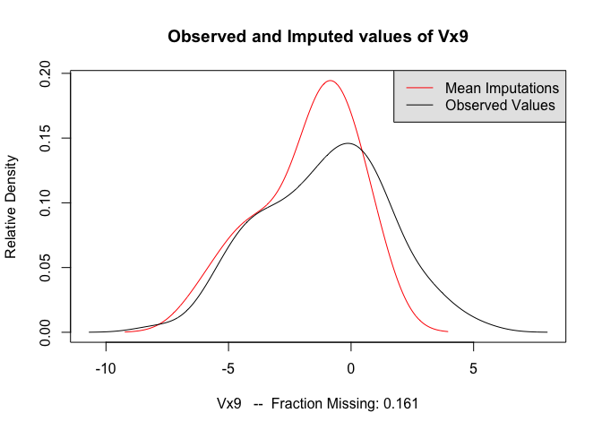
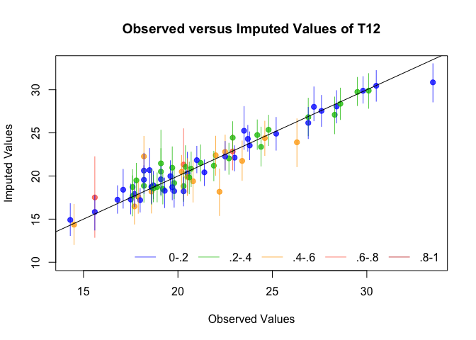

##Questions

**1 - When you suggest methods to deal with missing values to users, the recurrent question is "What is the percentage of missing values that I can have in my data set, is 50% too much but 20% OK?" What is your answer to this question?**

*It depends on the dataset. If your data is highly correlated, you can have many missing values and impute precisely. If the data is vey noisy, even just a few missing values can be problematic. Multiple imputation can always be performed and enables us to estimate the variability of the predictions, which will tell us how much we can trust the result of the imputation*

**2 - Explain the aims of multiple imputation in comparison to single imputation.**

*With single imputation we underestimate the variance of our data that comes from the missing values. Multiple imputation is a way of conserving this variance because we impute both the missing values and their variability*

**3 - Your aim is to impute a data set (predict as well as possible the missing values). You have 3 imputation methods available. How could you compare them?**

*Do cross-validation: take a dataset where there is no missing data. Take out some data, and impute those missing values 3 times using each method. Each time, compute the errors of the predictions. Choose the method which yields the lowest mean square error (or other error metric)*


## Continuous data with missing values - Regression with missing data via Multiple Imputation
First of all you will need to install the following packages


```r
install.packages("VIM")
install.packages("missMDA")
install.packages("Amelia")
```


```r
library(VIM)
library(missMDA)
library(Amelia)
library(FactoMineR)
```

Air pollution is currently one of the most serious public health worries worldwide. Many epidemiological studies
have proved the influence that some chemical compounds, such as sulphur dioxide (SO2), nitrogen dioxide
(NO2), ozone (O3) can have on our health. Associations set up to monitor air quality are active all over the
world to measure the concentration of these pollutants. They also keep a record of meteorological conditions
such as temperature, cloud cover, wind, etc.  

We have at our disposal 112 observations collected
during the summer of 2001 in Rennes. The variables available are 

* maxO3 (maximum daily ozone) 
* maxO3v (maximum daily ozone the previous day) 
* T12 (temperature at midday) 
* T9 
* T15 (Temp at 3pm)
* Vx12 (projection of the wind speed vector on the east-west axis at midday)
* Vx9 and Vx15 as well as the Nebulosity (cloud) Ne9, Ne12, Ne15

Here the final aim is to analyse the relationship between the
maximum daily ozone (maxO3) level and the other meteorological variables. To do so we will perform regression to explain maxO3 in function of all the other variables. This data is incomplete (there are missing values). Indeed, it occurs frenquently to have machines that fail one day, leading to some information not recorded. We will therefore perform regression via multiple imputation.

__(R1)__ Import the data.


```r
ozo <- read.table("data/ozoneNA.csv",header=TRUE,
sep=",", row.names=1)
WindDirection <- ozo[,12]
don <- ozo[,1:11]   #### keep only the continuous variables
summary(don)
```

```
##      maxO3              T9             T12             T15       
##  Min.   : 42.00   Min.   :11.30   Min.   :14.30   Min.   :14.90  
##  1st Qu.: 71.00   1st Qu.:16.00   1st Qu.:18.60   1st Qu.:18.90  
##  Median : 81.50   Median :17.70   Median :20.40   Median :21.40  
##  Mean   : 91.24   Mean   :18.22   Mean   :21.46   Mean   :22.41  
##  3rd Qu.:108.25   3rd Qu.:19.90   3rd Qu.:23.60   3rd Qu.:25.65  
##  Max.   :166.00   Max.   :25.30   Max.   :33.50   Max.   :35.50  
##  NA's   :16       NA's   :37      NA's   :33      NA's   :37     
##       Ne9             Ne12            Ne15           Vx9         
##  Min.   :0.000   Min.   :0.000   Min.   :0.00   Min.   :-7.8785  
##  1st Qu.:3.000   1st Qu.:4.000   1st Qu.:3.00   1st Qu.:-3.0000  
##  Median :5.000   Median :5.000   Median :5.00   Median :-0.8671  
##  Mean   :4.987   Mean   :4.986   Mean   :4.60   Mean   :-1.0958  
##  3rd Qu.:7.000   3rd Qu.:7.000   3rd Qu.:6.25   3rd Qu.: 0.6919  
##  Max.   :8.000   Max.   :8.000   Max.   :8.00   Max.   : 5.1962  
##  NA's   :34      NA's   :42      NA's   :32     NA's   :18       
##       Vx12              Vx15            maxO3v      
##  Min.   :-7.8785   Min.   :-9.000   Min.   : 42.00  
##  1st Qu.:-3.6941   1st Qu.:-3.759   1st Qu.: 70.00  
##  Median :-1.9284   Median :-1.710   Median : 82.50  
##  Mean   :-1.6853   Mean   :-1.830   Mean   : 89.39  
##  3rd Qu.:-0.1302   3rd Qu.: 0.000   3rd Qu.:101.00  
##  Max.   : 6.5778   Max.   : 3.830   Max.   :166.00  
##  NA's   :10        NA's   :21       NA's   :12
```

```r
head(don)
```

```
##          maxO3   T9  T12  T15 Ne9 Ne12 Ne15     Vx9    Vx12    Vx15 maxO3v
## 20010601    87 15.6 18.5   NA   4    4    8  0.6946 -1.7101 -0.6946     84
## 20010602    82   NA   NA   NA   5    5    7 -4.3301 -4.0000 -3.0000     87
## 20010603    92 15.3 17.6 19.5   2   NA   NA  2.9544      NA  0.5209     82
## 20010604   114 16.2 19.7   NA   1    1    0      NA  0.3473 -0.1736     92
## 20010605    94   NA 20.5 20.4  NA   NA   NA -0.5000 -2.9544 -4.3301    114
## 20010606    80 17.7 19.8 18.3   6   NA    7 -5.6382 -5.0000 -6.0000     94
```

__(R2)__ Load the libraries.


First, we perfom some descriptive statistics (how many missing? how many variables, individuals with missing?) and try to **inspect and vizualize the pattern of missing entries and get hints on the mechanism** that generated the missingness.  For this purpose, we use the R package **VIM** (Visualization and Imputation of Missing Values - Mathias Templ) as well as Multiple Correspondence Analysis (FactoMineR package). The package VIM provides tools for the visualization of missing or imputed values, which can be used for exploring the data and the structure of the missing or imputed values. Depending on this structure, they may help to identify the mechanism generating the missing values or errors, which may have happened in the imputation process. You can check the documentation for the VIM package by executing


```r
?VIM
```

The VIM function **aggr** calculates and plots the amount of missing entries in each variables and in some combinations of variables (that tend to be missing simultaneously).


```r
paste("dimensions of total dataset: ", dim(don))
paste("dimensions of dataset if we remove rows with missing values: ", dim(na.omit(don)))
dim(na.omit(don))
res<-summary(aggr(don, sortVar=TRUE))$combinations
```


```r
head(res[rev(order(res[,2])),])
```
In the combinations column, 1 means the variable is missing, 0 means it is observed.

So the most  frequent combination is the one where all the variables are observed (13 values). Then, the second one is  where T9, T12 and T15 are simultaneously missing (7 rows) (1 is missing, 0 is observed - there is a 1 for the second, third and fourth variables). The graph on the right panel represents these pattern, with blue for observed and red for missing.


```r
aggr(don, sortVar=TRUE)
```

<!-- -->

```
## 
##  Variables sorted by number of missings: 
##  Variable      Count
##      Ne12 0.37500000
##        T9 0.33035714
##       T15 0.33035714
##       Ne9 0.30357143
##       T12 0.29464286
##      Ne15 0.28571429
##      Vx15 0.18750000
##       Vx9 0.16071429
##     maxO3 0.14285714
##    maxO3v 0.10714286
##      Vx12 0.08928571
```


The VIM function **matrixplot ** creates a matrix plot in which all cells of a data matrix are visualized by rectangles. Available data is coded according to a continuous color scheme (gray scale), while missing/imputed data is visualized by a clearly distinguishable color (red). If you use Rstudio the plot is not interactive (thus the warnings), but if you use R directly, you can click on a column of your choice, this will result in sorting the rows in the decreasing order of the values of this column. This is useful to check if there is an association between the value of a variable and the missingness of another one.


```r
matrixplot(don,sortby=2) # marche pas sur Rstudio
```
Here, "red" means data is missing. Non-missing data are on a gray scale with darker shades indicating higher values.  
We notice that often when T9 is missing, T12 and T15 are also missing. When T9 is missing, we do not see more black or white values associated to other variables which should imply that when T9 is missing it would have corresponded to high or low values in another variable. This would have suggested missing at random (MAR) missing values for instance. Here everything points to missing completely at random (MCAR) values.

By playing around with the *sortby* argument, we can make the following observations about the structure of our missing data
* *maxO3 seems uncorrelated in terms with others of missing values* 
* *T9, T12, T15 seem to all be correlated (in the sense that when one variable is missing, the others are likely to be missing)*
* *Ne9, Ne12 and Ne15 are correlated.*
* *Vx9 seems uncorrelated*
* *Vx12 and Vx15 seem correlated*
* *maxO3v seems uncorrelated*


The VIM function **marginplot** creates a scatterplot with additional information on the missing values. If you plot the variables (x,y), the points with no missing values are represented as in a standard scatterplot. The points for which x (resp. y) is missing are represented in red along the y (resp. x) axis. In addition, boxplots of the x and y variables are represented along the axes with and without missing values (in red all variables x where y is missing, in blue all variables x where y is observed).


```r
marginplot(don[,c("T9","maxO3")])
```

We can see here that the distribution of T9 is the same when maxO3 is oberved and when maxO3 is missing. If the two boxplots (red and blue) would have been very different it would imply that when maxO3 is missing the values of T9 can be very high or very low which lead to suspect the MAR hypothesis

**The plots we have showed so far are useful because they may help to identify the mechanism generating the missing values or errors, which may have happened in the imputation process. This is useful to check if there is an association between the value of a variable and the missingness of another one. Do you observe any associations between the missing entries ? When values are missing on a variable does it correspond to small or large values on another one ?**


__(R3)__ Create a categorical dataset with "o" when the value of the cell is observed and "m" when it is missing, and with the same row and column names as in the original data. Then, you can perform Multiple Correspondence Analysis on the categories to visualize the association with the **MCA** function.


```r
class(don)
```

```
## [1] "data.frame"
```

```r
cat <- don
cat <- apply(cat, c(1,2), function(x) return(ifelse(is.na(x),'m','o')))
MCA(cat)
```

<!-- --><!-- --><!-- -->

```
## **Results of the Multiple Correspondence Analysis (MCA)**
## The analysis was performed on 112 individuals, described by 11 variables
## *The results are available in the following objects:
## 
##    name              description                       
## 1  "$eig"            "eigenvalues"                     
## 2  "$var"            "results for the variables"       
## 3  "$var$coord"      "coord. of the categories"        
## 4  "$var$cos2"       "cos2 for the categories"         
## 5  "$var$contrib"    "contributions of the categories" 
## 6  "$var$v.test"     "v-test for the categories"       
## 7  "$ind"            "results for the individuals"     
## 8  "$ind$coord"      "coord. for the individuals"      
## 9  "$ind$cos2"       "cos2 for the individuals"        
## 10 "$ind$contrib"    "contributions of the individuals"
## 11 "$call"           "intermediate results"            
## 12 "$call$marge.col" "weights of columns"              
## 13 "$call$marge.li"  "weights of rows"
```

**Interpretation**  
*If variables are close on the variables factor map (eg. T15_m and T9_m), this means that the missing values are correlated : when T15_m is missing, so is T9_m. The point T_15m corresponds to the barycenter of all the individuals for which T15 is missing. You can see the projection of the individuals on the second graph (which we call the individuals factor map)*

###Single imputation

Then, before modeling the data, we perform a **PCA with missing values** to explore the correlation between variables. Use the R package **missMDA** dedicated to perform principal components methods with missing values and to impute data with principal components methods.


```r
library(missMDA)
?missMDA
```


__(R4)__ Determine the number of components ncp to keep using the 
**estim_ncpPCA** function. Perform PCA with missing values using the 
**imputePCA** function and ncp components. Then plot the correlation circle.


```r
?estim_ncpPCA
?imputePCA
```


```r
estim_ncpPCA(don)
```

```
## $ncp
## [1] 2
## 
## $criterion
##         0         1         2         3         4         5 
## 170.77775  88.60110  84.97487 104.60004  92.98638 115.43620
```

```r
plot((0:5), estim_ncpPCA(don)$criterion)
```

<!-- -->

```r
#Donne le nombre de composantes "optimal" par cross-validation
estim_ncpPCA(don)$ncp
```

```
## [1] 2
```

```r
#Complete les missing values
completed_don <- imputePCA(don, ncp = estim_ncpPCA(don)$ncp)$completeObs


PCA(completed_don)
```

<!-- --><!-- -->

```
## **Results for the Principal Component Analysis (PCA)**
## The analysis was performed on 112 individuals, described by 11 variables
## *The results are available in the following objects:
## 
##    name               description                          
## 1  "$eig"             "eigenvalues"                        
## 2  "$var"             "results for the variables"          
## 3  "$var$coord"       "coord. for the variables"           
## 4  "$var$cor"         "correlations variables - dimensions"
## 5  "$var$cos2"        "cos2 for the variables"             
## 6  "$var$contrib"     "contributions of the variables"     
## 7  "$ind"             "results for the individuals"        
## 8  "$ind$coord"       "coord. for the individuals"         
## 9  "$ind$cos2"        "cos2 for the individuals"           
## 10 "$ind$contrib"     "contributions of the individuals"   
## 11 "$call"            "summary statistics"                 
## 12 "$call$centre"     "mean of the variables"              
## 13 "$call$ecart.type" "standard error of the variables"    
## 14 "$call$row.w"      "weights for the individuals"        
## 15 "$call$col.w"      "weights for the variables"
```


**4. Explain quickly how this analysis is performed. Could you guess how cross-validation is performed to select the number of components?**

*The package missMDA allows the use of principal component methods to impute an incomplete data set. To achieve this goal in the case of PCA, the missing values are predicted using the iterative PCA algorithm for a predefined number of dimensions. Then, PCA is performed on the imputed data set. The single imputation step requires tuning the number of dimensions used to impute the data, which is where cross-validation comes in.*

*The cross-validation is performed with the Kfold methodFor the Kfold. A percentage pNA of missing values is inserted and predicted with a PCA model using ncp.min to ncp.max dimensions. This process is repeated nbsim times. The number of components which leads to the smallest MSEP (Mean Standard Error of Prediction) is retained.*

*Through the argument method.cv, the function estim_ncpPCA proposes several cross-validation procedures to choose this number. The default method is the generalised cross-validation method (method.cv=“gcv”). It consists in searching the number of dimensions which minimises the generalised cross-validation criterion, which can be seen as an approximation of the leave-one-out cross-validation criterion. The procedure is very fast, because it does not require adding explicitly missing values and predicting them for each cell of the data set. However, the number of dimensions minimising the criterion can sometimes be unobvious when several local minimum occur. In such a case, more computationally intensive methods, those performing explicit cross-validation, can be used, such as Kfold (method.cv=“Kfold”) or leave-one-out (method.cv=“loo”).*

*The Kfold cross-validation suggests to retain 2 dimensions for the imputation of the data set.*

*Thus, the incomplete data set can be imputed using the function imputePCA performing the iterative PCA algorithm, specifying the number of dimensions through the argument ncp=2. At convergence the algorithm provides both an estimation of the scores and loadings as well as a completed data set. The imputePCA function outputs the imputed data set. The completed data set is in the object completeObs.*

*The imputePCA function also outputs the fitted matrix X̂ X^ in the object fitted.*

###Multiple imputation

Then, to run the regression with missing values, we use **Multiple Imputation**. We impute the data either assuming 1) a Gaussian distribution (library Amelia) or 2) a PCA based model (library missMDA).
Note that there are two ways to impute either using a Joint Modeling (one joint probabilitisc model for the variables all together)
or a Condional Modeling (one model per variable) approach. We refer to the references given in the class slides for more details.  We use the R package **Amelia**. We generate 100 imputed data sets with the amelia method:

First we show how to impute one data set using **Amelia**


```r
library(Amelia)
```


```r
?amelia
```


```r
res.amelia <- amelia(don, m=100)  
```

```
## -- Imputation 1 --
## 
##   1  2  3  4  5  6  7  8  9 10 11 12 13 14 15 16 17 18 19 20
##  21 22 23 24 25 26 27 28 29 30 31 32 33 34 35 36 37 38 39 40
##  41 42 43 44 45 46 47 48 49 50 51 52 53 54 55 56 57 58 59 60
##  61 62 63 64 65 66 67
## 
## -- Imputation 2 --
## 
##   1  2  3  4  5  6  7  8  9 10 11 12 13 14 15 16 17 18 19 20
##  21 22 23 24 25 26 27 28 29 30 31 32 33 34 35 36 37 38 39 40
##  41 42 43 44 45 46 47
## 
## -- Imputation 3 --
## 
##   1  2  3  4  5  6  7  8  9 10 11 12 13 14 15 16 17 18 19 20
##  21 22 23 24 25 26 27 28 29 30 31 32 33 34 35 36 37 38 39 40
##  41 42 43 44 45 46 47 48 49 50 51 52 53 54 55 56 57 58 59 60
##  61 62 63 64 65 66 67 68 69 70 71 72 73 74 75 76 77 78 79 80
##  81 82 83
## 
## -- Imputation 4 --
## 
##   1  2  3  4  5  6  7  8  9 10 11 12 13 14 15 16 17 18 19 20
##  21 22 23 24 25 26 27 28 29 30 31 32 33 34 35 36 37 38 39 40
##  41 42 43 44 45 46 47 48 49
## 
## -- Imputation 5 --
## 
##   1  2  3  4  5  6  7  8  9 10 11 12 13 14 15 16 17 18 19 20
##  21 22 23 24 25 26 27 28 29 30 31 32 33 34 35 36 37
## 
## -- Imputation 6 --
## 
##   1  2  3  4  5  6  7  8  9 10 11 12 13 14 15 16 17 18 19 20
##  21 22 23 24 25 26 27 28 29 30 31 32 33 34 35 36 37 38 39 40
##  41 42 43 44 45 46 47 48 49 50 51 52 53 54 55 56 57 58 59 60
##  61 62 63 64 65 66 67 68 69 70 71 72 73 74
## 
## -- Imputation 7 --
## 
##   1  2  3  4  5  6  7  8  9 10 11 12 13 14 15 16 17 18 19 20
##  21 22 23 24 25 26 27 28 29 30 31 32 33 34 35 36 37 38 39 40
##  41 42 43 44 45 46
## 
## -- Imputation 8 --
## 
##   1  2  3  4  5  6  7  8  9 10 11 12 13 14 15 16 17 18 19 20
##  21 22 23 24 25 26 27 28 29 30 31 32 33 34 35 36 37 38 39 40
##  41 42 43 44 45 46 47 48 49 50 51 52 53 54 55 56 57 58 59 60
##  61 62 63 64 65 66 67 68 69 70 71
## 
## -- Imputation 9 --
## 
##   1  2  3  4  5  6  7  8  9 10 11 12 13 14 15 16 17 18 19 20
##  21 22 23 24 25 26 27 28 29 30 31 32 33 34 35 36 37 38 39 40
##  41 42 43 44 45 46 47 48 49 50 51 52 53 54 55 56 57 58 59 60
##  61 62 63 64 65 66 67 68 69 70 71 72 73 74 75 76 77 78 79 80
##  81 82 83 84 85 86 87 88 89 90 91 92 93 94 95 96 97 98 99 100
##  101 102 103 104 105 106 107 108 109 110 111 112 113 114 115 116 117 118 119 120
##  121 122 123 124 125 126 127 128 129 130 131 132 133 134 135 136 137 138 139 140
##  141 142 143 144 145 146 147 148 149 150 151 152 153 154 155 156 157 158 159 160
##  161 162 163 164 165 166 167 168 169 170 171 172 173 174 175 176 177 178 179 180
##  181 182 183 184 185 186 187 188 189 190 191 192 193 194 195 196 197 198 199 200
##  201 202 203 204 205 206 207 208 209 210 211 212 213 214 215 216 217 218 219 220
##  221 222 223 224 225 226 227 228 229 230 231 232 233 234 235 236 237 238 239 240
##  241 242 243 244 245 246 247 248 249 250 251 252 253 254 255 256 257 258 259 260
##  261 262 263 264 265 266 267 268 269 270 271 272 273 274 275 276 277 278 279 280
##  281 282 283 284 285 286 287 288
## 
## -- Imputation 10 --
## 
##   1  2  3  4  5  6  7  8  9 10 11 12 13 14 15 16 17 18 19 20
##  21 22 23 24 25 26 27 28 29 30 31 32 33 34 35 36
## 
## -- Imputation 11 --
## 
##   1  2  3  4  5  6  7  8  9 10 11 12 13 14 15 16 17 18 19 20
##  21 22 23 24 25 26 27 28 29 30 31 32 33 34 35 36 37 38 39 40
##  41 42 43
## 
## -- Imputation 12 --
## 
##   1  2  3  4  5  6  7  8  9 10 11 12 13 14 15 16 17 18 19 20
##  21 22 23 24 25 26 27 28 29 30 31 32 33 34 35 36 37 38 39 40
##  41 42 43 44 45 46 47 48 49 50 51 52 53 54 55 56 57 58 59 60
##  61
## 
## -- Imputation 13 --
## 
##   1  2  3  4  5  6  7  8  9 10 11 12 13 14 15 16 17 18 19 20
##  21 22 23 24 25 26 27 28 29 30 31 32 33 34 35 36 37 38 39 40
##  41 42 43 44 45 46 47 48 49
## 
## -- Imputation 14 --
## 
##   1  2  3  4  5  6  7  8  9 10 11 12 13 14 15 16 17 18 19 20
##  21 22 23 24 25 26 27 28 29 30 31 32 33 34 35 36 37 38 39 40
##  41 42 43 44 45 46 47 48 49 50 51 52 53 54 55 56 57 58 59 60
##  61 62 63 64 65 66 67 68 69 70 71 72 73 74 75 76 77 78 79 80
##  81 82 83 84 85 86 87 88 89 90 91 92 93 94 95 96 97 98 99 100
##  101 102 103 104 105 106 107 108 109 110 111
## 
## -- Imputation 15 --
## 
##   1  2  3  4  5  6  7  8  9 10 11 12 13 14 15 16 17 18 19 20
##  21 22 23 24 25 26 27 28 29 30 31 32 33 34 35 36 37 38 39 40
##  41 42 43 44 45 46 47 48 49 50 51 52 53 54 55 56 57 58 59 60
##  61 62 63 64 65 66 67 68 69 70 71 72 73 74 75 76 77 78 79 80
##  81 82 83 84 85 86 87 88 89 90 91
## 
## -- Imputation 16 --
## 
##   1  2  3  4  5  6  7  8  9 10 11 12 13 14 15 16 17 18 19 20
##  21 22 23 24 25 26 27 28 29 30 31 32 33 34 35 36 37 38 39 40
##  41 42 43 44 45 46 47 48 49 50 51 52 53 54 55 56
## 
## -- Imputation 17 --
## 
##   1  2  3  4  5  6  7  8  9 10 11 12 13 14 15 16 17 18 19 20
##  21 22 23 24 25 26 27 28 29 30 31 32 33 34 35 36 37 38 39 40
##  41 42 43 44 45 46 47 48 49 50 51 52 53 54 55 56 57 58 59 60
##  61 62 63 64 65 66 67 68 69 70 71 72 73 74 75 76 77 78 79 80
##  81 82 83 84 85 86 87 88 89 90 91 92 93 94 95 96 97 98 99 100
##  101 102 103 104 105 106 107 108 109 110 111 112 113 114 115 116 117 118 119 120
##  121 122 123 124 125 126 127 128 129 130 131 132 133 134 135 136 137 138 139 140
##  141 142 143 144 145 146 147 148 149 150 151 152 153 154 155 156 157 158 159 160
##  161 162 163 164 165 166 167 168 169 170 171 172 173 174 175 176 177 178 179 180
##  181 182 183 184 185 186 187 188 189 190 191 192 193 194 195 196 197 198 199 200
##  201 202 203 204 205 206 207 208 209 210 211 212 213 214 215 216 217 218 219 220
##  221 222 223 224 225 226 227 228 229 230 231 232 233 234 235 236 237 238 239 240
##  241 242 243 244 245 246 247 248 249 250 251 252 253 254 255 256 257 258 259 260
##  261 262 263 264 265 266 267 268 269 270 271 272 273 274 275 276 277 278 279 280
##  281 282 283 284 285 286 287 288 289 290 291 292 293 294 295 296 297 298 299 300
##  301 302 303 304 305 306 307 308 309 310 311 312 313 314 315 316 317 318 319 320
##  321 322 323 324 325 326 327 328 329 330 331 332 333 334 335 336 337 338 339 340
##  341 342 343 344 345 346 347 348 349 350 351 352 353 354 355 356 357 358 359 360
##  361 362 363 364 365 366 367 368 369 370 371 372 373 374 375 376 377 378 379 380
##  381 382 383 384 385 386 387 388 389 390 391 392 393 394 395 396 397 398 399 400
##  401 402 403 404 405 406 407 408 409 410 411 412 413 414 415 416 417 418 419 420
##  421 422 423 424 425 426 427 428 429 430 431 432 433 434 435 436 437 438 439 440
##  441 442 443 444 445 446 447 448 449 450 451 452 453 454 455 456 457 458 459 460
##  461 462 463 464 465 466 467 468 469 470 471 472 473 474 475 476 477 478 479 480
##  481 482 483 484 485 486 487 488 489 490 491 492 493 494 495 496 497 498 499 500
##  501 502 503 504 505 506 507 508 509 510 511 512 513 514 515 516 517 518 519 520
##  521 522 523 524 525 526 527 528 529 530 531 532 533 534 535 536 537 538 539 540
##  541 542 543 544 545 546 547 548 549 550 551 552 553 554 555 556 557 558 559 560
##  561 562 563 564 565 566 567 568 569 570 571 572 573 574 575 576 577 578 579 580
##  581 582 583 584 585 586 587 588 589 590 591 592 593 594 595 596 597 598 599 600
##  601 602 603 604 605 606 607 608 609 610 611 612 613 614 615 616 617 618 619 620
##  621 622 623 624 625 626 627 628 629 630 631 632 633 634 635 636 637 638 639 640
##  641 642 643 644 645 646 647 648 649 650 651 652 653 654 655 656 657 658 659 660
##  661 662 663 664 665 666 667 668 669 670 671 672 673 674 675 676 677 678 679 680
##  681 682 683 684 685 686 687 688 689 690 691 692 693 694 695 696 697 698 699 700
##  701 702 703 704 705 706 707 708 709 710 711 712 713 714 715 716 717 718 719 720
##  721 722 723 724 725 726 727 728 729 730 731 732 733 734 735 736 737 738 739 740
##  741 742 743 744 745 746 747 748 749 750 751 752 753 754 755 756 757 758 759 760
##  761 762 763 764 765 766 767 768 769 770 771 772 773 774 775 776 777 778 779 780
##  781 782 783 784 785 786 787 788 789 790 791 792 793 794 795 796 797 798 799 800
##  801 802 803 804 805 806 807 808 809 810 811 812 813 814 815 816 817 818 819 820
##  821 822 823 824 825 826 827 828 829 830 831 832
## 
## -- Imputation 18 --
## 
##   1  2  3  4  5  6  7  8  9 10 11 12 13 14 15 16 17 18 19 20
##  21 22 23 24 25 26 27 28
## 
## -- Imputation 19 --
## 
##   1  2  3  4  5  6  7  8  9 10 11 12 13 14 15 16 17 18 19 20
##  21 22 23 24 25 26 27 28 29 30 31 32 33 34 35 36 37 38 39 40
##  41 42 43 44 45 46 47 48 49 50 51 52 53 54 55 56 57 58 59 60
##  61 62 63 64 65 66 67 68 69 70 71 72 73 74 75 76 77
## 
## -- Imputation 20 --
## 
##   1  2  3  4  5  6  7  8  9 10 11 12 13 14 15 16 17 18 19 20
##  21 22 23 24 25 26 27 28 29 30 31 32 33 34 35 36 37
## 
## -- Imputation 21 --
## 
##   1  2  3  4  5  6  7  8  9 10 11 12 13 14 15 16 17 18 19 20
##  21 22 23 24 25 26 27 28 29 30 31 32 33 34 35
## 
## -- Imputation 22 --
## 
##   1  2  3  4  5  6  7  8  9 10 11 12 13 14 15 16 17 18 19 20
##  21 22 23 24 25 26 27 28 29 30 31 32 33 34 35 36 37 38 39 40
##  41 42 43 44 45 46 47
## 
## -- Imputation 23 --
## 
##   1  2  3  4  5  6  7  8  9 10 11 12 13 14 15 16 17 18 19 20
##  21 22 23 24 25 26 27 28 29 30 31 32 33
## 
## -- Imputation 24 --
## 
##   1  2  3  4  5  6  7  8  9 10 11 12 13 14 15 16 17 18 19 20
##  21 22 23 24 25 26 27 28 29 30 31 32 33 34 35 36 37 38 39 40
##  41 42 43 44 45 46 47 48 49 50 51 52 53 54 55 56 57 58
## 
## -- Imputation 25 --
## 
##   1  2  3  4  5  6  7  8  9 10 11 12 13 14 15 16 17 18 19 20
##  21 22 23 24 25 26 27 28 29 30 31 32 33 34 35 36 37 38 39 40
##  41 42 43 44 45 46 47 48 49 50 51 52 53 54 55 56 57 58 59 60
##  61 62 63 64 65 66 67 68 69 70 71
## 
## -- Imputation 26 --
## 
##   1  2  3  4  5  6  7  8  9 10 11 12 13 14 15 16 17 18 19 20
##  21 22 23 24 25 26 27 28 29 30 31 32 33
## 
## -- Imputation 27 --
## 
##   1  2  3  4  5  6  7  8  9 10 11 12 13 14 15 16 17 18 19 20
##  21 22 23 24 25 26 27 28 29 30 31 32 33 34 35 36 37 38 39 40
##  41 42 43 44 45 46 47 48 49 50 51 52 53 54 55 56 57 58 59 60
##  61 62 63 64 65
## 
## -- Imputation 28 --
## 
##   1  2  3  4  5  6  7  8  9 10 11 12 13 14 15 16 17 18 19 20
##  21 22 23 24 25 26 27 28 29 30 31 32 33 34 35 36 37 38 39 40
##  41 42 43
## 
## -- Imputation 29 --
## 
##   1  2  3  4  5  6  7  8  9 10 11 12 13 14 15 16 17 18 19 20
##  21 22 23 24 25 26 27 28 29 30 31 32 33 34 35 36 37 38 39 40
##  41 42
## 
## -- Imputation 30 --
## 
##   1  2  3  4  5  6  7  8  9 10 11 12 13 14 15 16 17 18 19 20
##  21 22 23 24 25 26 27 28 29 30 31 32 33 34 35 36 37 38 39 40
##  41 42 43 44 45 46 47 48 49 50 51 52 53 54 55 56 57 58 59
## 
## -- Imputation 31 --
## 
##   1  2  3  4  5  6  7  8  9 10 11 12 13 14 15 16 17 18 19 20
##  21 22 23 24 25 26 27 28 29 30 31 32 33 34 35 36 37 38 39 40
##  41 42 43 44 45 46 47 48 49 50 51 52 53 54 55 56 57 58 59 60
##  61 62 63 64 65 66 67 68 69 70 71 72 73 74 75 76 77 78 79 80
##  81 82 83 84 85 86 87 88 89 90 91 92 93 94 95 96 97 98 99 100
##  101 102 103 104 105 106 107 108 109 110 111 112 113 114 115 116 117 118 119 120
##  121 122 123 124 125 126 127 128 129
## 
## -- Imputation 32 --
## 
##   1  2  3  4  5  6  7  8  9 10 11 12 13 14 15 16 17 18 19 20
##  21 22 23 24 25 26 27 28 29 30 31 32 33 34 35 36 37 38 39 40
##  41 42 43 44 45 46 47 48 49 50 51
## 
## -- Imputation 33 --
## 
##   1  2  3  4  5  6  7  8  9 10 11 12 13 14 15 16 17 18 19 20
##  21 22 23 24 25 26 27 28 29 30 31 32 33 34 35
## 
## -- Imputation 34 --
## 
##   1  2  3  4  5  6  7  8  9 10 11 12 13 14 15 16 17 18 19 20
##  21 22 23 24 25 26 27 28 29 30 31 32 33 34 35 36 37 38 39 40
##  41 42 43 44 45
## 
## -- Imputation 35 --
## 
##   1  2  3  4  5  6  7  8  9 10 11 12 13 14 15 16 17 18 19 20
##  21 22 23 24 25 26 27 28 29 30 31 32 33 34 35 36 37 38 39 40
##  41 42 43
## 
## -- Imputation 36 --
## 
##   1  2  3  4  5  6  7  8  9 10 11 12 13 14 15 16 17 18 19 20
##  21 22 23 24 25 26 27 28 29 30 31 32 33 34 35 36 37 38 39 40
##  41 42 43 44 45 46 47 48 49 50 51 52 53 54 55 56 57 58 59 60
##  61 62 63
## 
## -- Imputation 37 --
## 
##   1  2  3  4  5  6  7  8  9 10 11 12 13 14 15 16 17 18 19 20
##  21 22 23 24 25 26 27 28 29 30
## 
## -- Imputation 38 --
## 
##   1  2  3  4  5  6  7  8  9 10 11 12 13 14 15 16 17 18 19 20
##  21 22 23 24 25 26 27 28 29 30 31 32 33 34 35 36 37 38 39 40
##  41 42 43 44 45 46 47 48 49 50 51 52 53 54 55 56 57 58 59 60
##  61 62 63 64 65 66 67 68 69 70 71 72
## 
## -- Imputation 39 --
## 
##   1  2  3  4  5  6  7  8  9 10 11 12 13 14 15 16 17 18 19 20
##  21 22 23 24 25 26 27 28 29 30 31 32 33 34 35 36 37 38 39 40
##  41 42 43 44 45 46 47 48 49 50 51 52 53 54 55 56 57 58 59
## 
## -- Imputation 40 --
## 
##   1  2  3  4  5  6  7  8  9 10 11 12 13 14 15 16 17 18 19 20
##  21 22 23 24 25 26 27 28 29 30 31 32 33 34 35 36 37 38 39 40
##  41 42 43 44 45 46 47 48 49 50 51 52 53 54 55 56 57 58 59 60
##  61 62 63 64 65 66 67 68 69 70 71 72
## 
## -- Imputation 41 --
## 
##   1  2  3  4  5  6  7  8  9 10 11 12 13 14 15 16 17 18 19 20
##  21 22 23 24 25 26 27 28 29 30 31 32 33 34 35
## 
## -- Imputation 42 --
## 
##   1  2  3  4  5  6  7  8  9 10 11 12 13 14 15 16 17 18 19 20
##  21 22 23 24 25 26 27 28 29 30 31 32 33 34 35 36 37 38 39 40
##  41 42 43 44 45 46 47 48 49 50 51
## 
## -- Imputation 43 --
## 
##   1  2  3  4  5  6  7  8  9 10 11 12 13 14 15 16 17 18 19 20
##  21 22 23 24 25 26 27 28 29 30 31 32 33 34 35 36 37 38 39 40
##  41 42 43 44 45 46 47 48
## 
## -- Imputation 44 --
## 
##   1  2  3  4  5  6  7  8  9 10 11 12 13 14 15 16 17 18 19 20
##  21 22 23 24 25 26 27 28 29 30 31 32 33 34 35 36 37 38 39 40
##  41 42 43 44 45 46 47 48 49 50 51 52 53 54 55 56 57 58 59 60
##  61 62 63 64 65 66 67
## 
## -- Imputation 45 --
## 
##   1  2  3  4  5  6  7  8  9 10 11 12 13 14 15 16 17 18 19 20
##  21 22 23 24 25 26 27 28 29 30 31 32 33 34 35 36 37 38 39 40
## 
## 
## -- Imputation 46 --
## 
##   1  2  3  4  5  6  7  8  9 10 11 12 13 14 15 16 17 18 19 20
##  21 22 23 24 25 26 27 28 29 30 31 32 33 34 35 36 37 38
## 
## -- Imputation 47 --
## 
##   1  2  3  4  5  6  7  8  9 10 11 12 13 14 15 16 17 18 19 20
##  21 22 23 24 25 26 27 28 29 30 31 32 33 34 35 36 37 38 39 40
##  41 42 43 44 45 46 47 48 49 50 51 52 53 54 55 56 57 58 59 60
##  61 62 63 64 65 66 67 68 69 70 71 72 73 74 75 76 77 78 79 80
##  81 82 83 84 85
## 
## -- Imputation 48 --
## 
##   1  2  3  4  5  6  7  8  9 10 11 12 13 14 15 16 17 18 19 20
##  21 22 23 24 25 26 27 28 29 30 31 32 33 34
## 
## -- Imputation 49 --
## 
##   1  2  3  4  5  6  7  8  9 10 11 12 13 14 15 16 17 18 19 20
##  21 22 23 24 25 26 27 28 29 30 31 32 33 34 35 36 37 38 39 40
##  41 42 43 44 45 46 47 48 49 50 51 52
## 
## -- Imputation 50 --
## 
##   1  2  3  4  5  6  7  8  9 10 11 12 13 14 15 16 17 18 19 20
##  21 22 23 24 25 26 27 28 29 30 31 32 33 34 35 36 37 38 39 40
##  41 42 43 44 45 46 47 48 49 50 51 52 53 54 55 56 57 58 59 60
##  61 62 63 64
## 
## -- Imputation 51 --
## 
##   1  2  3  4  5  6  7  8  9 10 11 12 13 14 15 16 17 18 19 20
##  21 22 23 24 25 26 27 28 29 30 31 32 33 34 35 36 37 38 39 40
##  41 42 43 44 45 46
## 
## -- Imputation 52 --
## 
##   1  2  3  4  5  6  7  8  9 10 11 12 13 14 15 16 17 18 19 20
##  21 22 23 24 25 26 27 28 29 30 31 32 33 34 35 36 37 38 39 40
##  41 42 43 44 45 46 47 48 49 50 51 52
## 
## -- Imputation 53 --
## 
##   1  2  3  4  5  6  7  8  9 10 11 12 13 14 15 16 17 18 19 20
##  21 22 23 24 25 26 27 28 29 30 31 32 33 34 35 36 37 38 39 40
##  41 42 43 44 45 46 47 48 49 50 51 52 53 54 55 56 57 58 59 60
##  61 62 63 64 65 66 67 68 69 70 71 72 73 74 75 76 77 78 79 80
##  81
## 
## -- Imputation 54 --
## 
##   1  2  3  4  5  6  7  8  9 10 11 12 13 14 15 16 17 18 19 20
##  21 22 23 24 25 26 27 28 29 30 31 32 33 34 35 36 37 38 39 40
##  41 42 43 44 45 46 47 48 49 50 51 52 53 54 55 56 57 58 59 60
##  61 62 63 64 65 66 67 68 69 70 71 72 73 74 75 76 77 78 79
## 
## -- Imputation 55 --
## 
##   1  2  3  4  5  6  7  8  9 10 11 12 13 14 15 16 17 18 19 20
##  21 22 23 24 25 26 27 28 29 30 31 32 33 34 35 36 37 38 39 40
##  41 42 43 44 45 46
## 
## -- Imputation 56 --
## 
##   1  2  3  4  5  6  7  8  9 10 11 12 13 14 15 16 17 18 19 20
##  21 22 23 24 25 26 27 28 29 30 31 32 33 34 35 36 37 38 39 40
##  41 42 43 44 45 46 47 48 49 50 51 52 53 54 55 56 57 58 59 60
##  61 62 63 64 65 66 67 68 69 70 71 72 73 74 75 76 77 78 79 80
##  81 82 83 84 85 86 87 88 89
## 
## -- Imputation 57 --
## 
##   1  2  3  4  5  6  7  8  9 10 11 12 13 14 15 16 17 18 19 20
##  21 22 23 24 25 26 27 28 29 30 31 32 33 34 35 36 37 38 39
## 
## -- Imputation 58 --
## 
##   1  2  3  4  5  6  7  8  9 10 11 12 13 14 15 16 17 18 19 20
##  21 22 23 24 25 26 27 28 29 30 31 32 33 34 35 36 37 38 39 40
##  41 42 43 44 45 46 47 48 49 50 51 52 53 54 55 56 57 58 59 60
##  61 62 63 64 65 66 67 68 69 70 71 72 73 74 75 76 77 78 79 80
##  81 82 83 84 85 86 87 88 89 90 91 92 93 94 95 96 97 98 99 100
##  101 102 103 104 105 106 107 108
## 
## -- Imputation 59 --
## 
##   1  2  3  4  5  6  7  8  9 10 11 12 13 14 15 16 17 18 19 20
##  21 22 23 24 25 26 27 28 29 30 31 32 33 34 35 36 37 38 39 40
##  41 42 43 44 45 46 47 48 49 50 51 52 53 54 55 56 57 58 59 60
##  61 62 63 64 65 66 67 68 69 70 71 72 73 74 75 76 77 78 79 80
##  81 82 83 84 85 86 87 88 89 90 91 92 93 94 95 96 97 98 99 100
##  101 102 103 104 105 106 107 108 109 110 111 112 113 114 115 116 117 118 119 120
##  121 122 123 124 125 126 127 128 129 130 131 132 133 134 135 136 137 138 139 140
##  141 142 143 144 145 146 147 148 149 150 151 152 153 154 155 156 157 158 159 160
##  161 162 163 164 165 166 167 168 169 170 171 172 173 174 175 176 177 178 179 180
##  181 182 183 184 185 186 187 188 189 190 191 192 193 194 195 196 197 198 199 200
##  201 202 203 204 205 206 207 208 209 210 211 212 213 214 215 216 217 218 219 220
##  221 222 223 224 225 226 227 228 229 230 231 232 233 234 235 236 237 238 239 240
##  241 242 243 244 245 246 247 248 249 250 251 252 253
## 
## -- Imputation 60 --
## 
##   1  2  3  4  5  6  7  8  9 10 11 12 13 14 15 16 17 18 19 20
##  21 22 23 24 25 26 27 28 29
## 
## -- Imputation 61 --
## 
##   1  2  3  4  5  6  7  8  9 10 11 12 13 14 15 16 17 18 19 20
##  21 22 23 24 25 26 27 28 29 30 31 32 33 34 35 36 37 38 39 40
##  41 42 43 44 45 46 47 48 49 50 51 52 53 54
## 
## -- Imputation 62 --
## 
##   1  2  3  4  5  6  7  8  9 10 11 12 13 14 15 16 17 18 19 20
##  21 22 23 24 25 26 27 28 29 30 31 32 33 34 35 36 37 38 39 40
##  41 42 43 44 45 46 47 48 49 50 51 52 53 54 55 56 57 58 59 60
##  61 62
## 
## -- Imputation 63 --
## 
##   1  2  3  4  5  6  7  8  9 10 11 12 13 14 15 16 17 18 19 20
##  21 22 23 24 25 26 27 28 29 30 31 32 33 34 35 36 37 38 39 40
##  41 42 43 44 45 46
## 
## -- Imputation 64 --
## 
##   1  2  3  4  5  6  7  8  9 10 11 12 13 14 15 16 17 18 19 20
##  21 22 23 24 25 26 27 28 29 30 31 32 33 34 35
## 
## -- Imputation 65 --
## 
##   1  2  3  4  5  6  7  8  9 10 11 12 13 14 15 16 17 18 19 20
##  21 22 23 24 25 26 27 28 29 30 31 32 33 34 35 36 37 38 39 40
##  41
## 
## -- Imputation 66 --
## 
##   1  2  3  4  5  6  7  8  9 10 11 12 13 14 15 16 17 18 19 20
##  21 22 23 24 25 26 27 28 29 30 31 32 33 34 35 36 37 38 39 40
##  41 42 43 44 45 46 47 48 49 50 51 52 53 54 55 56 57 58
## 
## -- Imputation 67 --
## 
##   1  2  3  4  5  6  7  8  9 10 11 12 13 14 15 16 17 18 19 20
##  21 22 23 24 25 26 27 28 29 30 31 32 33 34 35 36 37 38 39 40
##  41 42
## 
## -- Imputation 68 --
## 
##   1  2  3  4  5  6  7  8  9 10 11 12 13 14 15 16 17 18 19 20
##  21 22 23 24 25 26 27 28 29 30 31 32 33 34 35 36 37 38 39 40
##  41 42 43 44 45 46 47
## 
## -- Imputation 69 --
## 
##   1  2  3  4  5  6  7  8  9 10 11 12 13 14 15 16 17 18 19 20
##  21 22 23 24 25 26 27 28 29 30 31 32 33
## 
## -- Imputation 70 --
## 
##   1  2  3  4  5  6  7  8  9 10 11 12 13 14 15 16 17 18 19 20
##  21 22 23 24 25 26 27 28 29 30 31 32 33 34 35 36 37 38 39 40
##  41 42 43 44 45 46 47 48 49 50 51 52 53 54 55 56 57 58 59 60
##  61 62 63 64 65 66 67 68 69 70 71 72 73 74 75 76 77 78 79 80
##  81 82
## 
## -- Imputation 71 --
## 
##   1  2  3  4  5  6  7  8  9 10 11 12 13 14 15 16 17 18 19 20
##  21 22 23 24 25 26 27 28 29 30 31 32 33 34 35 36 37 38 39 40
##  41 42 43 44 45 46 47 48 49 50 51 52 53
## 
## -- Imputation 72 --
## 
##   1  2  3  4  5  6  7  8  9 10 11 12 13 14 15 16 17 18 19 20
##  21 22 23 24 25 26 27 28 29 30 31 32 33 34 35 36 37 38 39 40
##  41 42 43 44 45 46 47 48 49 50 51 52 53 54 55 56 57 58 59
## 
## -- Imputation 73 --
## 
##   1  2  3  4  5  6  7  8  9 10 11 12 13 14 15 16 17 18 19 20
##  21 22 23 24 25 26 27 28 29 30 31 32 33 34 35 36 37 38 39 40
##  41 42 43 44 45 46 47 48 49 50 51
## 
## -- Imputation 74 --
## 
##   1  2  3  4  5  6  7  8  9 10 11 12 13 14 15 16 17 18 19 20
##  21 22 23 24 25 26 27 28 29 30 31 32 33 34 35 36 37 38 39 40
##  41 42 43 44 45 46 47 48 49 50
## 
## -- Imputation 75 --
## 
##   1  2  3  4  5  6  7  8  9 10 11 12 13 14 15 16 17 18 19 20
##  21 22 23 24 25 26 27 28 29 30 31 32 33 34 35 36
## 
## -- Imputation 76 --
## 
##   1  2  3  4  5  6  7  8  9 10 11 12 13 14 15 16 17 18 19 20
##  21 22 23 24 25 26 27 28 29 30 31 32 33 34 35 36 37 38 39 40
##  41 42 43 44 45 46 47
## 
## -- Imputation 77 --
## 
##   1  2  3  4  5  6  7  8  9 10 11 12 13 14 15 16 17 18 19 20
##  21 22 23 24 25 26 27 28 29 30 31 32
## 
## -- Imputation 78 --
## 
##   1  2  3  4  5  6  7  8  9 10 11 12 13 14 15 16 17 18 19 20
##  21 22 23 24 25 26 27 28 29 30 31 32 33 34 35 36 37 38 39
## 
## -- Imputation 79 --
## 
##   1  2  3  4  5  6  7  8  9 10 11 12 13 14 15 16 17 18 19 20
##  21 22 23 24 25 26 27 28 29
## 
## -- Imputation 80 --
## 
##   1  2  3  4  5  6  7  8  9 10 11 12 13 14 15 16 17 18 19 20
##  21 22 23 24 25 26 27 28 29 30 31 32 33 34 35 36 37 38 39 40
##  41 42 43 44 45 46 47 48 49 50 51 52 53 54
## 
## -- Imputation 81 --
## 
##   1  2  3  4  5  6  7  8  9 10 11 12 13 14 15 16 17 18 19 20
##  21 22 23 24 25 26 27 28 29 30 31 32 33 34
## 
## -- Imputation 82 --
## 
##   1  2  3  4  5  6  7  8  9 10 11 12 13 14 15 16 17 18 19 20
##  21 22 23 24 25 26 27 28 29 30 31 32 33 34 35 36 37 38 39 40
## 
## 
## -- Imputation 83 --
## 
##   1  2  3  4  5  6  7  8  9 10 11 12 13 14 15 16 17 18 19 20
##  21 22 23 24 25 26 27 28 29 30 31 32 33 34 35 36 37 38 39 40
##  41
## 
## -- Imputation 84 --
## 
##   1  2  3  4  5  6  7  8  9 10 11 12 13 14 15 16 17 18 19 20
##  21 22 23 24 25 26 27 28 29 30
## 
## -- Imputation 85 --
## 
##   1  2  3  4  5  6  7  8  9 10 11 12 13 14 15 16 17 18 19 20
##  21 22 23 24 25 26 27 28 29 30 31 32 33 34 35 36 37 38 39 40
##  41
## 
## -- Imputation 86 --
## 
##   1  2  3  4  5  6  7  8  9 10 11 12 13 14 15 16 17 18 19 20
##  21 22 23 24 25 26 27 28 29 30 31 32 33 34 35 36 37 38 39 40
##  41 42 43 44 45 46 47 48 49 50 51 52 53
## 
## -- Imputation 87 --
## 
##   1  2  3  4  5  6  7  8  9 10 11 12 13 14 15 16 17 18 19 20
##  21 22 23 24 25 26 27 28 29 30 31 32 33 34 35 36 37 38 39 40
##  41 42
## 
## -- Imputation 88 --
## 
##   1  2  3  4  5  6  7  8  9 10 11 12 13 14 15 16 17 18 19 20
##  21 22 23 24 25 26 27 28 29 30 31 32 33 34 35 36 37 38 39 40
##  41 42 43 44 45 46 47 48 49 50 51
## 
## -- Imputation 89 --
## 
##   1  2  3  4  5  6  7  8  9 10 11 12 13 14 15 16 17 18 19 20
##  21 22 23 24 25 26 27 28 29 30 31 32 33 34 35 36 37 38 39 40
##  41 42 43 44 45 46 47 48 49 50 51 52 53 54 55 56 57 58 59
## 
## -- Imputation 90 --
## 
##   1  2  3  4  5  6  7  8  9 10 11 12 13 14 15 16 17 18 19 20
##  21 22 23 24 25 26 27 28 29 30 31 32 33 34 35 36 37 38 39 40
##  41
## 
## -- Imputation 91 --
## 
##   1  2  3  4  5  6  7  8  9 10 11 12 13 14 15 16 17 18 19 20
##  21 22 23 24 25 26 27 28 29 30 31 32 33 34 35 36 37 38 39 40
##  41 42 43 44 45 46 47 48 49 50 51 52 53 54 55 56 57 58 59 60
##  61 62 63 64 65 66 67 68 69 70 71 72 73 74 75 76 77 78 79 80
##  81 82 83 84 85 86 87 88 89 90 91 92 93 94 95 96 97 98 99 100
##  101 102 103 104 105 106 107 108 109 110 111 112 113 114 115 116 117 118 119 120
##  121 122 123 124 125 126 127 128 129 130 131 132 133 134 135 136 137 138 139 140
##  141 142 143 144 145 146 147 148 149 150 151 152 153 154 155 156 157 158 159 160
##  161 162 163 164 165 166 167 168 169 170 171 172 173 174 175 176 177 178 179 180
##  181 182 183 184 185 186 187 188 189 190 191 192 193 194 195 196 197 198 199 200
##  201 202 203 204 205 206 207 208 209 210 211 212 213 214 215 216 217 218 219 220
##  221 222 223 224 225 226 227 228 229 230 231 232 233 234 235 236 237 238 239 240
##  241 242 243 244 245 246 247 248 249 250 251 252 253 254 255 256 257 258 259 260
##  261 262 263 264 265 266 267 268 269 270 271 272 273 274 275 276 277 278 279 280
##  281 282 283 284 285 286 287 288 289 290 291 292 293 294 295 296 297 298 299 300
##  301 302 303 304 305 306 307 308 309 310 311 312 313 314 315 316 317 318 319 320
##  321 322 323 324 325 326 327 328 329 330 331 332 333 334 335 336 337 338 339 340
##  341 342 343 344 345 346 347 348 349 350 351 352 353 354 355 356 357 358 359 360
##  361 362 363 364 365 366 367 368 369 370 371 372 373 374 375 376 377 378 379 380
##  381 382 383 384 385 386 387 388 389 390 391 392 393 394 395 396 397 398 399 400
##  401 402 403 404 405 406 407 408 409 410 411 412 413 414 415 416 417 418 419 420
##  421 422 423 424 425 426 427 428 429 430 431 432 433 434
## 
## -- Imputation 92 --
## 
##   1  2  3  4  5  6  7  8  9 10 11 12 13 14 15 16 17 18 19 20
##  21 22 23 24 25 26 27 28 29 30 31 32 33 34 35 36 37 38 39 40
##  41 42 43 44 45 46 47 48 49 50 51 52 53 54 55 56 57 58 59 60
##  61 62 63 64 65 66 67 68 69 70 71 72 73 74 75 76 77 78 79 80
##  81 82 83 84 85 86 87 88 89 90 91 92 93 94 95 96 97 98 99 100
##  101 102 103 104
## 
## -- Imputation 93 --
## 
##   1  2  3  4  5  6  7  8  9 10 11 12 13 14 15 16 17 18 19 20
##  21 22 23 24 25 26 27 28 29 30 31
## 
## -- Imputation 94 --
## 
##   1  2  3  4  5  6  7  8  9 10 11 12 13 14 15 16 17 18 19 20
##  21 22 23 24 25 26 27 28 29 30 31 32 33 34 35
## 
## -- Imputation 95 --
## 
##   1  2  3  4  5  6  7  8  9 10 11 12 13 14 15 16 17 18 19 20
##  21 22 23 24 25 26 27 28 29 30 31 32 33 34 35
## 
## -- Imputation 96 --
## 
##   1  2  3  4  5  6  7  8  9 10 11 12 13 14 15 16 17 18 19 20
##  21 22 23 24 25 26 27 28 29
## 
## -- Imputation 97 --
## 
##   1  2  3  4  5  6  7  8  9 10 11 12 13 14 15 16 17 18 19 20
##  21 22 23 24 25 26 27 28 29 30 31 32 33 34 35 36
## 
## -- Imputation 98 --
## 
##   1  2  3  4  5  6  7  8  9 10 11 12 13 14 15 16 17 18 19 20
##  21 22 23 24 25 26 27 28 29 30 31 32 33 34 35 36 37 38 39 40
##  41 42 43 44 45 46 47 48 49 50 51 52 53 54 55 56 57 58 59 60
##  61 62 63 64 65 66 67 68 69 70 71 72 73 74 75 76 77 78 79 80
##  81 82 83 84 85 86 87 88 89 90 91 92 93 94 95 96 97 98 99 100
##  101 102 103 104 105 106 107 108 109 110 111 112 113 114 115 116 117 118 119 120
##  121 122 123 124 125 126 127 128 129 130 131 132 133 134 135 136 137 138 139 140
##  141 142 143 144 145 146 147 148 149 150 151 152 153 154 155 156 157 158 159 160
## 
## 
## -- Imputation 99 --
## 
##   1  2  3  4  5  6  7  8  9 10 11 12 13 14 15 16 17 18 19 20
##  21 22 23 24 25 26 27 28 29 30 31 32 33 34 35 36 37 38 39 40
##  41 42 43 44 45 46 47 48 49 50 51 52 53 54 55 56 57 58 59 60
##  61 62 63 64 65 66 67 68 69 70 71 72 73 74 75 76 77 78 79 80
## 
## 
## -- Imputation 100 --
## 
##   1  2  3  4  5  6  7  8  9 10 11 12 13 14 15 16 17 18 19 20
##  21 22 23 24 25 26 27 28 29 30 31 32 33 34 35 36 37 38 39 40
##  41 42
```

```r
#names(res.amelia$imputations) 
res.amelia$imputations$imp1  #the first imputed data set
```

```
##              maxO3       T9      T12      T15        Ne9       Ne12
## 20010601  87.00000 15.60000 18.50000 19.55548  4.0000000  4.0000000
## 20010602  82.00000 17.27007 20.68520 16.88593  5.0000000  5.0000000
## 20010603  92.00000 15.30000 17.60000 19.50000  2.0000000  2.8999214
## 20010604 114.00000 16.20000 19.70000 21.83210  1.0000000  1.0000000
## 20010605  94.00000 17.87915 20.50000 20.40000  7.0944768  3.1299631
## 20010606  80.00000 17.70000 19.80000 18.30000  6.0000000  4.7211439
## 20010607  79.00000 16.80000 15.60000 14.90000  7.0000000  8.0000000
## 20010610  79.00000 14.90000 17.50000 18.90000  5.0000000  5.0000000
## 20010611 101.00000 16.10000 19.60000 21.40000  2.0000000  4.6657428
## 20010612 106.00000 18.30000 22.12616 22.90000  5.0000000  5.0468830
## 20010613 101.00000 17.30000 19.30000 20.20000  7.0000000  7.0000000
## 20010614  90.00000 17.60000 20.30000 17.40000  5.9358820  6.0000000
## 20010615  72.00000 15.47683 19.33106 20.07559  7.0000000  5.0000000
## 20010616  70.00000 17.10000 18.20000 18.00000  6.3273090  7.0000000
## 20010617  83.00000 15.40000 18.72897 16.60000  8.0000000  7.0000000
## 20010618  88.00000 14.92762 19.10000 21.74729  6.0000000  5.0000000
## 20010620 101.02877 21.00000 24.60000 26.90000  3.1791184  2.6087318
## 20010621  78.63985 20.64887 22.45162 22.12671  4.3457271  4.1218178
## 20010622 121.00000 19.70000 24.20000 26.90000  2.0000000  1.0000000
## 20010623 146.00000 23.60000 28.60000 28.40000  5.4678467  4.5450660
## 20010624 121.00000 20.40000 25.20000 27.70000  1.0000000  0.0000000
## 20010625 146.00000 20.51371 27.07892 31.96870 -1.7788511  0.0000000
## 20010626 108.00000 24.00000 23.50000 29.33783  4.0000000  4.0000000
## 20010627  83.00000 19.70000 22.90000 24.80000  6.7115298  4.7214581
## 20010628  71.57140 19.67320 19.03967 23.72094  6.0793451  7.8455553
## 20010629  81.00000 18.81928 20.51478 23.13420  3.0000000  4.0000000
## 20010630  67.00000 17.61994 23.40000 23.70000  5.9410004  4.1112255
## 20010701  70.00000 17.30768 23.00664 23.88296  5.0000000  2.0000000
## 20010702 106.00000 17.10841 25.52174 25.16484  2.4482324  0.0000000
## 20010703 139.00000 24.23403 30.10000 31.90000  0.2795224  1.0000000
## 20010704  79.00000 18.91696 20.26567 18.89631  8.2139027  4.4339208
## 20010705  77.04432 16.80000 18.20000 22.00000  8.0000000  8.0000000
## 20010706 109.17383 20.80000 26.45016 28.61848  3.0884541  3.0000000
## 20010707 113.00000 17.93754 18.20000 22.70000  7.0055389 10.3922725
## 20010708  72.00000 20.61096 21.20000 23.90000  7.0000000  6.5131217
## 20010709  88.00000 19.20000 22.00000 23.55242  6.2447092  6.5339997
## 20010710  77.00000 19.40000 20.70000 22.50000  7.0000000  8.0000000
## 20010711  71.00000 19.20000 21.00000 22.40000  6.0000000  4.0000000
## 20010712  56.00000 13.80000 17.54616 18.50000  8.0000000  8.0000000
## 20010713  45.00000 13.26707 14.50000 15.20000  8.0000000  7.7548046
## 20010714  67.00000 15.60000 18.60000 18.46269  5.0000000  4.8798298
## 20010715  94.46168 16.90000 19.10000 19.79648  5.0000000  6.1125466
## 20010716  84.00000 17.40000 20.40000 21.57117  3.0000000  5.8136623
## 20010717  63.00000 18.63980 20.50000 20.60000  8.0000000  6.0000000
## 20010718  41.51707 16.18320 15.60000 14.59378  7.4844828  8.0000000
## 20010719  92.00000 16.70000 19.10000 19.30000  7.0000000  6.0000000
## 20010720  88.00000 18.97701 20.30000 21.82592  5.2339464  5.2628394
## 20010721  66.00000 18.00000 20.31032 22.60387  8.0000000  6.0000000
## 20010722  72.00000 18.60000 21.90000 23.60000  4.0000000  7.0000000
## 20010723  81.00000 18.80000 22.50000 23.90000  6.0000000  3.0000000
## 20010724  81.93358 19.00000 22.50000 24.10000  4.4936253  4.1773937
## 20010725 149.00000 19.90000 26.90000 29.00000  3.0000000  4.0000000
## 20010726 153.00000 19.35375 22.81588 26.40559  1.0000000  2.4797686
## 20010727 159.00000 24.00000 28.30000 26.50000  2.0000000  3.5970405
## 20010728 149.00000 23.30000 27.60000 28.80000  4.0000000  2.1580975
## 20010729 160.00000 21.90715 25.09343 28.73766  2.3994648  4.5917591
## 20010730 156.00000 24.90000 30.50000 32.20000  0.0000000  1.0000000
## 20010731  84.00000 21.55891 26.30000 27.80000  3.8596260  0.2000211
## 20010801 126.00000 25.30000 29.50000 31.20000  3.6822251  4.0000000
## 20010802 116.00000 21.30000 23.80000 22.10000  7.0000000  7.0000000
## 20010803  77.00000 20.00000 18.20000 23.60000  5.0000000  7.0000000
## 20010804  63.00000 18.70000 20.60000 20.30000  6.0000000  5.1612077
## 20010805  76.08727 18.60000 18.70000 17.80000  8.0000000  8.0000000
## 20010806  65.00000 19.20000 23.00000 22.70000  8.0000000  7.0000000
## 20010807  72.00000 19.90000 19.59836 20.40000  7.0000000  7.0000000
## 20010808  60.00000 18.70000 21.40000 21.70000  7.0000000  7.0000000
## 20010809  70.00000 18.40000 17.10000 21.00872  3.0000000  6.0000000
## 20010810  77.00000 17.74385 20.02077 22.91971  4.0000000  5.0000000
## 20010811  98.00000 17.74762 23.73773 27.58132  1.0000000  1.0000000
## 20010812 111.00000 18.97349 23.59867 29.57381  1.0000000  5.0000000
## 20010813  75.00000 17.37722 19.24660 24.66904  8.0000000  7.0000000
## 20010814 116.00000 23.50000 29.80000 31.70000  1.0000000  3.0000000
## 20010815 109.00000 20.80000 23.70000 26.60000  8.0000000  5.0000000
## 20010819  67.00000 18.80000 17.69244 18.90000  6.9834783  9.1577870
## 20010820  76.00000 18.86190 21.20905 24.00000  2.2564885  5.0000000
## 20010821 113.00000 20.60000 24.80000 27.00000  2.1138677  3.5393403
## 20010822 117.00000 21.60000 26.90000 28.60000  6.0000000  3.0383795
## 20010823 131.00000 22.13874 28.40000 30.10000  5.0000000  3.0000000
## 20010824 166.00000 19.80000 27.20000 30.80000  4.0000000  0.0000000
## 20010825 159.00000 25.00000 33.50000 35.50000  1.0000000 -2.3998973
## 20010826 112.22560 20.10000 22.90000 27.60000  8.0000000  8.0000000
## 20010827 114.00000 16.34979 22.51197 22.00080  7.0000000  4.0000000
## 20010828 117.75243 21.00000 24.40000 31.33869  1.0000000  6.0000000
## 20010829 108.72598 16.90000 17.80000 20.60000  3.2962984  4.9098863
## 20010830  76.00000 18.35155 18.60000 18.70000  7.0000000  7.0000000
## 20010831  59.00000 16.50000 20.30000 20.30000  5.0000000  7.0000000
## 20010901  78.00000 17.70000 20.20000 21.50000  6.9398815  6.7656245
## 20010902  76.00000 17.30000 22.70000 24.60000  4.0000000  4.8271948
## 20010903  55.00000 15.30000 16.80000 19.20000  8.0000000  7.0000000
## 20010904  71.00000 15.90000 19.20000 19.50000  7.0000000  5.0000000
## 20010905  99.39651 16.20000 18.90000 19.30000  2.0000000  5.0000000
## 20010906  59.00000 11.64665 12.58126 10.25662  7.0000000  7.0000000
## 20010907  79.11539 15.57384 17.56683 15.09887  6.0000000  5.0000000
## 20010908  63.00000 17.30000 19.80000 19.40000  5.6754112  5.5398397
## 20010912  65.47774 14.20000 22.20000 19.99004  5.0000000  4.8623057
## 20010913  74.00000 15.80000 18.70000 19.10000  7.3266025  7.0000000
## 20010914  71.00000 15.20000 17.90000 18.60000  7.4912103  7.0528447
## 20010915  69.00000 17.10000 17.70000 17.50000  6.0000000  7.0000000
## 20010916  71.00000 15.40000 16.48565 16.60000  4.0000000  5.0000000
## 20010917  60.00000 13.86333 16.38638 18.88693  4.0000000  5.0000000
## 20010918  42.00000 14.34498 14.30000 14.90000  8.0000000  7.0000000
## 20010919  65.00000 14.80000 16.83711 15.90000  7.0000000  6.5902606
## 20010920  71.00000 15.50000 18.00000 17.40000  7.0000000  7.0000000
## 20010921  96.00000 11.30000 19.03218 20.20000  3.0000000  3.0000000
## 20010922  98.00000 15.20000 19.70000 20.30000  2.0000000  2.0000000
## 20010923  92.00000 15.96473 17.60000 18.20000  1.0000000  4.0000000
## 20010924  76.00000 13.30000 17.70000 17.70000  6.6411756  4.5095499
## 20010925  84.07284 13.30000 17.20318 17.80000  3.0000000  5.0000000
## 20010927  77.00000 16.20000 20.80000 21.85337  4.6968230  4.6703873
## 20010928  99.00000 16.10178 17.12851 21.15253  2.3695816  3.3334705
## 20010929  83.00000 18.85609 21.19883 22.52878  5.2086800  5.0000000
## 20010930  70.00000 15.70000 18.60000 20.70000  7.0000000  5.6925378
##               Ne15         Vx9        Vx12       Vx15    maxO3v
## 20010601  8.000000  0.69460000 -1.71010000 -0.6946000  84.00000
## 20010602  7.000000 -4.33010000 -4.00000000 -3.0000000  87.00000
## 20010603  3.866521  2.95440000  0.51304697  0.5209000  82.00000
## 20010604  0.000000 -2.75373154  0.34730000 -0.1736000  92.00000
## 20010605  4.638623 -0.50000000 -2.95440000 -4.3301000 114.00000
## 20010606  7.000000 -5.63820000 -5.00000000 -6.0000000  94.00000
## 20010607 10.306503 -4.33010000 -1.87940000 -3.7588000  80.00000
## 20010610  7.174099  0.00000000 -1.04190000 -1.3892000  99.00000
## 20010611  4.000000 -0.76600000 -1.02610000 -2.2981000  79.00000
## 20010612  6.324863  1.28560000 -2.29810000 -3.9392000 101.00000
## 20010613  3.000000 -1.50000000 -1.50000000 -0.8682000 106.00000
## 20010614  8.000000 -1.39832412 -1.04190000 -0.6946000 101.00000
## 20010615  6.000000 -0.86820000 -2.73620000 -6.8944000  90.00000
## 20010616  7.019603 -5.68505703 -7.87850000 -5.1962000  72.00000
## 20010617  6.900731 -4.33010000 -2.05210000 -3.0000000  70.00000
## 20010618  4.000000  0.52090000 -2.95440000 -1.0261000  83.00000
## 20010620  1.000000 -0.34200000 -0.73279715 -0.6840000 121.00000
## 20010621  6.462225  0.00000000  0.34730000 -2.5712000  83.19637
## 20010622  0.000000  0.64585172  4.57482616  2.0000000  81.00000
## 20010623  4.829463  1.00000000 -1.92840000 -1.2155000 121.00000
## 20010624  0.000000  0.13974239 -0.52090000  1.0261000 146.00000
## 20010625  0.000000  2.95440000  6.57780000  4.1353271 121.00000
## 20010626  0.000000 -2.57120000 -3.85670000 -4.6985000 146.00000
## 20010627  4.091344 -2.59810000 -6.09445149 -4.5005651 104.08390
## 20010628  6.184403 -5.63820000 -3.83020000 -4.5963000  83.00000
## 20010629  4.000000 -1.92840000 -2.57120000 -4.3301000  57.00000
## 20010630  5.948544 -1.53210000 -3.06420000 -0.8682000  81.00000
## 20010701  1.000000  0.68400000  0.00000000  1.3681000  67.00000
## 20010702  1.000000  2.81910000  3.93920000  3.4641000  70.00000
## 20010703  4.000000  1.87940000  2.00000000  1.3681000 106.00000
## 20010704  6.718251  0.69460000 -0.86600000 -1.0261000 139.00000
## 20010705  6.000000  0.00000000  0.00000000  1.2856000  79.00000
## 20010706  4.000000  0.00000000  1.71010000  1.5289452  93.00000
## 20010707  9.573633 -3.75880000 -3.93920000 -4.6985000  97.00000
## 20010708  4.000000 -2.59810000 -3.93920000 -3.7588000 113.00000
## 20010709  4.050565 -1.96960000 -3.06420000 -4.0000000  72.00000
## 20010710  8.541526 -2.97729602 -5.63820000 -9.0000000  88.00000
## 20010711  6.000000 -7.87850000 -6.89370000 -6.8937000  77.00000
## 20010712  6.000000  1.50000000 -3.83020000 -2.0521000  71.00000
## 20010713  8.000000  0.68400000  4.00000000  0.3337531  72.25973
## 20010714  5.000000 -3.21390000  1.76055279  1.4869435  45.00000
## 20010715  6.000000 -2.29810000 -3.75880000  0.0000000  67.00000
## 20010716  6.000000  0.00000000 -1.04528463 -2.5981000  67.00000
## 20010717  6.000000  2.00000000 -5.36230000 -6.1284000  84.00000
## 20010718  9.962129 -3.93345819 -3.83020000 -4.3301000  63.00000
## 20010719  4.000000 -2.05210000 -4.49950000 -2.7362000  69.00000
## 20010720  4.624038 -5.97594078 -3.46410000 -2.0378499  92.00000
## 20010721  5.000000 -3.00000000 -3.50000000 -3.1882431  88.00000
## 20010722  6.000000 -3.56943073 -1.96960000 -0.4274030  66.00000
## 20010723  2.000000  0.52090000 -1.00000000 -2.0000000 117.79804
## 20010724  6.315923 -1.05730776 -1.02610000  0.5209000  81.00000
## 20010725  5.298257  0.03802981 -0.93970000 -0.6428000  83.00000
## 20010726  4.000000  0.93970000  1.50000000  0.2334828 149.00000
## 20010727  7.000000 -0.34200000  1.28560000 -2.0000000 127.28816
## 20010728  3.000000  0.86600000 -1.53210000 -0.1736000 159.00000
## 20010729  2.646430  1.53210000 -0.08803899  2.4398160 149.00000
## 20010730  4.000000 -0.50000000 -1.87940000 -1.2856000 160.00000
## 20010731  2.000000 -1.36810000 -0.99692280  0.0000000 156.00000
## 20010801  4.000000  3.00000000  3.75880000  3.1451464  84.00000
## 20010802  8.000000  0.00000000 -2.39410000 -1.3892000 126.00000
## 20010803  6.000000 -3.46410000 -2.59810000 -3.7588000 116.00000
## 20010804  7.000000 -5.00000000 -4.92400000 -5.6382000  51.60067
## 20010805  8.000000 -4.69850000 -2.50000000 -0.8682000  63.00000
## 20010806  7.000000 -3.83020000 -4.92400000 -5.6382000  54.00000
## 20010807  8.000000 -3.00000000 -4.59630000 -5.2943676  65.00000
## 20010808  7.000000 -5.63820000 -6.06220000 -6.8937000  72.00000
## 20010809  3.000000 -5.90880000 -3.21390000 -4.4995000  60.00000
## 20010810  5.073445 -1.92840000 -1.02610000  0.5209000  70.00000
## 20010811  0.000000 -0.17092563 -1.53210000 -1.0000000 108.98308
## 20010812  2.000000 -1.02610000 -3.00000000 -2.2981000  98.00000
## 20010813  1.000000 -0.86600000  0.00000000  0.0000000 110.46114
## 20010814  5.000000  1.87940000  1.36810000  0.6946000  75.00000
## 20010815  4.000000 -1.02610000 -1.71010000 -3.2139000 116.00000
## 20010819  7.009158 -3.13839011 -5.36230000 -2.5000000  86.00000
## 20010820  5.000000 -3.06420000 -2.29810000 -2.3577600  67.00000
## 20010821  4.295440  1.36810000  0.86820000 -2.2981000  76.00000
## 20010822  4.000000  1.53210000  1.92840000  1.9284000 113.00000
## 20010823  3.000000  0.17360000 -1.96960000 -1.9284000 117.00000
## 20010824  1.000000  0.64280000 -0.86600000  0.6840000 131.00000
## 20010825  1.000000  1.00000000  0.69460000 -1.7101000 166.00000
## 20010826  6.000000  1.28560000 -1.73210000 -0.6840000 118.29446
## 20010827  5.000000  3.06420000  2.81910000  1.3681000 100.00000
## 20010828  3.000000  4.00000000  4.00000000  3.7588000 114.00000
## 20010829  7.000000 -2.00000000 -0.52090000  1.8794000 112.00000
## 20010830  7.000000 -3.46410000 -4.00000000 -1.7321000 101.00000
## 20010831  6.000000 -4.33010000 -5.36230000 -3.9697486  76.00000
## 20010901  5.511689 -0.03383757  0.52090000  0.0000000  59.00000
## 20010902  6.000000 -2.95440000 -2.95440000 -2.0000000  57.93434
## 20010903  5.000000 -1.87940000 -2.75386616 -2.3941000  76.00000
## 20010904  3.000000 -1.78097697 -2.22084480 -1.3892000  55.00000
## 20010905  6.000000 -1.36810000 -0.86820000  0.1910440  71.00000
## 20010906  7.000000 -3.32786635 -1.92840000 -1.7101000  66.00000
## 20010907  6.536475 -1.50000000 -3.46410000 -3.0642000  59.00000
## 20010908  6.142685 -4.59630000 -6.06220000 -4.3301000  68.00000
## 20010912  6.000000 -0.86600000 -5.00000000 -4.8869234  62.00000
## 20010913  7.000000 -4.59630000 -6.89370000 -4.0745396  78.00000
## 20010914  6.456801 -1.04190000 -1.36810000 -1.8453261  74.00000
## 20010915  8.000000 -5.19620000 -2.73620000 -1.0419000  71.00000
## 20010916  5.000000 -3.83020000  0.00000000  1.3892000  69.00000
## 20010917  4.000000  0.00000000  3.21390000  0.0000000  71.00000
## 20010918  7.000000 -2.50000000 -3.21390000 -2.5000000  60.00000
## 20010919  7.000000 -1.60936931 -6.06220000 -5.1962000  42.00000
## 20010920  6.000000 -3.93920000 -3.06420000  0.0000000  65.00000
## 20010921  3.000000 -0.17360000  3.75880000  3.8302000  71.00000
## 20010922  2.000000  4.00000000  5.00000000  5.1317840  96.00000
## 20010923  6.000000  5.19620000  5.14230000  2.7494035  98.00000
## 20010924  3.730111 -0.93970000 -0.76600000 -0.5000000  62.71344
## 20010925  8.701453  0.00000000 -1.00000000 -1.2856000  76.00000
## 20010927  5.700433 -0.69460000 -2.00000000 -2.6508146  71.00000
## 20010928  2.783956  1.50000000  0.86820000  0.8682000 100.32136
## 20010929  3.000000 -4.00000000 -3.75880000 -4.0000000  99.00000
## 20010930  7.000000 -2.01273729 -1.04190000 -4.0000000  83.00000
```

__(R5)__ Now we generate 100 imputed data sets with the MIPCA method and 2 components. Store the result in a variable called res.MIPCA.


```r
?MIPCA
?plot.MIPCA
```


The function MIPCA gives as output the data set imputed by the iterative PCA algorithm (in res.imputePCA) and the other data sets generated by the MIPCA algorithm (in res.MI). The number of data sets generated by this algorithm is controlled by the nboot argument, equal to 100 by default. The other arguments of this function are the same as those for the imputePCA function.

Exploratory analysis is very important and even at this stage of the analysis.

We will **inspect the imputed values created** to know if the imputation method should require more investigation or if we can continue and analyze the data. A common practice consists in comparing the distribution of the imputed values and of the observed values. Check the **compare.density** function and apply it to compare the distributions of the T12 variable.


```r
?compare.density
```


```r
compare.density(res.amelia, var = 8)
```

<!-- -->


__(Q5)__ Do both distributions need to be close? Could the missing values differ from the observed ones both in spread and in location? 

*Not necessarily, they should only be close if the missing values are missing completely at random (MCAR). Here the difference in the densities is not a problem. It indicates the missing values for Vx9 be missing at random (MAR) or missing not at random (MNAR). In any case, we should investigate the data to explain this difference*

The quality of imputation can also be assessed with cross-validation using the **overimpute** function. Each observed value is deleted and for each one 100 values are predicted (using the same MI method) and the mean and 90% confidence intervals are computed for these 100 values. Then, we inspect whether the observed value falls within the obtained interval. On the graph, the y=x line is plotted (where the imputations should fall if they were perfect), as well as the mean (dots) and intervals (lines) for each value. Around ninety percent of these confidence intervals should contain the y = x line, which means that the true observed value falls
within this range. The color of the line (as coded in the legend) represents the
fraction of missing observations in the pattern of missingness for that observation (ex: blue=0-2 missing entries). 


```r
?overimpute
```


```r
overimpute(res.amelia,3)
```

<!-- -->


__(Q6)__ Comment the quality of the imputation.

*The data is rather well imputed: there are very few values where the confidence interval does not coincide with the line *

We can also examine the variability by projecting as supplementary tables the imputed data sets on the PCA configuration (plot the results of MI with PCA).


```r
plot(res.MIPCA,choice= "ind.supp")
plot(res.MIPCA,choice= "var")
```

*The plots represent the projection of the individuals (top) and variables (bottom) of each imputed data set as supplementary elements onto the reference configuration obtained with the iterative PCA algorithm. For the individuals, a confidence area is constructed for each individual which has a missing value, and if one has no missing entries, its confidence area is restricted to a point. All the plots show that the variability across different imputations is small and a user can interpret the PCA results with confidence.*

__(R6)__ Apply a regression model on each imputed data set of the amelia method. Hint: a regression with several variables can be performed as follows 'lm(formula="maxO3 ~ T9+T12", data =don)'. You can also use the function**with**.


```r
resamelia <- lapply(res.amelia$imputations, as.data.frame)
fitamelia <- lapply(resamelia, with, 
                    lm(maxO3 ~ T9+T12+T15+Ne9+Ne12+Ne15+Vx9+Vx12+Vx15+maxO3v))
```


__(R7)__ Now do the same with the imputed datasets of the MIPCA method.


The package **mice** (Multiple Imputation by Chained Equations) allows to aggregate the results from some simple models.


```r
library(mice)
```

```
## Loading required package: lattice
```

```r
# ?mice
# pool is a function from mice to aggregate the results according to Rubin's rule
# ?pool
```


__(R8)__ Aggregate the results of Regression with Multiple Imputation according to Rubin's rule (slide "Multiple imputation") for MI with amelia with the 
**pool** function from the mice package.


```r
poolamelia<-pool(as.mira(fitamelia)) 
summary(poolamelia)
```

__(R9)__ Now do the same with the MIPCA results.

__(R10)__ Write a function that removes the variables with the largest pvalues step by step (each time a variable is removed the regression model is performed again) until all variables are significant.


#### EM algorithm

In this simple setting, we have an explicit expression of the maximum likelihood estimator despite missing values. However, this is not always the case but it is possible to use an EM algorithm which allows to get the maximum likelihood estimators in the cases where data are missing.

The EM algorithm consists in maximizing the "observed likelihood" 
$$l(\mu, \Sigma|y_1,y_2)=-\frac{n}{2}\log(\sigma_{11}^2)-\frac{1}{2}\sum_{i=1}^n\frac{(y_{i1}-\mu_1)^2}{\sigma_{11}^2}-\frac{r}{2}\log((\sigma_{22}-\frac{\sigma_{12}^2}{\sigma_{11}})^2)$$
$$-\frac{1}{2}\sum_{i=1}^r\frac{(y_{i2}-\mu_2-\frac{\sigma_{12}}{\sigma_{11}}(y_{i1}-\mu_1))^2}{(\sigma_{22}-\frac{\sigma_{12}^2}{\sigma_{11}})^2},$$
through successive maximization of the "complete likelihood" (if we had observed all $n$ realizations of $y_1$ and $y_2$). Maximizing the complete likelihood 
$$l_c(\mu, \Sigma|y_1,y_2)=-\frac{n}{2}\log(\det(\Sigma))-\frac{1}{2}\sum_{i=1}^n(y_{i1}-\mu_1)^T\Sigma^{-1}(y_{i1}-\mu_1)$$

would be straightforward if we had all the observations. However elements of this likelihood are not available. Consequently, we replace them by the conditional expectation given observed data and the parameters of the current iteration. These two steps of computation of the conditional expectation (E-step) and maximization of the completed likelihood (M step) are repeated until convergence. 

The update formulas for the E and M steps are the following  

__E step__:

The sufficient statistics of the likelihood are:  

$$s_1=\sum_{i=1}^ny_{i1},\quad s_2=\sum_{i=1}^ny_{i2},\quad s_{11}=\sum_{i=1}^ny_{i1}^2,\quad s_{22}=\sum_{i=1}^ny_{i2}^2,\quad s_{12}=\sum_{i=1}^ny_{i1}y_{i2}.$$

Since some values of $y_2$ are not available, we fill in the sufficient statistics with:

$$E[y_{i2}|y_{i1},\mu,\Sigma]=\beta_{20.1}+\beta_{21.1}y_{i1}$$
$$E[y_{i2}^2|y_{i1},\mu,\Sigma]=(\beta_{20.1}+\beta_{21.1}y_{i1})^2+\sigma_{22.1}$$
$$E[y_{i2}y_{i2}|y_{i1},\mu,\Sigma]=(\beta_{20.1}+\beta_{21.1}y_{i1})y_{i1}.$$

__M step__: 

The M step consists in computing the maximum likelihood estimates as usual. 
Given $s_1, s_2, s_{11}, s_{22}, \text{and } s_{12},$ update $\hat{\mu}$ and $\hat{\sigma}$ with
$$\hat{\mu}_1=s_1/n\text{, }\hat{\mu}_2=s_2/n,$$
$$\hat{\sigma}_1=s_{11}/n-\hat{\mu}_1^2\text{, }\hat{\sigma}_2=s_{22}/n-\hat{\mu}_2^2\text{, }\hat{\sigma}_{12}=s_{12}/n-\hat{\mu}_1\hat{\mu}_2$$

Note that $s_1$, $s_{11}$, $\hat{\mu}_1$ and $\hat{\sigma}_1$ are constant accross iterations since we do not have missing values on $y_1$.

__(R11)__ Write two functions called Estep and Mstep that respectively perform the E step and the M step. 
The Estep function can take as an input $\mu$ and $\Sigma$. Then, you can compute 
$\beta_{21.1}=\sigma_{12}/\sigma_{11}$, $\beta_{20.1}=\mu_2-\beta_{21.1}\mu_1$, and $\sigma_{22.1}=\sigma_{22}-\sigma^2_{12}/\sigma_{11}$  and update the sufficient statistics $s_{ij}$.
The Mstep function consists in updating the update the $\mu$ and $\Sigma$ given the $s_{ij}$.


__(Q7)__ How could we initialize the algorithm ?

__(R12)__ Implement a function called initEM that returns initial values for $\hat{\mu}$ and $\hat{\Sigma}$.

__(R13)__ Implement the EM algorithm over 15 iterations and plot the value of $\left\|\mu-\hat{\mu}\right\|^2$ over iterations. Comment your results briefly.

__(R14)__ Check that the EM estimator $\mu$ is equal to the maximum likelihood estimator.

