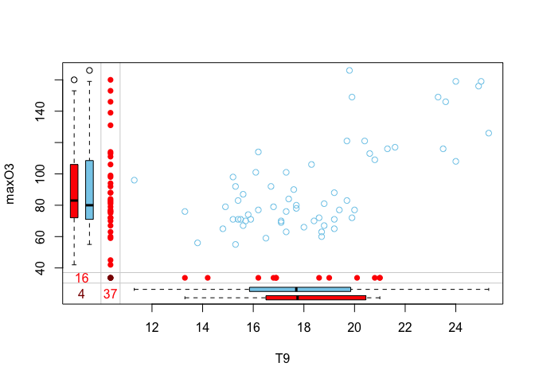
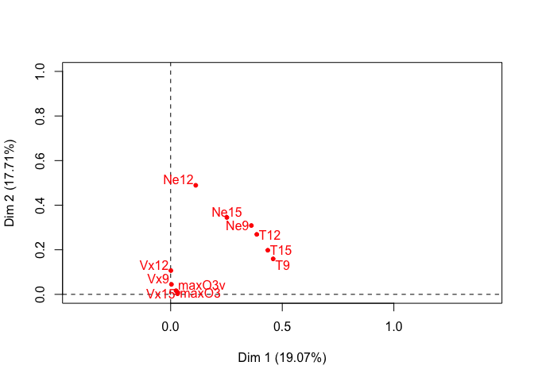
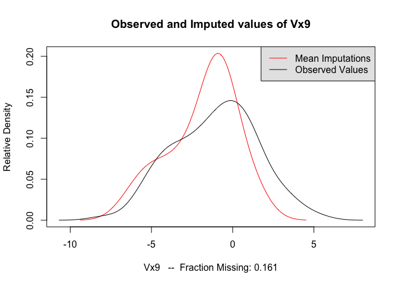

##Questions

**1 - When you suggest methods to deal with missing values to users, the recurrent question is "What is the percentage of missing values that I can have in my data set, is 50% too much but 20% OK?" What is your answer to this question?**

*It depends on the dataset. If your data is highly correlated, you can have many missing values and impute precisely. If the data is vey noisy, even just a few missing values can be problematic. Multiple imputation can always be performed and enables us to estimate the variability of the predictions, which will tell us how much we can trust the result of the imputation*

**2 - Explain the aims of multiple imputation in comparison to single imputation.**

*With single imputation we underestimate the variance of our data that comes from the missing values. Multiple imputation is a way of conserving this variance because we impute both the missing values and their variability*

**3 - Your aim is to impute a data set (predict as well as possible the missing values). You have 3 imputation methods available. How could you compare them?**

*Do cross-validation: take a dataset where there is no missing data. Take out some data, and impute those missing values 3 times using each method. Each time, compute the errors of the predictions. Choose the method which yields the lowest mean square error (or other error metric)*


## Continuous data with missing values - Regression with missing data via Multiple Imputation
First of all you will need to install the following packages


```r
install.packages("VIM")
install.packages("missMDA")
install.packages("Amelia")
```


```r
library(VIM)
library(missMDA)
library(Amelia)
library(FactoMineR)
```

Air pollution is currently one of the most serious public health worries worldwide. Many epidemiological studies
have proved the influence that some chemical compounds, such as sulphur dioxide (SO2), nitrogen dioxide
(NO2), ozone (O3) can have on our health. Associations set up to monitor air quality are active all over the
world to measure the concentration of these pollutants. They also keep a record of meteorological conditions
such as temperature, cloud cover, wind, etc.  

We have at our disposal 112 observations collected
during the summer of 2001 in Rennes. The variables available are 

* maxO3 (maximum daily ozone) 
* maxO3v (maximum daily ozone the previous day) 
* T12 (temperature at midday) 
* T9 
* T15 (Temp at 3pm)
* Vx12 (projection of the wind speed vector on the east-west axis at midday)
* Vx9 and Vx15 as well as the Nebulosity (cloud) Ne9, Ne12, Ne15

Here the final aim is to analyse the relationship between the
maximum daily ozone (maxO3) level and the other meteorological variables. To do so we will perform regression to explain maxO3 in function of all the other variables. This data is incomplete (there are missing values). Indeed, it occurs frenquently to have machines that fail one day, leading to some information not recorded. We will therefore perform regression via multiple imputation.

__(R1)__ Import the data.


```r
ozo <- read.table("data/ozoneNA.csv",header=TRUE,
sep=",", row.names=1)
WindDirection <- ozo[,12]
don <- ozo[,1:11]   #### keep only the continuous variables
summary(don)
```

```
##      maxO3              T9             T12             T15       
##  Min.   : 42.00   Min.   :11.30   Min.   :14.30   Min.   :14.90  
##  1st Qu.: 71.00   1st Qu.:16.00   1st Qu.:18.60   1st Qu.:18.90  
##  Median : 81.50   Median :17.70   Median :20.40   Median :21.40  
##  Mean   : 91.24   Mean   :18.22   Mean   :21.46   Mean   :22.41  
##  3rd Qu.:108.25   3rd Qu.:19.90   3rd Qu.:23.60   3rd Qu.:25.65  
##  Max.   :166.00   Max.   :25.30   Max.   :33.50   Max.   :35.50  
##  NA's   :16       NA's   :37      NA's   :33      NA's   :37     
##       Ne9             Ne12            Ne15           Vx9         
##  Min.   :0.000   Min.   :0.000   Min.   :0.00   Min.   :-7.8785  
##  1st Qu.:3.000   1st Qu.:4.000   1st Qu.:3.00   1st Qu.:-3.0000  
##  Median :5.000   Median :5.000   Median :5.00   Median :-0.8671  
##  Mean   :4.987   Mean   :4.986   Mean   :4.60   Mean   :-1.0958  
##  3rd Qu.:7.000   3rd Qu.:7.000   3rd Qu.:6.25   3rd Qu.: 0.6919  
##  Max.   :8.000   Max.   :8.000   Max.   :8.00   Max.   : 5.1962  
##  NA's   :34      NA's   :42      NA's   :32     NA's   :18       
##       Vx12              Vx15            maxO3v      
##  Min.   :-7.8785   Min.   :-9.000   Min.   : 42.00  
##  1st Qu.:-3.6941   1st Qu.:-3.759   1st Qu.: 70.00  
##  Median :-1.9284   Median :-1.710   Median : 82.50  
##  Mean   :-1.6853   Mean   :-1.830   Mean   : 89.39  
##  3rd Qu.:-0.1302   3rd Qu.: 0.000   3rd Qu.:101.00  
##  Max.   : 6.5778   Max.   : 3.830   Max.   :166.00  
##  NA's   :10        NA's   :21       NA's   :12
```

```r
head(don)
```

```
##          maxO3   T9  T12  T15 Ne9 Ne12 Ne15     Vx9    Vx12    Vx15 maxO3v
## 20010601    87 15.6 18.5   NA   4    4    8  0.6946 -1.7101 -0.6946     84
## 20010602    82   NA   NA   NA   5    5    7 -4.3301 -4.0000 -3.0000     87
## 20010603    92 15.3 17.6 19.5   2   NA   NA  2.9544      NA  0.5209     82
## 20010604   114 16.2 19.7   NA   1    1    0      NA  0.3473 -0.1736     92
## 20010605    94   NA 20.5 20.4  NA   NA   NA -0.5000 -2.9544 -4.3301    114
## 20010606    80 17.7 19.8 18.3   6   NA    7 -5.6382 -5.0000 -6.0000     94
```

__(R2)__ Load the libraries.


First, we perfom some descriptive statistics (how many missing? how many variables, individuals with missing?) and try to **inspect and vizualize the pattern of missing entries and get hints on the mechanism** that generated the missingness.  For this purpose, we use the R package **VIM** (Visualization and Imputation of Missing Values - Mathias Templ) as well as Multiple Correspondence Analysis (FactoMineR package). The package VIM provides tools for the visualization of missing or imputed values, which can be used for exploring the data and the structure of the missing or imputed values. Depending on this structure, they may help to identify the mechanism generating the missing values or errors, which may have happened in the imputation process. You should install the package VIM, then you can check the documentation by executing


```r
?VIM
```

The VIM function **aggr** calculates and plots the amount of missing entries in each variables and in some combinations of variables (that tend to be missing simultaneously).


```r
dim(na.omit(don))
dim(don)
res<-summary(aggr(don, sortVar=TRUE))$combinations
```


```r
head(res[rev(order(res[,2])),])
aggr(don, sortVar=TRUE)
```


The VIM function **matrixplot ** creates a matrix plot in which all cells of a data matrix are visualized by rectangles. Available data is coded according to a continuous color scheme (gray scale), while missing/imputed data is visualized by a clearly distinguishable color (red). If you use Rstudio the plot is not interactive (thus the warnings), but if you use R directly, you can click on a column of your choice, this will result in sorting the rows in the decreasing order of the values of this column. This is useful to check if there is an association between the value of a variable and the missingness of another one.


```r
matrixplot(don,sortby=2) # marche pas sur Rstudio
```

The VIM function **marginplot** creates a scatterplot with additional information on the missing values. If you plot the variables (x,y), the points with no missing values are represented as in a standard scatterplot. The points for which x (resp. y) is missing are represented in red along the y (resp. x) axis. In addition, boxplots of the x and y variables are represented along the axes with and without missing values (in red all variables x where y is missing, in blue all variables x where y is observed).


```r
marginplot(don[,c("T9","maxO3")])
```

__(Q3)__ Do you observe any associations between the missing entries ? When values are missing on a variable does it correspond to small or large values on another one ? (For this question you need to use the matrixplot function in R)

*First of all, we see that only 13 out of the 112 rows do not have any missing values.*


```r
matrixplot(don,sortby=1)
```
*By playing around with the sortby 'argument' we notice:*

* *maxO3 seems uncorrelated in terms with others of missing values* 
* *T9, T12, T15 seem to all be correlated (both in terms of missing values but also in the value (temperature). From this we could deduce they tend to be missing for high values *
* *Ne9, Ne12 and Ne15 are correlated. Again we can deduchigh values tend to miss more than low ones*
* *Vx9 seems uncorrelated*
* *Vx12 and Vx15 seem correlated*
* *maxO3v seems uncorrelated*

__(R3)__ Create a categorical dataset with "o" when the value of the cell is observed and "m" when it is missing, and with the same row and column names as in the original data. Then, you can perform Multiple Correspondence Analysis on the categories to visualize the association with the **MCA** function.


```r
class(don)
```

```
## [1] "data.frame"
```

```r
cat <- don
cat <- apply(cat, c(1,2), function(x) return(ifelse(is.na(x),'m','o')))
MCA(cat)
```

<!-- --><!-- --><!-- -->

```
## **Results of the Multiple Correspondence Analysis (MCA)**
## The analysis was performed on 112 individuals, described by 11 variables
## *The results are available in the following objects:
## 
##    name              description                       
## 1  "$eig"            "eigenvalues"                     
## 2  "$var"            "results for the variables"       
## 3  "$var$coord"      "coord. of the categories"        
## 4  "$var$cos2"       "cos2 for the categories"         
## 5  "$var$contrib"    "contributions of the categories" 
## 6  "$var$v.test"     "v-test for the categories"       
## 7  "$ind"            "results for the individuals"     
## 8  "$ind$coord"      "coord. for the individuals"      
## 9  "$ind$cos2"       "cos2 for the individuals"        
## 10 "$ind$contrib"    "contributions of the individuals"
## 11 "$call"           "intermediate results"            
## 12 "$call$marge.col" "weights of columns"              
## 13 "$call$marge.li"  "weights of rows"
```

**Interpretation**  
*If variables are close (eg. T15_m and T9_m), this means that the missing values are correlated : when T15_m is missing, so is T9_m. The point T_15m corresponds to the barycenter of all the individuals for which T15 is missing. You can see the projection of the individuals on the second graph*


Then, before modeling the data, we perform a **PCA with missing values** to explore the correlation between variables. Use the R package **missMDA** dedicated to perform principal components methods with missing values and to impute data with PC methods.


```r
library(missMDA)
?missMDA
```


__(R4)__ Determine the number of components ncp to keep using the 
**estim_ncpPCA** function. Perform PCA with missing values using the 
**imputePCA** function and ncp components. Then plot the correlation circle.


```r
?estim_ncpPCA
?imputePCA
```


```r
estim_ncpPCA(don)
```

```
## $ncp
## [1] 2
## 
## $criterion
##         0         1         2         3         4         5 
## 170.77775  88.60110  84.97487 104.60004  92.98638 115.43620
```

```r
plot((0:5), estim_ncpPCA(don)$criterion)
```

<!-- -->

```r
#Donne le nombre de composantes "optimal" par cross-validation
estim_ncpPCA(don)$ncp
```

```
## [1] 2
```

```r
#Complete les missing values
completed_don <- imputePCA(don, ncp = estim_ncpPCA(don)$ncp)$completeObs


PCA(completed_don)
```

<!-- --><!-- -->

```
## **Results for the Principal Component Analysis (PCA)**
## The analysis was performed on 112 individuals, described by 11 variables
## *The results are available in the following objects:
## 
##    name               description                          
## 1  "$eig"             "eigenvalues"                        
## 2  "$var"             "results for the variables"          
## 3  "$var$coord"       "coord. for the variables"           
## 4  "$var$cor"         "correlations variables - dimensions"
## 5  "$var$cos2"        "cos2 for the variables"             
## 6  "$var$contrib"     "contributions of the variables"     
## 7  "$ind"             "results for the individuals"        
## 8  "$ind$coord"       "coord. for the individuals"         
## 9  "$ind$cos2"        "cos2 for the individuals"           
## 10 "$ind$contrib"     "contributions of the individuals"   
## 11 "$call"            "summary statistics"                 
## 12 "$call$centre"     "mean of the variables"              
## 13 "$call$ecart.type" "standard error of the variables"    
## 14 "$call$row.w"      "weights for the individuals"        
## 15 "$call$col.w"      "weights for the variables"
```


__(Q4)__ Could you guess how cross-validation is performed to select the number of components?

*Probably by doing the imputePCA on a test set for different numbers of components. And choosing the number of components that gives the lowest mean square error*

Then, to run the regression with missing values, we use **Multiple Imputation**. We impute the data either assuming 1) a Gaussian distribution (library Amelia) or 2) a PCA based model (library missMDA). 
Note that there are two ways to impute either using a Joint Modeling (one joint probabilitisc model for the variables all together)
or a Condional Modeling (one model per variable) approach. We refer to the references given in the slides for more details.  We use the R package **Amelia**. We generate 100 imputed data sets with the amelia method:


```r
library(Amelia)
```


```r
?amelia
```


```r
res.amelia <- amelia(don, m=100)  
```

```
## -- Imputation 1 --
## 
##   1  2  3  4  5  6  7  8  9 10 11 12 13 14 15 16 17 18 19 20
##  21 22 23 24 25 26 27 28 29 30 31 32 33 34 35 36 37 38 39 40
##  41
## 
## -- Imputation 2 --
## 
##   1  2  3  4  5  6  7  8  9 10 11 12 13 14 15 16 17 18 19 20
##  21 22 23 24 25 26 27 28 29 30 31 32 33 34 35 36 37 38 39 40
##  41 42 43 44 45 46 47 48 49 50 51 52 53 54 55 56 57 58 59 60
## 
## 
## -- Imputation 3 --
## 
##   1  2  3  4  5  6  7  8  9 10 11 12 13 14 15 16 17 18 19 20
##  21 22 23 24 25 26 27 28 29 30 31 32 33 34 35 36 37 38 39 40
##  41 42 43 44 45 46 47 48 49 50 51 52 53 54 55 56 57 58 59 60
##  61 62 63 64 65 66 67
## 
## -- Imputation 4 --
## 
##   1  2  3  4  5  6  7  8  9 10 11 12 13 14 15 16 17 18 19 20
##  21 22 23 24 25 26 27 28 29 30 31 32 33 34 35 36 37 38 39 40
##  41 42 43 44 45 46 47
## 
## -- Imputation 5 --
## 
##   1  2  3  4  5  6  7  8  9 10 11 12 13 14 15 16 17 18 19 20
##  21 22 23 24 25 26 27 28 29 30 31 32 33 34 35 36 37 38 39 40
##  41 42 43 44 45 46 47 48 49 50 51 52 53 54 55 56 57 58 59 60
##  61 62 63 64 65 66 67 68 69 70
## 
## -- Imputation 6 --
## 
##   1  2  3  4  5  6  7  8  9 10 11 12 13 14 15 16 17 18 19 20
##  21 22 23 24 25 26 27 28 29 30 31 32 33 34 35 36 37 38 39 40
##  41 42
## 
## -- Imputation 7 --
## 
##   1  2  3  4  5  6  7  8  9 10 11 12 13 14 15 16 17 18 19 20
##  21 22 23 24 25 26 27 28 29 30 31 32 33 34 35 36 37 38 39 40
##  41 42 43
## 
## -- Imputation 8 --
## 
##   1  2  3  4  5  6  7  8  9 10 11 12 13 14 15 16 17 18 19 20
##  21 22 23 24 25 26 27 28 29 30 31 32 33 34 35 36 37 38 39 40
##  41 42 43 44 45 46 47 48 49 50 51 52 53 54 55 56 57 58 59 60
##  61 62 63 64 65 66 67 68 69 70 71 72 73 74 75 76 77 78 79 80
##  81 82 83 84 85 86 87 88 89 90 91 92 93 94 95 96 97 98 99 100
##  101 102 103 104 105 106 107 108 109 110 111 112 113 114 115 116 117 118 119 120
##  121 122 123 124 125 126 127 128 129 130 131
## 
## -- Imputation 9 --
## 
##   1  2  3  4  5  6  7  8  9 10 11 12 13 14 15 16 17 18 19 20
##  21 22 23 24 25 26 27 28 29 30 31 32 33 34
## 
## -- Imputation 10 --
## 
##   1  2  3  4  5  6  7  8  9 10 11 12 13 14 15 16 17 18 19 20
##  21 22 23 24 25 26 27 28 29 30 31 32 33 34 35 36 37 38 39 40
##  41 42 43 44 45 46 47 48 49 50 51 52 53 54 55 56 57 58 59 60
##  61 62 63 64 65 66 67 68 69 70 71 72 73 74 75 76 77
## 
## -- Imputation 11 --
## 
##   1  2  3  4  5  6  7  8  9 10 11 12 13 14 15 16 17 18 19 20
##  21 22 23 24 25 26 27 28 29 30 31 32 33 34 35 36 37 38 39 40
##  41 42 43 44
## 
## -- Imputation 12 --
## 
##   1  2  3  4  5  6  7  8  9 10 11 12 13 14 15 16 17 18 19 20
##  21 22 23 24 25 26 27 28 29 30 31 32 33 34 35 36 37 38 39 40
##  41 42 43 44 45 46 47 48 49 50 51 52 53 54
## 
## -- Imputation 13 --
## 
##   1  2  3  4  5  6  7  8  9 10 11 12 13 14 15 16 17 18 19 20
##  21 22 23 24 25 26 27 28 29 30 31 32 33 34 35 36 37 38 39 40
##  41 42 43 44 45 46 47 48 49 50
## 
## -- Imputation 14 --
## 
##   1  2  3  4  5  6  7  8  9 10 11 12 13 14 15 16 17 18 19 20
##  21 22 23 24 25 26 27 28 29 30 31 32 33 34 35 36 37 38 39 40
##  41 42 43 44 45 46 47 48 49 50
## 
## -- Imputation 15 --
## 
##   1  2  3  4  5  6  7  8  9 10 11 12 13 14 15 16 17 18 19 20
##  21 22 23 24 25 26 27 28 29 30 31 32 33 34 35 36 37 38 39 40
##  41 42 43 44 45 46 47 48 49 50 51 52 53 54 55 56 57 58 59 60
##  61 62 63 64 65 66 67 68 69 70 71 72 73 74 75 76
## 
## -- Imputation 16 --
## 
##   1  2  3  4  5  6  7  8  9 10 11 12 13 14 15 16 17 18 19 20
##  21 22 23 24 25 26
## 
## -- Imputation 17 --
## 
##   1  2  3  4  5  6  7  8  9 10 11 12 13 14 15 16 17 18 19 20
##  21 22 23 24 25 26 27 28 29 30 31 32 33 34 35 36
## 
## -- Imputation 18 --
## 
##   1  2  3  4  5  6  7  8  9 10 11 12 13 14 15 16 17 18 19 20
##  21 22 23 24 25 26 27 28 29 30 31 32 33 34 35
## 
## -- Imputation 19 --
## 
##   1  2  3  4  5  6  7  8  9 10 11 12 13 14 15 16 17 18 19 20
##  21 22 23 24 25 26 27 28 29 30 31 32 33 34 35 36 37 38 39 40
##  41 42 43 44 45 46 47 48 49 50 51 52 53 54
## 
## -- Imputation 20 --
## 
##   1  2  3  4  5  6  7  8  9 10 11 12 13 14 15 16 17 18 19 20
##  21 22 23 24 25 26 27 28 29 30 31 32 33 34 35 36 37 38 39 40
##  41 42 43 44 45 46 47
## 
## -- Imputation 21 --
## 
##   1  2  3  4  5  6  7  8  9 10 11 12 13 14 15 16 17 18 19 20
##  21 22 23 24 25 26 27 28 29 30 31 32 33 34
## 
## -- Imputation 22 --
## 
##   1  2  3  4  5  6  7  8  9 10 11 12 13 14 15 16 17 18 19 20
##  21 22 23 24 25 26 27 28 29 30 31 32 33 34 35 36 37 38 39 40
##  41 42 43 44 45 46 47 48 49 50 51
## 
## -- Imputation 23 --
## 
##   1  2  3  4  5  6  7  8  9 10 11 12 13 14 15 16 17 18 19 20
##  21 22 23 24 25 26 27 28 29 30 31 32 33 34 35 36 37 38 39 40
##  41 42 43 44 45 46 47 48 49 50 51 52 53 54 55
## 
## -- Imputation 24 --
## 
##   1  2  3  4  5  6  7  8  9 10 11 12 13 14 15 16 17 18 19 20
##  21 22 23 24 25 26 27 28 29 30 31 32 33 34 35 36 37 38 39 40
##  41 42 43 44 45 46 47 48 49 50 51
## 
## -- Imputation 25 --
## 
##   1  2  3  4  5  6  7  8  9 10 11 12 13 14 15 16 17 18 19 20
##  21 22 23 24 25 26 27 28 29 30 31 32 33 34 35 36 37
## 
## -- Imputation 26 --
## 
##   1  2  3  4  5  6  7  8  9 10 11 12 13 14 15 16 17 18 19 20
##  21 22 23 24 25 26 27 28 29 30 31 32 33 34 35 36 37 38 39 40
##  41 42 43 44 45 46 47 48 49 50 51 52 53 54 55 56 57 58 59 60
##  61 62 63 64 65 66 67 68 69 70 71 72 73 74 75 76 77 78 79
## 
## -- Imputation 27 --
## 
##   1  2  3  4  5  6  7  8  9 10 11 12 13 14 15 16 17 18 19 20
##  21 22 23 24 25 26 27 28 29 30 31 32 33 34 35 36 37 38 39 40
##  41 42 43 44 45 46 47 48
## 
## -- Imputation 28 --
## 
##   1  2  3  4  5  6  7  8  9 10 11 12 13 14 15 16 17 18 19 20
##  21 22 23 24 25 26 27 28 29 30 31 32 33 34 35 36 37 38 39 40
##  41 42 43 44 45 46 47 48 49 50 51 52 53 54 55 56 57 58 59 60
##  61 62 63 64 65 66 67 68 69 70 71 72 73 74 75 76 77 78
## 
## -- Imputation 29 --
## 
##   1  2  3  4  5  6  7  8  9 10 11 12 13 14 15 16 17 18 19 20
##  21 22 23 24 25 26 27 28 29 30 31 32 33 34 35 36 37 38 39 40
##  41 42 43 44 45 46 47 48 49 50 51 52 53 54 55 56 57 58 59 60
##  61 62 63 64 65 66 67 68 69 70 71 72 73 74 75 76 77 78 79 80
##  81 82 83 84 85 86 87 88 89 90 91 92 93 94 95 96 97 98 99 100
##  101 102 103 104 105 106 107 108 109 110 111 112 113 114 115 116 117 118 119 120
##  121 122 123 124 125 126 127 128 129 130 131 132 133 134 135 136 137 138 139 140
##  141 142 143 144 145 146 147 148 149 150 151 152 153 154 155 156 157 158 159 160
##  161 162 163 164 165 166 167 168 169 170 171 172 173 174 175 176 177 178 179 180
##  181 182 183 184 185
## 
## -- Imputation 30 --
## 
##   1  2  3  4  5  6  7  8  9 10 11 12 13 14 15 16 17 18 19 20
##  21 22 23 24 25 26 27 28 29 30 31 32 33
## 
## -- Imputation 31 --
## 
##   1  2  3  4  5  6  7  8  9 10 11 12 13 14 15 16 17 18 19 20
##  21 22 23 24 25 26 27 28 29 30 31 32 33 34 35 36 37 38 39 40
##  41
## 
## -- Imputation 32 --
## 
##   1  2  3  4  5  6  7  8  9 10 11 12 13 14 15 16 17 18 19 20
##  21 22 23 24 25 26 27 28 29 30 31 32 33 34 35 36 37 38 39 40
##  41 42 43 44
## 
## -- Imputation 33 --
## 
##   1  2  3  4  5  6  7  8  9 10 11 12 13 14 15 16 17 18 19 20
##  21 22 23 24 25 26 27 28 29 30 31 32 33 34 35 36 37 38 39 40
##  41 42 43 44 45 46 47 48 49 50 51 52 53 54 55 56 57 58 59 60
##  61 62 63 64 65 66 67
## 
## -- Imputation 34 --
## 
##   1  2  3  4  5  6  7  8  9 10 11 12 13 14 15 16 17 18 19 20
##  21 22 23 24 25 26 27 28 29 30 31 32 33 34 35 36 37 38 39
## 
## -- Imputation 35 --
## 
##   1  2  3  4  5  6  7  8  9 10 11 12 13 14 15 16 17 18 19 20
##  21 22 23 24 25 26 27 28 29 30 31 32 33 34 35
## 
## -- Imputation 36 --
## 
##   1  2  3  4  5  6  7  8  9 10 11 12 13 14 15 16 17 18 19 20
##  21 22 23 24 25 26 27 28 29 30 31 32 33 34 35 36 37 38 39 40
##  41 42 43 44 45 46 47 48 49 50 51 52 53 54 55 56 57 58 59 60
##  61 62 63 64 65 66 67 68 69 70 71 72 73 74 75 76 77 78 79 80
##  81 82 83 84 85 86 87 88 89 90 91 92 93 94 95 96 97 98 99 100
##  101 102 103 104 105 106 107 108 109 110 111 112 113 114 115 116 117 118 119 120
##  121 122 123 124 125 126 127 128 129 130 131 132 133 134 135 136 137 138 139 140
##  141 142 143 144 145 146 147 148 149 150 151 152 153
## 
## -- Imputation 37 --
## 
##   1  2  3  4  5  6  7  8  9 10 11 12 13 14 15 16 17 18 19 20
##  21 22 23 24 25 26 27 28 29 30 31 32 33 34 35 36 37 38 39 40
##  41 42 43 44 45 46 47 48 49 50 51 52 53 54 55 56 57 58 59 60
##  61 62 63 64 65 66 67 68 69 70 71 72 73 74 75 76 77 78 79 80
##  81 82 83 84 85 86 87 88 89 90 91 92 93 94 95 96 97 98 99 100
##  101 102 103 104 105 106 107 108 109 110 111 112 113 114 115 116 117 118 119 120
##  121 122 123 124 125 126 127 128 129 130 131 132 133 134 135 136 137 138 139 140
##  141 142 143 144 145 146 147 148 149 150 151 152 153 154 155 156 157 158 159 160
##  161 162 163 164 165 166 167 168 169 170 171 172 173 174 175 176 177 178 179 180
##  181 182 183 184 185 186 187 188 189 190 191 192 193 194 195 196 197 198 199 200
##  201 202 203 204 205 206 207 208 209 210 211 212 213 214 215 216 217 218 219 220
##  221 222 223 224 225 226 227 228 229 230 231 232 233 234 235 236 237 238 239 240
##  241 242 243 244 245 246 247 248 249 250 251 252 253 254 255 256 257 258 259 260
##  261 262 263 264 265 266 267 268 269 270 271 272 273 274 275 276 277 278 279 280
##  281 282 283 284 285 286 287 288 289 290 291 292 293 294 295 296 297 298 299 300
##  301 302 303 304 305 306 307 308 309 310 311 312 313 314 315 316 317 318 319 320
##  321 322 323 324 325 326 327 328 329 330 331 332 333 334 335 336 337 338 339 340
##  341 342 343 344 345 346 347 348 349 350 351 352 353 354 355 356 357 358 359 360
##  361 362 363 364 365 366 367 368 369 370 371 372 373 374 375 376 377 378 379 380
##  381 382 383 384 385 386 387 388 389 390 391 392 393 394 395 396 397 398 399 400
##  401 402 403 404 405 406 407 408 409 410 411 412 413 414 415 416 417 418 419 420
##  421 422 423 424 425 426 427 428 429 430 431 432 433 434 435 436 437 438 439 440
##  441 442 443 444 445 446 447 448 449 450 451 452 453 454 455 456 457 458 459 460
##  461 462 463 464 465 466 467 468 469 470 471 472 473 474 475 476 477 478 479 480
##  481 482 483 484 485 486 487 488 489 490 491 492 493 494 495 496 497 498 499 500
##  501 502 503 504 505 506 507 508 509 510 511 512 513 514 515 516 517 518 519 520
##  521 522 523 524 525 526 527 528 529 530 531 532 533 534 535 536 537 538 539 540
##  541 542 543 544 545 546 547 548 549 550 551 552 553 554 555 556 557 558 559 560
##  561 562
## 
## -- Imputation 38 --
## 
##   1  2  3  4  5  6  7  8  9 10 11 12 13 14 15 16 17 18 19 20
##  21 22 23 24 25 26 27 28 29 30 31 32 33 34 35 36 37 38 39 40
##  41 42 43 44 45 46 47 48 49 50 51 52 53 54 55 56 57 58 59 60
## 
## 
## -- Imputation 39 --
## 
##   1  2  3  4  5  6  7  8  9 10 11 12 13 14 15 16 17 18 19 20
##  21 22 23 24 25 26 27 28 29 30 31 32 33 34 35 36 37 38 39 40
##  41 42 43 44 45 46 47 48 49 50
## 
## -- Imputation 40 --
## 
##   1  2  3  4  5  6  7  8  9 10 11 12 13 14 15 16 17 18 19 20
##  21 22 23 24 25 26 27 28 29 30 31 32 33 34 35 36 37 38 39 40
##  41 42 43 44
## 
## -- Imputation 41 --
## 
##   1  2  3  4  5  6  7  8  9 10 11 12 13 14 15 16 17 18 19 20
##  21 22 23 24 25 26 27 28 29 30 31 32 33 34 35 36 37 38 39 40
##  41 42 43 44 45 46 47 48 49 50 51 52 53 54 55 56 57 58 59 60
##  61 62 63 64 65 66 67 68 69 70 71 72 73 74 75 76 77 78 79 80
##  81 82 83 84 85 86 87 88 89 90 91 92 93 94 95 96 97 98 99 100
##  101 102 103 104 105 106 107 108 109 110 111 112 113 114 115 116 117 118 119 120
##  121 122 123 124 125 126 127 128 129 130 131 132 133 134 135 136 137 138 139 140
##  141 142 143 144 145 146 147 148 149 150 151
## 
## -- Imputation 42 --
## 
##   1  2  3  4  5  6  7  8  9 10 11 12 13 14 15 16 17 18 19 20
##  21 22 23 24 25 26 27 28 29 30 31 32 33 34 35 36 37 38 39 40
##  41 42 43 44 45 46 47 48 49 50 51
## 
## -- Imputation 43 --
## 
##   1  2  3  4  5  6  7  8  9 10 11 12 13 14 15 16 17 18 19 20
##  21 22 23 24 25 26 27 28 29 30 31 32 33 34 35 36 37 38 39 40
##  41 42 43 44 45 46 47 48 49 50 51 52 53 54 55 56 57 58 59 60
##  61 62 63 64 65 66 67 68 69 70 71 72 73 74 75 76 77 78 79 80
##  81 82 83 84 85 86 87 88 89 90 91 92 93 94 95 96 97 98 99 100
##  101 102 103 104 105 106 107 108 109 110 111 112 113 114 115 116 117 118 119 120
##  121 122 123 124 125 126 127 128 129 130 131 132 133 134 135 136 137 138 139 140
##  141 142 143 144 145 146 147 148 149 150 151 152 153 154 155 156 157 158 159 160
##  161 162 163 164 165 166 167 168 169 170 171 172 173 174 175 176 177 178 179 180
##  181 182 183 184 185 186 187 188 189 190 191 192 193 194 195 196 197 198 199 200
##  201 202 203 204 205 206 207 208 209 210 211 212 213 214 215 216 217 218 219 220
##  221 222 223 224 225 226 227 228 229 230 231 232 233 234 235 236 237 238 239 240
##  241 242 243 244 245 246 247 248 249 250 251 252 253 254 255 256 257 258 259 260
##  261 262 263 264 265 266 267 268 269 270 271 272 273 274 275 276 277 278 279 280
##  281 282 283 284 285 286 287 288 289 290 291 292 293 294 295 296 297 298 299 300
##  301 302 303 304 305 306 307 308 309 310 311 312 313 314 315 316 317 318 319 320
##  321 322 323 324 325 326 327 328 329 330 331 332 333 334 335 336 337 338 339 340
##  341 342 343 344 345 346 347 348 349 350 351 352 353 354 355 356 357 358 359 360
##  361 362 363 364 365 366 367 368 369 370 371 372 373 374 375 376 377 378 379 380
##  381 382 383 384 385 386 387 388 389 390 391 392 393 394 395 396 397 398 399 400
##  401 402 403 404 405 406 407 408 409 410 411 412 413 414 415 416 417 418 419 420
##  421 422 423 424 425 426
## 
## -- Imputation 44 --
## 
##   1  2  3  4  5  6  7  8  9 10 11 12 13 14 15 16 17 18 19 20
##  21 22 23 24 25 26 27 28 29 30 31 32 33 34 35 36 37 38 39 40
##  41 42 43 44 45 46 47 48 49 50 51 52 53 54 55 56 57 58 59
## 
## -- Imputation 45 --
## 
##   1  2  3  4  5  6  7  8  9 10 11 12 13 14 15 16 17 18 19 20
##  21 22 23 24 25 26 27 28 29 30 31 32 33 34 35 36 37 38 39 40
##  41 42 43 44 45 46 47 48 49 50 51 52 53 54 55 56 57 58 59 60
##  61
## 
## -- Imputation 46 --
## 
##   1  2  3  4  5  6  7  8  9 10 11 12 13 14 15 16 17 18 19 20
##  21 22 23 24 25 26 27 28 29 30 31 32 33 34 35 36 37 38 39 40
##  41 42 43 44 45 46 47
## 
## -- Imputation 47 --
## 
##   1  2  3  4  5  6  7  8  9 10 11 12 13 14 15 16 17 18 19 20
##  21 22 23 24 25 26 27 28 29 30 31 32 33 34 35 36 37 38 39 40
##  41
## 
## -- Imputation 48 --
## 
##   1  2  3  4  5  6  7  8  9 10 11 12 13 14 15 16 17 18 19 20
##  21 22 23 24 25 26 27 28 29 30 31 32 33 34 35 36 37 38 39 40
##  41 42 43 44 45 46 47 48 49 50 51 52 53
## 
## -- Imputation 49 --
## 
##   1  2  3  4  5  6  7  8  9 10 11 12 13 14 15 16 17 18 19 20
##  21 22 23 24 25 26 27 28 29 30 31 32 33 34 35 36 37 38 39 40
##  41 42 43 44 45 46 47 48 49 50 51 52 53 54 55 56 57 58 59 60
##  61 62 63 64 65 66 67 68 69 70 71 72 73 74 75 76 77 78 79 80
##  81
## 
## -- Imputation 50 --
## 
##   1  2  3  4  5  6  7  8  9 10 11 12 13 14 15 16 17 18 19 20
##  21 22 23 24 25 26 27 28 29 30 31 32 33 34 35 36 37 38 39 40
##  41 42 43 44 45 46 47 48 49
## 
## -- Imputation 51 --
## 
##   1  2  3  4  5  6  7  8  9 10 11 12 13 14 15 16 17 18 19 20
##  21 22 23 24 25 26 27 28 29 30 31 32 33 34 35 36 37 38 39 40
##  41 42 43 44 45 46 47 48 49 50 51 52 53 54 55 56 57 58 59 60
##  61 62 63 64 65 66 67 68 69 70 71 72 73 74 75 76 77 78 79 80
##  81 82 83 84 85 86 87 88 89 90 91 92 93 94 95 96 97 98 99 100
##  101 102 103 104 105 106 107 108 109 110 111 112 113 114 115 116 117 118 119 120
##  121 122 123 124 125 126 127 128 129 130 131 132 133 134 135 136 137 138 139 140
##  141 142 143 144 145 146 147 148 149 150 151 152 153 154 155 156 157 158 159 160
##  161 162 163 164 165 166 167 168 169 170 171 172 173 174 175 176 177 178 179 180
##  181 182 183 184 185 186 187 188 189 190 191 192 193 194 195 196 197 198 199 200
##  201 202 203 204 205 206 207 208 209 210 211 212 213 214 215 216 217 218 219 220
##  221 222 223 224 225 226 227 228 229 230 231 232 233 234 235 236 237 238 239 240
##  241 242 243 244 245 246 247 248 249 250 251 252 253 254 255 256 257 258 259 260
##  261 262 263 264 265 266 267 268 269 270 271 272 273 274 275 276 277 278 279 280
##  281 282 283 284 285 286 287 288 289 290 291 292 293 294 295 296 297 298 299 300
##  301 302 303 304 305 306 307 308 309 310 311 312 313 314 315 316 317 318 319 320
##  321 322 323 324 325 326 327 328 329 330 331 332 333 334 335 336 337 338 339 340
##  341 342 343 344 345 346 347 348 349 350 351 352 353 354 355 356 357 358 359 360
##  361 362 363 364 365 366 367 368 369 370 371 372 373 374 375 376 377 378 379 380
##  381 382 383 384 385 386 387 388 389 390 391 392 393 394 395 396 397 398 399 400
##  401 402 403 404 405 406 407 408 409 410 411 412 413 414 415 416 417 418 419 420
##  421 422 423 424 425 426 427 428 429 430 431 432 433 434 435 436 437 438 439 440
##  441 442 443 444 445 446
## 
## -- Imputation 52 --
## 
##   1  2  3  4  5  6  7  8  9 10 11 12 13 14 15 16 17 18 19 20
##  21 22 23 24 25 26 27 28 29 30 31 32 33 34 35 36 37 38 39 40
##  41 42 43 44 45 46 47 48 49 50 51 52 53 54 55 56 57 58 59 60
##  61 62 63 64 65 66 67 68 69 70 71 72 73 74 75 76 77 78 79 80
##  81 82 83 84 85 86 87 88 89 90 91 92 93 94
## 
## -- Imputation 53 --
## 
##   1  2  3  4  5  6  7  8  9 10 11 12 13 14 15 16 17 18 19 20
##  21 22 23 24 25 26 27 28 29 30 31 32 33 34 35 36 37 38 39 40
##  41 42
## 
## -- Imputation 54 --
## 
##   1  2  3  4  5  6  7  8  9 10 11 12 13 14 15 16 17 18 19 20
##  21 22 23 24 25 26 27 28 29 30 31 32 33 34 35 36 37 38 39 40
##  41 42 43 44 45 46 47 48 49 50 51 52 53 54 55 56 57 58 59 60
##  61 62 63 64 65 66 67 68 69 70 71 72 73 74 75 76 77 78 79 80
##  81 82 83 84 85 86 87 88 89 90 91 92 93 94 95 96 97 98 99 100
##  101 102 103 104 105 106 107 108 109 110
## 
## -- Imputation 55 --
## 
##   1  2  3  4  5  6  7  8  9 10 11 12 13 14 15 16 17 18 19 20
##  21 22 23 24 25 26 27 28 29 30 31 32 33 34 35 36 37 38 39 40
##  41 42 43 44 45 46 47 48 49 50 51 52 53 54 55 56 57 58 59 60
##  61 62 63 64 65 66 67 68 69 70 71 72 73 74 75 76 77 78 79 80
##  81 82 83 84 85 86 87 88 89 90 91 92
## 
## -- Imputation 56 --
## 
##   1  2  3  4  5  6  7  8  9 10 11 12 13 14 15 16 17 18 19 20
##  21 22 23 24 25 26 27 28 29 30 31 32 33 34
## 
## -- Imputation 57 --
## 
##   1  2  3  4  5  6  7  8  9 10 11 12 13 14 15 16 17 18 19 20
##  21 22 23 24 25 26 27 28 29 30 31 32 33 34 35 36 37 38 39 40
##  41 42 43 44 45 46 47 48 49 50 51 52 53 54 55 56 57 58 59
## 
## -- Imputation 58 --
## 
##   1  2  3  4  5  6  7  8  9 10 11 12 13 14 15 16 17 18 19 20
##  21 22 23 24 25 26 27 28 29 30 31 32 33 34 35 36 37 38 39 40
##  41 42 43 44 45 46 47 48 49 50 51 52
## 
## -- Imputation 59 --
## 
##   1  2  3  4  5  6  7  8  9 10 11 12 13 14 15 16 17 18 19 20
##  21 22 23 24 25 26 27 28 29 30 31 32 33 34 35 36 37 38 39 40
##  41 42 43 44 45 46 47 48 49 50 51 52 53 54 55 56
## 
## -- Imputation 60 --
## 
##   1  2  3  4  5  6  7  8  9 10 11 12 13 14 15 16 17 18 19 20
##  21 22 23 24 25 26 27 28 29 30 31 32 33 34 35 36 37 38 39 40
##  41 42 43 44 45 46 47 48 49 50 51 52 53 54 55 56 57 58 59 60
##  61 62 63 64 65 66 67 68 69 70 71 72 73 74 75 76 77 78 79 80
##  81 82 83 84 85 86 87 88 89 90 91 92 93 94 95 96 97 98 99 100
##  101 102 103 104 105 106 107 108 109 110 111 112 113 114 115 116 117 118 119 120
##  121 122 123 124 125 126 127 128 129 130 131 132 133 134 135 136 137 138 139 140
##  141 142 143 144 145 146 147 148 149 150 151 152 153 154 155 156 157 158 159 160
##  161 162 163 164 165 166 167 168 169 170 171 172 173 174 175 176 177 178 179 180
##  181 182 183 184 185 186 187 188 189 190 191 192 193 194 195 196 197 198 199 200
##  201 202 203 204 205 206 207 208 209 210 211 212 213 214 215 216 217 218 219 220
##  221 222 223 224 225 226 227 228 229 230 231 232
## 
## -- Imputation 61 --
## 
##   1  2  3  4  5  6  7  8  9 10 11 12 13 14 15 16 17 18 19 20
##  21 22 23 24 25 26 27 28 29 30 31 32 33 34
## 
## -- Imputation 62 --
## 
##   1  2  3  4  5  6  7  8  9 10 11 12 13 14 15 16 17 18 19 20
##  21 22 23 24 25 26 27 28 29 30 31 32 33 34 35 36 37 38 39 40
##  41 42 43 44 45 46 47 48 49 50 51 52 53 54 55 56 57 58 59
## 
## -- Imputation 63 --
## 
##   1  2  3  4  5  6  7  8  9 10 11 12 13 14 15 16 17 18 19 20
##  21 22 23 24 25 26 27 28 29 30 31 32 33 34 35 36 37 38 39 40
##  41 42 43 44 45 46 47 48 49 50 51 52 53 54 55 56 57 58 59 60
##  61 62 63 64 65 66 67 68 69 70 71 72 73 74 75 76 77 78 79 80
##  81 82 83 84 85 86 87 88 89 90 91 92 93 94 95 96 97 98 99 100
##  101 102 103 104 105 106 107 108 109 110 111 112 113 114 115 116 117 118 119 120
##  121 122 123 124 125 126 127 128 129 130 131 132 133 134 135 136 137 138 139 140
##  141 142 143 144 145 146 147 148 149 150 151 152 153 154 155 156 157 158 159 160
##  161 162 163 164 165 166 167 168 169 170 171 172 173 174 175 176 177 178 179 180
##  181 182 183 184 185 186 187 188 189 190 191 192 193 194 195 196 197 198 199 200
##  201 202 203 204 205 206 207 208 209 210 211 212 213 214 215 216 217 218 219 220
##  221 222 223 224 225 226 227 228 229 230 231 232 233 234 235 236 237 238 239 240
##  241 242 243 244 245 246 247 248 249 250 251 252 253 254 255 256 257 258 259 260
##  261
## 
## -- Imputation 64 --
## 
##   1  2  3  4  5  6  7  8  9 10 11 12 13 14 15 16 17 18 19 20
##  21 22 23 24 25 26 27 28 29 30 31 32 33 34 35 36 37 38 39 40
##  41 42 43 44 45 46 47 48 49 50 51 52 53 54 55 56 57
## 
## -- Imputation 65 --
## 
##   1  2  3  4  5  6  7  8  9 10 11 12 13 14 15 16 17 18 19 20
##  21 22 23 24 25 26 27 28 29 30 31 32 33 34 35 36 37 38 39 40
##  41 42 43 44 45 46 47 48 49 50 51 52 53 54 55 56
## 
## -- Imputation 66 --
## 
##   1  2  3  4  5  6  7  8  9 10 11 12 13 14 15 16 17 18 19 20
##  21 22 23 24 25 26 27 28 29 30 31 32 33 34 35 36 37 38 39 40
## 
## 
## -- Imputation 67 --
## 
##   1  2  3  4  5  6  7  8  9 10 11 12 13 14 15 16 17 18 19 20
##  21 22 23 24 25 26 27 28 29 30 31 32 33 34 35 36 37 38 39 40
##  41 42 43 44 45 46 47 48 49 50
## 
## -- Imputation 68 --
## 
##   1  2  3  4  5  6  7  8  9 10 11 12 13 14 15 16 17 18 19 20
##  21 22 23 24 25 26 27 28 29 30 31 32 33 34 35 36 37 38 39 40
##  41 42 43 44 45 46 47 48 49 50 51 52 53 54 55 56 57 58 59 60
##  61 62 63 64 65 66 67 68 69 70 71 72 73 74 75 76 77 78 79 80
##  81 82 83 84 85 86 87 88 89 90 91 92 93 94 95 96 97 98 99 100
##  101 102 103 104 105 106 107 108 109 110 111 112 113 114 115 116 117 118 119 120
##  121 122 123 124 125 126 127 128 129 130 131 132 133 134 135 136 137 138 139 140
##  141 142 143 144 145 146 147 148 149 150 151 152 153 154 155 156 157 158 159 160
##  161 162 163 164 165 166 167 168 169 170 171 172 173 174 175 176 177 178 179 180
##  181 182 183 184 185 186 187 188 189 190 191 192 193 194 195 196 197 198 199 200
##  201 202 203 204 205 206
## 
## -- Imputation 69 --
## 
##   1  2  3  4  5  6  7  8  9 10 11 12 13 14 15 16 17 18 19 20
##  21 22 23 24 25 26 27 28 29 30 31 32 33 34 35 36 37 38 39 40
##  41 42 43 44 45 46 47 48 49 50 51 52 53 54 55 56 57 58 59 60
##  61 62 63 64 65 66 67 68 69 70 71 72 73 74 75 76 77 78 79 80
##  81 82 83 84 85 86 87 88 89 90 91 92
## 
## -- Imputation 70 --
## 
##   1  2  3  4  5  6  7  8  9 10 11 12 13 14 15 16 17 18 19 20
##  21 22 23 24 25 26 27 28 29 30 31 32 33 34 35 36 37 38 39 40
##  41 42 43
## 
## -- Imputation 71 --
## 
##   1  2  3  4  5  6  7  8  9 10 11 12 13 14 15 16 17 18 19 20
##  21 22 23 24 25 26 27 28 29 30 31 32 33 34 35 36 37 38 39 40
##  41 42 43 44 45 46 47 48 49 50 51 52 53 54 55 56 57 58 59 60
##  61 62 63 64 65 66 67 68 69 70 71 72 73 74
## 
## -- Imputation 72 --
## 
##   1  2  3  4  5  6  7  8  9 10 11 12 13 14 15 16 17 18 19 20
##  21 22 23 24 25 26 27 28 29 30 31 32 33 34 35 36 37 38 39 40
##  41 42 43 44 45 46 47 48 49 50 51 52 53 54 55 56 57 58 59
## 
## -- Imputation 73 --
## 
##   1  2  3  4  5  6  7  8  9 10 11 12 13 14 15 16 17 18 19 20
##  21 22 23 24 25 26 27 28 29 30 31 32 33 34 35 36 37 38 39 40
##  41
## 
## -- Imputation 74 --
## 
##   1  2  3  4  5  6  7  8  9 10 11 12 13 14 15 16 17 18 19 20
##  21 22 23 24 25 26 27 28 29 30 31 32 33 34
## 
## -- Imputation 75 --
## 
##   1  2  3  4  5  6  7  8  9 10 11 12 13 14 15 16 17 18 19 20
##  21 22 23 24 25 26 27 28 29 30 31 32 33 34 35 36 37 38 39 40
##  41 42 43 44 45 46
## 
## -- Imputation 76 --
## 
##   1  2  3  4  5  6  7  8  9 10 11 12 13 14 15 16 17 18 19 20
##  21 22 23 24 25 26 27 28 29
## 
## -- Imputation 77 --
## 
##   1  2  3  4  5  6  7  8  9 10 11 12 13 14 15 16 17 18 19 20
##  21 22 23 24 25 26 27 28 29 30 31 32 33 34 35 36 37 38 39 40
##  41 42 43 44 45 46 47 48 49 50 51 52 53 54 55 56 57 58 59 60
##  61 62 63 64 65 66 67 68 69 70 71 72 73 74 75 76
## 
## -- Imputation 78 --
## 
##   1  2  3  4  5  6  7  8  9 10 11 12 13 14 15 16 17 18 19 20
##  21 22 23 24 25 26 27 28 29 30 31 32 33 34 35 36 37 38 39 40
##  41 42 43 44 45 46 47 48 49 50 51 52 53 54 55 56 57 58 59 60
##  61 62 63
## 
## -- Imputation 79 --
## 
##   1  2  3  4  5  6  7  8  9 10 11 12 13 14 15 16 17 18 19 20
##  21 22 23 24 25 26
## 
## -- Imputation 80 --
## 
##   1  2  3  4  5  6  7  8  9 10 11 12 13 14 15 16 17 18 19 20
##  21 22 23 24 25 26
## 
## -- Imputation 81 --
## 
##   1  2  3  4  5  6  7  8  9 10 11 12 13 14 15 16 17 18 19 20
##  21 22 23 24 25
## 
## -- Imputation 82 --
## 
##   1  2  3  4  5  6  7  8  9 10 11 12 13 14 15 16 17 18 19 20
##  21 22 23 24 25 26 27 28 29 30 31 32 33 34 35 36 37 38 39 40
##  41 42 43 44 45
## 
## -- Imputation 83 --
## 
##   1  2  3  4  5  6  7  8  9 10 11 12 13 14 15 16 17 18 19 20
##  21 22 23 24 25 26 27 28 29 30 31 32 33 34 35 36 37 38 39 40
##  41 42 43 44 45 46 47 48 49
## 
## -- Imputation 84 --
## 
##   1  2  3  4  5  6  7  8  9 10 11 12 13 14 15 16 17 18 19 20
##  21 22 23 24 25 26 27 28 29 30 31 32 33 34 35 36 37 38 39 40
##  41 42 43 44
## 
## -- Imputation 85 --
## 
##   1  2  3  4  5  6  7  8  9 10 11 12 13 14 15 16 17 18 19 20
##  21 22 23 24 25 26 27 28 29 30 31 32 33 34 35 36 37 38 39 40
##  41 42 43 44 45 46 47 48 49 50 51 52 53 54 55 56 57 58 59 60
##  61 62 63 64 65 66 67 68 69 70 71 72 73 74 75 76 77 78 79 80
##  81 82 83 84 85 86 87 88 89 90 91 92 93 94 95 96 97 98 99 100
##  101 102 103 104 105 106 107 108 109 110 111 112 113 114 115 116 117 118 119 120
##  121 122 123 124 125 126 127 128 129 130 131 132 133 134 135 136 137 138 139 140
##  141 142 143 144 145 146 147 148 149 150 151 152 153 154 155 156 157 158 159 160
##  161 162 163 164 165 166 167 168 169 170 171 172 173 174 175 176 177 178 179 180
##  181 182 183 184 185 186 187 188 189 190 191 192 193 194 195 196 197 198 199 200
##  201 202 203 204 205 206 207 208 209 210 211 212 213 214 215 216 217 218 219 220
##  221 222 223 224 225 226 227 228 229 230 231 232 233 234 235 236 237 238 239 240
##  241 242 243 244 245 246 247
## 
## -- Imputation 86 --
## 
##   1  2  3  4  5  6  7  8  9 10 11 12 13 14 15 16 17 18 19 20
##  21 22 23 24 25 26
## 
## -- Imputation 87 --
## 
##   1  2  3  4  5  6  7  8  9 10 11 12 13 14 15 16 17 18 19 20
##  21 22 23 24 25 26 27 28 29 30 31 32 33 34
## 
## -- Imputation 88 --
## 
##   1  2  3  4  5  6  7  8  9 10 11 12 13 14 15 16 17 18 19 20
##  21 22 23 24 25 26 27 28 29 30 31 32 33 34 35 36 37 38 39 40
##  41
## 
## -- Imputation 89 --
## 
##   1  2  3  4  5  6  7  8  9 10 11 12 13 14 15 16 17 18 19 20
##  21 22 23 24 25 26 27 28 29 30 31 32 33 34 35 36 37 38 39 40
##  41 42 43 44 45 46 47 48 49 50 51 52 53 54 55 56 57 58 59 60
##  61 62 63 64 65 66 67 68 69 70 71 72 73 74 75 76 77 78 79 80
##  81 82 83 84 85 86 87 88 89 90 91 92 93 94 95 96 97 98 99 100
##  101 102 103 104 105 106 107 108 109 110 111 112 113 114 115 116 117 118 119 120
##  121 122 123 124 125 126 127 128 129 130 131 132 133 134 135 136 137 138 139 140
##  141 142 143 144 145 146 147 148 149 150 151 152 153 154 155 156 157 158 159 160
##  161 162 163 164 165 166 167 168 169 170 171 172 173 174 175 176 177 178 179 180
##  181 182 183 184 185 186 187 188 189 190 191 192 193 194 195 196 197 198 199 200
##  201 202 203 204 205 206 207 208 209 210 211 212 213 214 215 216 217 218 219 220
##  221 222 223 224 225 226 227 228 229 230 231 232 233 234 235 236 237 238 239 240
##  241 242 243 244 245 246 247 248 249 250 251 252 253 254 255 256 257 258 259 260
##  261 262 263 264 265 266 267 268 269 270 271 272 273 274 275 276 277 278 279 280
##  281 282 283 284 285 286 287 288 289 290 291 292 293 294 295 296 297 298 299 300
##  301 302 303 304 305 306 307 308 309 310 311 312 313 314 315 316 317 318 319 320
##  321 322 323 324 325 326 327 328 329 330 331 332 333 334 335 336 337 338 339 340
##  341 342 343 344 345 346 347 348 349 350 351 352 353 354 355 356 357 358 359 360
##  361 362 363 364 365 366 367 368 369 370 371 372 373 374 375 376 377 378 379 380
##  381 382 383 384 385 386 387 388 389 390 391 392 393 394 395 396 397 398 399 400
##  401 402 403 404 405 406 407 408 409 410 411 412 413 414 415 416 417 418 419 420
##  421 422 423 424 425 426 427 428 429 430 431 432 433 434 435 436 437 438 439 440
##  441 442 443 444 445 446 447 448 449 450 451 452 453 454 455 456 457 458 459 460
##  461 462 463 464 465 466 467 468 469 470 471 472 473 474 475 476 477 478 479 480
##  481 482 483 484 485 486 487 488 489 490 491 492 493 494 495 496 497 498 499 500
##  501 502 503 504 505 506 507 508 509 510 511 512 513 514 515 516 517 518 519 520
##  521 522 523 524 525 526 527 528 529 530 531 532 533 534 535 536 537 538 539 540
##  541 542 543 544 545 546 547 548 549
## 
## -- Imputation 90 --
## 
##   1  2  3  4  5  6  7  8  9 10 11 12 13 14 15 16 17 18 19 20
##  21 22 23 24 25 26 27 28 29 30 31 32 33 34 35 36 37 38 39 40
##  41 42 43 44 45 46 47 48 49 50 51 52 53 54 55 56 57
## 
## -- Imputation 91 --
## 
##   1  2  3  4  5  6  7  8  9 10 11 12 13 14 15 16 17 18 19 20
##  21 22 23 24 25 26 27 28 29 30 31 32 33 34 35 36 37 38 39 40
## 
## 
## -- Imputation 92 --
## 
##   1  2  3  4  5  6  7  8  9 10 11 12 13 14 15 16 17 18 19 20
##  21 22 23 24 25 26 27 28 29 30 31 32 33 34 35 36 37 38 39 40
##  41 42 43 44 45 46 47 48 49 50 51 52 53 54 55 56 57 58 59 60
##  61 62 63 64 65 66 67 68
## 
## -- Imputation 93 --
## 
##   1  2  3  4  5  6  7  8  9 10 11 12 13 14 15 16 17 18 19 20
##  21 22 23 24 25 26 27 28 29 30 31 32 33 34 35 36 37 38 39 40
##  41 42 43 44 45 46 47 48 49 50 51 52 53 54 55 56 57 58 59 60
##  61 62 63 64 65 66 67 68 69 70 71 72 73 74 75 76 77 78 79
## 
## -- Imputation 94 --
## 
##   1  2  3  4  5  6  7  8  9 10 11 12 13 14 15 16 17 18 19 20
##  21 22 23 24 25 26 27 28 29 30 31 32 33 34 35 36 37 38 39 40
##  41 42
## 
## -- Imputation 95 --
## 
##   1  2  3  4  5  6  7  8  9 10 11 12 13 14 15 16 17 18 19 20
##  21 22 23 24 25 26 27 28 29 30 31 32 33 34 35 36 37 38 39 40
##  41 42 43 44 45 46 47 48 49 50 51 52 53 54 55 56
## 
## -- Imputation 96 --
## 
##   1  2  3  4  5  6  7  8  9 10 11 12 13 14 15 16 17 18 19 20
##  21 22 23 24 25 26 27 28 29 30 31 32 33 34 35 36 37 38 39 40
##  41 42 43 44 45 46 47 48 49 50
## 
## -- Imputation 97 --
## 
##   1  2  3  4  5  6  7  8  9 10 11 12 13 14 15 16 17 18 19 20
##  21 22 23 24 25 26 27 28 29 30 31 32 33 34 35 36 37 38 39 40
##  41 42 43 44 45 46
## 
## -- Imputation 98 --
## 
##   1  2  3  4  5  6  7  8  9 10 11 12 13 14 15 16 17 18 19 20
##  21 22 23 24 25 26 27 28 29 30 31 32 33 34 35 36 37 38 39 40
##  41 42 43 44 45 46 47 48 49 50 51 52 53 54 55 56 57 58 59 60
##  61 62 63 64 65 66 67
## 
## -- Imputation 99 --
## 
##   1  2  3  4  5  6  7  8  9 10 11 12 13 14 15 16 17 18 19 20
##  21 22 23 24 25 26 27 28 29 30 31 32 33 34 35 36 37 38 39 40
##  41 42 43 44 45 46 47 48 49 50 51 52 53 54 55 56 57 58 59 60
##  61
## 
## -- Imputation 100 --
## 
##   1  2  3  4  5  6  7  8  9 10 11 12 13 14 15 16 17 18 19 20
##  21 22 23 24 25 26 27 28 29 30 31 32 33 34 35 36 37 38 39 40
##  41 42 43 44 45 46 47 48 49
```

```r
#names(res.amelia$imputations) 
res.amelia$imputations$imp1 
```

```
##              maxO3        T9      T12      T15         Ne9       Ne12
## 20010601  87.00000 15.600000 18.50000 16.05220  4.00000000  4.0000000
## 20010602  82.00000 19.758898 23.90455 19.88217  5.00000000  5.0000000
## 20010603  92.00000 15.300000 17.60000 19.50000  2.00000000  4.5791887
## 20010604 114.00000 16.200000 19.70000 22.97178  1.00000000  1.0000000
## 20010605  94.00000 19.037453 20.50000 20.40000  5.24929431  6.4123000
## 20010606  80.00000 17.700000 19.80000 18.30000  6.00000000  6.3489769
## 20010607  79.00000 16.800000 15.60000 14.90000  7.00000000  8.0000000
## 20010610  79.00000 14.900000 17.50000 18.90000  5.00000000  5.0000000
## 20010611 101.00000 16.100000 19.60000 21.40000  2.00000000  2.6347126
## 20010612 106.00000 18.300000 24.01105 22.90000  5.00000000  7.8020246
## 20010613 101.00000 17.300000 19.30000 20.20000  7.00000000  7.0000000
## 20010614  90.00000 17.600000 20.30000 17.40000  4.22532209  6.0000000
## 20010615  72.00000 19.018427 22.04680 24.95640  7.00000000  5.0000000
## 20010616  70.00000 17.100000 18.20000 18.00000  8.06634200  7.0000000
## 20010617  83.00000 15.400000 16.81893 16.60000  8.00000000  7.0000000
## 20010618  88.00000 16.426810 19.10000 20.46765  6.00000000  5.0000000
## 20010620 131.51156 21.000000 24.60000 26.90000  1.41559578  2.2286658
## 20010621 136.55180 24.078619 28.43355 29.55117  2.16227735  3.9656542
## 20010622 121.00000 19.700000 24.20000 26.90000  2.00000000  1.0000000
## 20010623 146.00000 23.600000 28.60000 28.40000  0.06011807  1.5435446
## 20010624 121.00000 20.400000 25.20000 27.70000  1.00000000  0.0000000
## 20010625 146.00000 19.844302 24.39438 28.37937 -2.10641606  0.0000000
## 20010626 108.00000 24.000000 23.50000 31.84953  4.00000000  4.0000000
## 20010627  83.00000 19.700000 22.90000 24.80000  5.02757153  5.4531329
## 20010628  71.89762 17.501009 19.98963 22.45803 10.33961355  7.0759983
## 20010629  81.00000 15.010225 18.45374 18.94391  3.00000000  4.0000000
## 20010630  67.00000 19.678342 23.40000 23.70000  3.59761137  5.0202513
## 20010701  70.00000 10.696726 13.80211 15.89186  5.00000000  2.0000000
## 20010702 106.00000 15.171748 19.90553 23.28291  0.75193782  0.0000000
## 20010703 139.00000 22.934956 30.10000 31.90000 -1.63078892  1.0000000
## 20010704  79.00000 19.181955 21.72676 23.29537  4.89372061  6.2167414
## 20010705  56.55075 16.800000 18.20000 22.00000  8.00000000  8.0000000
## 20010706 114.51606 20.800000 26.11221 28.08062  0.49359061  3.0000000
## 20010707 113.00000 16.502968 18.20000 22.70000  6.20977234  3.4414334
## 20010708  72.00000 19.305046 21.20000 23.90000  7.00000000  5.5394617
## 20010709  88.00000 19.200000 22.00000 24.91141  6.40710129  5.9814924
## 20010710  77.00000 19.400000 20.70000 22.50000  7.00000000  8.0000000
## 20010711  71.00000 19.200000 21.00000 22.40000  6.00000000  4.0000000
## 20010712  56.00000 13.800000 15.59906 18.50000  8.00000000  8.0000000
## 20010713  45.00000 13.219447 14.50000 15.20000  8.00000000  9.0180159
## 20010714  67.00000 15.600000 18.60000 18.10605  5.00000000  4.8615726
## 20010715  85.51983 16.900000 19.10000 17.26775  5.00000000  4.7346491
## 20010716  84.00000 17.400000 20.40000 21.66157  3.00000000  5.8522083
## 20010717  63.00000 15.982796 20.50000 20.60000  8.00000000  6.0000000
## 20010718  57.06313 14.642090 15.60000 13.03677  8.75796559  8.0000000
## 20010719  92.00000 16.700000 19.10000 19.30000  7.00000000  6.0000000
## 20010720  88.00000 16.453610 20.30000 23.40137  5.06883657  1.4776257
## 20010721  66.00000 18.000000 16.46349 18.98468  8.00000000  6.0000000
## 20010722  72.00000 18.600000 21.90000 23.60000  4.00000000  7.0000000
## 20010723  81.00000 18.800000 22.50000 23.90000  6.00000000  3.0000000
## 20010724  90.59175 19.000000 22.50000 24.10000  4.77072858  5.1021163
## 20010725 149.00000 19.900000 26.90000 29.00000  3.00000000  4.0000000
## 20010726 153.00000 22.200946 26.29873 28.86014  1.00000000  2.0082317
## 20010727 159.00000 24.000000 28.30000 26.50000  2.00000000  3.7591496
## 20010728 149.00000 23.300000 27.60000 28.80000  4.00000000  1.7473617
## 20010729 160.00000 22.839383 26.32749 28.75818  2.10653499  1.5722408
## 20010730 156.00000 24.900000 30.50000 32.20000  0.00000000  1.0000000
## 20010731  84.00000 20.369416 26.30000 27.80000  5.57929782  1.8343615
## 20010801 126.00000 25.300000 29.50000 31.20000 -1.31084032  4.0000000
## 20010802 116.00000 21.300000 23.80000 22.10000  7.00000000  7.0000000
## 20010803  77.00000 20.000000 18.20000 23.60000  5.00000000  7.0000000
## 20010804  63.00000 18.700000 20.60000 20.30000  6.00000000  7.3106022
## 20010805  78.05581 18.600000 18.70000 17.80000  8.00000000  8.0000000
## 20010806  65.00000 19.200000 23.00000 22.70000  8.00000000  7.0000000
## 20010807  72.00000 19.900000 21.98424 20.40000  7.00000000  7.0000000
## 20010808  60.00000 18.700000 21.40000 21.70000  7.00000000  7.0000000
## 20010809  70.00000 18.400000 17.10000 22.94182  3.00000000  6.0000000
## 20010810  77.00000 14.671994 14.81712 16.25131  4.00000000  5.0000000
## 20010811  98.00000 16.904706 23.02444 26.50958  1.00000000  1.0000000
## 20010812 111.00000 18.901344 20.07642 23.50728  1.00000000  5.0000000
## 20010813  75.00000 16.624990 20.74642 27.29502  8.00000000  7.0000000
## 20010814 116.00000 23.500000 29.80000 31.70000  1.00000000  3.0000000
## 20010815 109.00000 20.800000 23.70000 26.60000  8.00000000  5.0000000
## 20010819  67.00000 18.800000 20.83790 18.90000  8.08992238  9.1910988
## 20010820  76.00000 19.041809 21.77929 24.00000  4.14542462  5.0000000
## 20010821 113.00000 20.600000 24.80000 27.00000  4.25882759  4.5801433
## 20010822 117.00000 21.600000 26.90000 28.60000  6.00000000  5.4494019
## 20010823 131.00000 23.229526 28.40000 30.10000  5.00000000  3.0000000
## 20010824 166.00000 19.800000 27.20000 30.80000  4.00000000  0.0000000
## 20010825 159.00000 25.000000 33.50000 35.50000  1.00000000 -0.7218015
## 20010826  94.32989 20.100000 22.90000 27.60000  8.00000000  8.0000000
## 20010827 114.00000 19.025196 25.57570 24.47910  7.00000000  4.0000000
## 20010828 127.62957 21.000000 24.40000 28.08613  1.00000000  6.0000000
## 20010829  99.09343 16.900000 17.80000 20.60000  8.31014975  7.6571006
## 20010830  76.00000 18.249609 18.60000 18.70000  7.00000000  7.0000000
## 20010831  59.00000 16.500000 20.30000 20.30000  5.00000000  7.0000000
## 20010901  78.00000 17.700000 20.20000 21.50000  2.36791428  5.3099947
## 20010902  76.00000 17.300000 22.70000 24.60000  4.00000000  5.8482375
## 20010903  55.00000 15.300000 16.80000 19.20000  8.00000000  7.0000000
## 20010904  71.00000 15.900000 19.20000 19.50000  7.00000000  5.0000000
## 20010905  96.52917 16.200000 18.90000 19.30000  2.00000000  5.0000000
## 20010906  59.00000 17.160016 20.94799 22.97974  7.00000000  7.0000000
## 20010907  66.46028 13.677957 14.04776 14.38489  6.00000000  5.0000000
## 20010908  63.00000 17.300000 19.80000 19.40000  8.24057795  7.2420142
## 20010912  54.29760 14.200000 22.20000 17.94169  5.00000000  4.0684248
## 20010913  74.00000 15.800000 18.70000 19.10000  9.94313144  7.0000000
## 20010914  71.00000 15.200000 17.90000 18.60000  6.45552864  3.9904816
## 20010915  69.00000 17.100000 17.70000 17.50000  6.00000000  7.0000000
## 20010916  71.00000 15.400000 16.30634 16.60000  4.00000000  5.0000000
## 20010917  60.00000  9.873282 11.21077 15.01207  4.00000000  5.0000000
## 20010918  42.00000 13.359300 14.30000 14.90000  8.00000000  7.0000000
## 20010919  65.00000 14.800000 15.62781 15.90000  7.00000000  9.1947142
## 20010920  71.00000 15.500000 18.00000 17.40000  7.00000000  7.0000000
## 20010921  96.00000 11.300000 17.70319 20.20000  3.00000000  3.0000000
## 20010922  98.00000 15.200000 19.70000 20.30000  2.00000000  2.0000000
## 20010923  92.00000 13.975061 17.60000 18.20000  1.00000000  4.0000000
## 20010924  76.00000 13.300000 17.70000 17.70000  1.84609993  4.2426841
## 20010925  79.28964 13.300000 14.27361 17.80000  3.00000000  5.0000000
## 20010927  77.00000 16.200000 20.80000 21.38743  8.81146496  6.5138849
## 20010928  99.00000 18.698364 19.23772 21.01282  4.94150562  4.1856080
## 20010929  83.00000 16.468400 17.36681 22.96803  5.23440582  5.0000000
## 20010930  70.00000 15.700000 18.60000 20.70000  7.00000000  9.1534514
##              Ne15         Vx9       Vx12       Vx15    maxO3v
## 20010601 8.000000  0.69460000 -1.7101000 -0.6946000  84.00000
## 20010602 7.000000 -4.33010000 -4.0000000 -3.0000000  87.00000
## 20010603 4.727177  2.95440000  0.5050671  0.5209000  82.00000
## 20010604 0.000000 -1.58893039  0.3473000 -0.1736000  92.00000
## 20010605 6.796059 -0.50000000 -2.9544000 -4.3301000 114.00000
## 20010606 7.000000 -5.63820000 -5.0000000 -6.0000000  94.00000
## 20010607 9.495908 -4.33010000 -1.8794000 -3.7588000  80.00000
## 20010610 5.195074  0.00000000 -1.0419000 -1.3892000  99.00000
## 20010611 4.000000 -0.76600000 -1.0261000 -2.2981000  79.00000
## 20010612 7.221826  1.28560000 -2.2981000 -3.9392000 101.00000
## 20010613 3.000000 -1.50000000 -1.5000000 -0.8682000 106.00000
## 20010614 8.000000 -0.11126022 -1.0419000 -0.6946000 101.00000
## 20010615 6.000000 -0.86820000 -2.7362000 -6.8944000  90.00000
## 20010616 5.718880 -5.49635593 -7.8785000 -5.1962000  72.00000
## 20010617 5.477442 -4.33010000 -2.0521000 -3.0000000  70.00000
## 20010618 4.000000  0.52090000 -2.9544000 -1.0261000  83.00000
## 20010620 1.000000 -0.34200000 -1.5155573 -0.6840000 121.00000
## 20010621 6.249258  0.00000000  0.3473000 -2.5712000 145.84456
## 20010622 0.000000 -1.72719516 -0.5196246  2.0000000  81.00000
## 20010623 1.972010  1.00000000 -1.9284000 -1.2155000 121.00000
## 20010624 0.000000  0.86552050 -0.5209000  1.0261000 146.00000
## 20010625 0.000000  2.95440000  6.5778000  6.6600740 121.00000
## 20010626 0.000000 -2.57120000 -3.8567000 -4.6985000 146.00000
## 20010627 4.084128 -2.59810000 -5.2807273 -6.1933699  89.84602
## 20010628 5.158622 -5.63820000 -3.8302000 -4.5963000  83.00000
## 20010629 4.000000 -1.92840000 -2.5712000 -4.3301000  57.00000
## 20010630 4.254897 -1.53210000 -3.0642000 -0.8682000  81.00000
## 20010701 1.000000  0.68400000  0.0000000  1.3681000  67.00000
## 20010702 1.000000  2.81910000  3.9392000  3.4641000  70.00000
## 20010703 4.000000  1.87940000  2.0000000  1.3681000 106.00000
## 20010704 6.453051  0.69460000 -0.8660000 -1.0261000 139.00000
## 20010705 6.000000  0.00000000  0.0000000  1.2856000  79.00000
## 20010706 4.000000  0.00000000  1.7101000  0.4620451  93.00000
## 20010707 0.471648 -3.75880000 -3.9392000 -4.6985000  97.00000
## 20010708 4.000000 -2.59810000 -3.9392000 -3.7588000 113.00000
## 20010709 6.931902 -1.96960000 -3.0642000 -4.0000000  72.00000
## 20010710 5.650365 -3.83726294 -5.6382000 -9.0000000  88.00000
## 20010711 6.000000 -7.87850000 -6.8937000 -6.8937000  77.00000
## 20010712 6.000000  1.50000000 -3.8302000 -2.0521000  71.00000
## 20010713 8.000000  0.68400000  4.0000000  3.2029264  45.60802
## 20010714 5.000000 -3.21390000 -3.0431701 -2.2302308  45.00000
## 20010715 6.000000 -2.29810000 -3.7588000  0.0000000  67.00000
## 20010716 6.000000  0.00000000 -1.5882092 -2.5981000  67.00000
## 20010717 6.000000  2.00000000 -5.3623000 -6.1284000  84.00000
## 20010718 9.124262 -5.47883572 -3.8302000 -4.3301000  63.00000
## 20010719 4.000000 -2.05210000 -4.4995000 -2.7362000  69.00000
## 20010720 3.832155 -2.91342087 -3.4641000 -5.6997386  92.00000
## 20010721 5.000000 -3.00000000 -3.5000000 -3.3633323  88.00000
## 20010722 6.000000  2.26961403 -1.9696000  1.5686266  66.00000
## 20010723 2.000000  0.52090000 -1.0000000 -2.0000000  98.62710
## 20010724 5.262425 -1.27683812 -1.0261000  0.5209000  81.00000
## 20010725 2.200908  0.83587742 -0.9397000 -0.6428000  83.00000
## 20010726 4.000000  0.93970000  1.5000000 -1.1896720 149.00000
## 20010727 7.000000 -0.34200000  1.2856000 -2.0000000 130.56218
## 20010728 3.000000  0.86600000 -1.5321000 -0.1736000 159.00000
## 20010729 2.317969  1.53210000  2.3361271  0.7931840 149.00000
## 20010730 4.000000 -0.50000000 -1.8794000 -1.2856000 160.00000
## 20010731 2.000000 -1.36810000 -3.8376366  0.0000000 156.00000
## 20010801 4.000000  3.00000000  3.7588000  2.5503297  84.00000
## 20010802 8.000000  0.00000000 -2.3941000 -1.3892000 126.00000
## 20010803 6.000000 -3.46410000 -2.5981000 -3.7588000 116.00000
## 20010804 7.000000 -5.00000000 -4.9240000 -5.6382000  60.32138
## 20010805 8.000000 -4.69850000 -2.5000000 -0.8682000  63.00000
## 20010806 7.000000 -3.83020000 -4.9240000 -5.6382000  54.00000
## 20010807 8.000000 -3.00000000 -4.5963000 -3.6124062  65.00000
## 20010808 7.000000 -5.63820000 -6.0622000 -6.8937000  72.00000
## 20010809 3.000000 -5.90880000 -3.2139000 -4.4995000  60.00000
## 20010810 4.786973 -1.92840000 -1.0261000  0.5209000  70.00000
## 20010811 0.000000 -0.18262491 -1.5321000 -1.0000000  77.16441
## 20010812 2.000000 -1.02610000 -3.0000000 -2.2981000  98.00000
## 20010813 1.000000 -0.86600000  0.0000000  0.0000000  47.91993
## 20010814 5.000000  1.87940000  1.3681000  0.6946000  75.00000
## 20010815 4.000000 -1.02610000 -1.7101000 -3.2139000 116.00000
## 20010819 8.484823 -6.81337454 -5.3623000 -2.5000000  86.00000
## 20010820 5.000000 -3.06420000 -2.2981000 -2.7165281  67.00000
## 20010821 3.734823  1.36810000  0.8682000 -2.2981000  76.00000
## 20010822 4.000000  1.53210000  1.9284000  1.9284000 113.00000
## 20010823 3.000000  0.17360000 -1.9696000 -1.9284000 117.00000
## 20010824 1.000000  0.64280000 -0.8660000  0.6840000 131.00000
## 20010825 1.000000  1.00000000  0.6946000 -1.7101000 166.00000
## 20010826 6.000000  1.28560000 -1.7321000 -0.6840000 116.08111
## 20010827 5.000000  3.06420000  2.8191000  1.3681000 100.00000
## 20010828 3.000000  4.00000000  4.0000000  3.7588000 114.00000
## 20010829 7.000000 -2.00000000 -0.5209000  1.8794000 112.00000
## 20010830 7.000000 -3.46410000 -4.0000000 -1.7321000 101.00000
## 20010831 6.000000 -4.33010000 -5.3623000 -5.9982591  76.00000
## 20010901 7.076679 -1.68281504  0.5209000  0.0000000  59.00000
## 20010902 6.000000 -2.95440000 -2.9544000 -2.0000000  59.98452
## 20010903 5.000000 -1.87940000 -1.2307803 -2.3941000  76.00000
## 20010904 3.000000 -5.13458878 -4.4233524 -1.3892000  55.00000
## 20010905 6.000000 -1.36810000 -0.8682000 -1.7231457  71.00000
## 20010906 7.000000 -1.79151896 -1.9284000 -1.7101000  66.00000
## 20010907 6.638253 -1.50000000 -3.4641000 -3.0642000  59.00000
## 20010908 5.834706 -4.59630000 -6.0622000 -4.3301000  68.00000
## 20010912 6.000000 -0.86600000 -5.0000000 -3.4307012  62.00000
## 20010913 7.000000 -4.59630000 -6.8937000 -9.2571922  78.00000
## 20010914 3.895477 -1.04190000 -1.3681000  1.9219562  74.00000
## 20010915 8.000000 -5.19620000 -2.7362000 -1.0419000  71.00000
## 20010916 5.000000 -3.83020000  0.0000000  1.3892000  69.00000
## 20010917 4.000000  0.00000000  3.2139000  0.0000000  71.00000
## 20010918 7.000000 -2.50000000 -3.2139000 -2.5000000  60.00000
## 20010919 7.000000 -6.78198369 -6.0622000 -5.1962000  42.00000
## 20010920 6.000000 -3.93920000 -3.0642000  0.0000000  65.00000
## 20010921 3.000000 -0.17360000  3.7588000  3.8302000  71.00000
## 20010922 2.000000  4.00000000  5.0000000  5.5146613  96.00000
## 20010923 6.000000  5.19620000  5.1423000  4.1422656  98.00000
## 20010924 7.038500 -0.93970000 -0.7660000 -0.5000000  35.72922
## 20010925 4.199981  0.00000000 -1.0000000 -1.2856000  76.00000
## 20010927 6.315230 -0.69460000 -2.0000000 -0.5458476  71.00000
## 20010928 4.906136  1.50000000  0.8682000  0.8682000 109.36651
## 20010929 3.000000 -4.00000000 -3.7588000 -4.0000000  99.00000
## 20010930 7.000000 -0.08506938 -1.0419000 -4.0000000  83.00000
```

__(R5)__ Now generate 100 imputed data sets with the MIPCA method and 2 components. Store the result in a variable called res.MIPCA.


```r
?MIPCA
?plot.MIPCA
```


We will **inspect the imputed values created** to know if the imputation method should require more investigation or if we can continue and analyze the data. A common practice consists in comparing the distribution of the imputed values and of the observed values. Check the **compare.density** function and apply it to compare the distributions of the T12 variable.


```r
?compare.density
```


```r
compare.density(res.amelia, var = 8)
```

<!-- -->


__(Q5)__ Do both distributions need to be close? Could the missing values differ from the observed ones both in spread and in location? 

*Not necessarily, they should only be close if the missing values are missing at random (MCAR)*

The quality of imputation can also be assessed with cross-validation using the **overimpute** function. Each observed value is deleted and for each one 100 values are predicted (using the same MI method) and the mean and 90% confidence intervals are computed for these 100 values. Then, we inspect whether the observed value falls within the obtained interval. On the graph, the y=x line is plotted (where the imputations should fall if they were perfect), as well as the mean (dots) and intervals (lines) for each value. Around ninety percent of these confidence intervals should contain the y = x line, which means that the true observed value falls
within this range. The color of the line (as coded in the legend) represents the
fraction of missing observations in the pattern of missingness for that observation (ex: blue=0-2 missing entries). 


```r
?overimpute
```


```r
overimpute(res.amelia,3)
```

<!-- -->


__(Q6)__ Comment the quality of the imputation.

*The data is rather well imputed: there are only a few values where the confidence interval does not coincide with the line *

We can also examine the variability by projecting as supplementary tables the imputed data sets on the PCA configuration (plot the results of MI with PCA).


```r
plot(res.MIPCA,choice= "ind.supp")
plot(res.MIPCA,choice= "var")
```

__(R6)__ Apply a regression model on each imputed data set of the amelia method. Hint: a regression with several variables can be performed as follows 'lm(formula="maxO3 ~ T9+T12", data =don)'. You can also use the function
**with**.

__(R7)__ Now do the same with the imputed datasets of the MIPCA method.


The package **mice** (Multiple Imputation by Chained Equations) allows to aggregate the results from some simple models.


```r
library(mice)
```

```
## Loading required package: lattice
```

```r
# ?mice
# pool is a function from mice to aggregate the results according to Rubin's rule
# ?pool
```


__(R8)__ Aggregate the results of Regression with Multiple Imputation according to Rubin's rule (slide "Multiple imputation") for MI with amelia with the 
**pool** function from the mice package.


```r
poolamelia<-pool(as.mira(fitamelia)) 
summary(poolamelia)
```

__(R9)__ Now do the same with the MIPCA results.

__(R10)__ Write a function that removes the variables with the largest pvalues step by step (each time a variable is removed the regression model is performed again) until all variables are significant.


#### EM algorithm

In this simple setting, we have an explicit expression of the maximum likelihood estimator despite missing values. However, this is not always the case but it is possible to use an EM algorithm which allows to get the maximum likelihood estimators in the cases where data are missing.

The EM algorithm consists in maximizing the "observed likelihood" 
$$l(\mu, \Sigma|y_1,y_2)=-\frac{n}{2}\log(\sigma_{11}^2)-\frac{1}{2}\sum_{i=1}^n\frac{(y_{i1}-\mu_1)^2}{\sigma_{11}^2}-\frac{r}{2}\log((\sigma_{22}-\frac{\sigma_{12}^2}{\sigma_{11}})^2)$$
$$-\frac{1}{2}\sum_{i=1}^r\frac{(y_{i2}-\mu_2-\frac{\sigma_{12}}{\sigma_{11}}(y_{i1}-\mu_1))^2}{(\sigma_{22}-\frac{\sigma_{12}^2}{\sigma_{11}})^2},$$
through successive maximization of the "complete likelihood" (if we had observed all $n$ realizations of $y_1$ and $y_2$). Maximizing the complete likelihood 
$$l_c(\mu, \Sigma|y_1,y_2)=-\frac{n}{2}\log(\det(\Sigma))-\frac{1}{2}\sum_{i=1}^n(y_{i1}-\mu_1)^T\Sigma^{-1}(y_{i1}-\mu_1)$$

would be straightforward if we had all the observations. However elements of this likelihood are not available. Consequently, we replace them by the conditional expectation given observed data and the parameters of the current iteration. These two steps of computation of the conditional expectation (E-step) and maximization of the completed likelihood (M step) are repeated until convergence. 

The update formulas for the E and M steps are the following  

__E step__:

The sufficient statistics of the likelihood are:  

$$s_1=\sum_{i=1}^ny_{i1},\quad s_2=\sum_{i=1}^ny_{i2},\quad s_{11}=\sum_{i=1}^ny_{i1}^2,\quad s_{22}=\sum_{i=1}^ny_{i2}^2,\quad s_{12}=\sum_{i=1}^ny_{i1}y_{i2}.$$

Since some values of $y_2$ are not available, we fill in the sufficient statistics with:

$$E[y_{i2}|y_{i1},\mu,\Sigma]=\beta_{20.1}+\beta_{21.1}y_{i1}$$
$$E[y_{i2}^2|y_{i1},\mu,\Sigma]=(\beta_{20.1}+\beta_{21.1}y_{i1})^2+\sigma_{22.1}$$
$$E[y_{i2}y_{i2}|y_{i1},\mu,\Sigma]=(\beta_{20.1}+\beta_{21.1}y_{i1})y_{i1}.$$

__M step__: 

The M step consists in computing the maximum likelihood estimates as usual. 
Given $s_1, s_2, s_{11}, s_{22}, \text{and } s_{12},$ update $\hat{\mu}$ and $\hat{\sigma}$ with
$$\hat{\mu}_1=s_1/n\text{, }\hat{\mu}_2=s_2/n,$$
$$\hat{\sigma}_1=s_{11}/n-\hat{\mu}_1^2\text{, }\hat{\sigma}_2=s_{22}/n-\hat{\mu}_2^2\text{, }\hat{\sigma}_{12}=s_{12}/n-\hat{\mu}_1\hat{\mu}_2$$

Note that $s_1$, $s_{11}$, $\hat{\mu}_1$ and $\hat{\sigma}_1$ are constant accross iterations since we do not have missing values on $y_1$.

__(R11)__ Write two functions called Estep and Mstep that respectively perform the E step and the M step. 
The Estep function can take as an input $\mu$ and $\Sigma$. Then, you can compute 
$\beta_{21.1}=\sigma_{12}/\sigma_{11}$, $\beta_{20.1}=\mu_2-\beta_{21.1}\mu_1$, and $\sigma_{22.1}=\sigma_{22}-\sigma^2_{12}/\sigma_{11}$  and update the sufficient statistics $s_{ij}$.
The Mstep function consists in updating the update the $\mu$ and $\Sigma$ given the $s_{ij}$.


__(Q7)__ How could we initialize the algorithm ?

__(R12)__ Implement a function called initEM that returns initial values for $\hat{\mu}$ and $\hat{\Sigma}$.

__(R13)__ Implement the EM algorithm over 15 iterations and plot the value of $\left\|\mu-\hat{\mu}\right\|^2$ over iterations. Comment your results briefly.

__(R14)__ Check that the EM estimator $\mu$ is equal to the maximum likelihood estimator.

