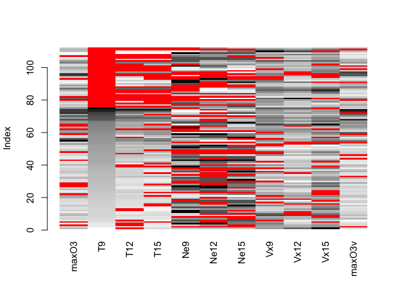

##Questions

**1 - When you suggest methods to deal with missing values to users, the recurrent question is "What is the percentage of missing values that I can have in my data set, is 50% too much but 20% OK?" What is your answer to this question?**

*It depends on the dataset. If your data is highly correlated, you can have many missing values and impute precisely. If the data is vey noisy, even just a few missing values can be problematic. Multiple imputation can always be performed and enables us to estimate the variability of the predictions, which will tell us how much we can trust the result of the imputation*

**2 - Explain the aims of multiple imputation in comparison to single imputation.**

*With single imputation we underestimate the variance of our data that comes from the missing values. Multiple imputation is a way of conserving this variance because we impute both the missing values and their variability*

**3 - Your aim is to impute a data set (predict as well as possible the missing values). You have 3 imputation methods available. How could you compare them?**

*Do cross-validation: take a dataset where there is no missing data. Take out some data, and impute those missing values 3 times using each method. Each time, compute the errors of the predictions. Choose the method which yields the lowest mean square error (or other error metric)*


## Continuous data with missing values - Regression with missing data via Multiple Imputation
First of all you will need to install the following packages


```r
install.packages("VIM")
install.packages("missMDA")
install.packages("Amelia")
```


```r
library(VIM)
library(missMDA)
library(Amelia)
library(FactoMineR)
```

Air pollution is currently one of the most serious public health worries worldwide. Many epidemiological studies
have proved the influence that some chemical compounds, such as sulphur dioxide (SO2), nitrogen dioxide
(NO2), ozone (O3) can have on our health. Associations set up to monitor air quality are active all over the
world to measure the concentration of these pollutants. They also keep a record of meteorological conditions
such as temperature, cloud cover, wind, etc.  

We have at our disposal 112 observations collected
during the summer of 2001 in Rennes. The variables available are 

* maxO3 (maximum daily ozone) 
* maxO3v (maximum daily ozone the previous day) 
* T12 (temperature at midday) 
* T9 
* T15 (Temp at 3pm)
* Vx12 (projection of the wind speed vector on the east-west axis at midday)
* Vx9 and Vx15 as well as the Nebulosity (cloud) Ne9, Ne12, Ne15

Here the final aim is to analyse the relationship between the
maximum daily ozone (maxO3) level and the other meteorological variables. To do so we will perform regression to explain maxO3 in function of all the other variables. This data is incomplete (there are missing values). Indeed, it occurs frenquently to have machines that fail one day, leading to some information not recorded. We will therefore perform regression via multiple imputation.

__(R1)__ Import the data.


```r
ozo <- read.table("data/ozoneNA.csv",header=TRUE,
sep=",", row.names=1)
WindDirection <- ozo[,12]
don <- ozo[,1:11]   #### keep only the continuous variables
summary(don)
```

```
##      maxO3              T9             T12             T15       
##  Min.   : 42.00   Min.   :11.30   Min.   :14.30   Min.   :14.90  
##  1st Qu.: 71.00   1st Qu.:16.00   1st Qu.:18.60   1st Qu.:18.90  
##  Median : 81.50   Median :17.70   Median :20.40   Median :21.40  
##  Mean   : 91.24   Mean   :18.22   Mean   :21.46   Mean   :22.41  
##  3rd Qu.:108.25   3rd Qu.:19.90   3rd Qu.:23.60   3rd Qu.:25.65  
##  Max.   :166.00   Max.   :25.30   Max.   :33.50   Max.   :35.50  
##  NA's   :16       NA's   :37      NA's   :33      NA's   :37     
##       Ne9             Ne12            Ne15           Vx9         
##  Min.   :0.000   Min.   :0.000   Min.   :0.00   Min.   :-7.8785  
##  1st Qu.:3.000   1st Qu.:4.000   1st Qu.:3.00   1st Qu.:-3.0000  
##  Median :5.000   Median :5.000   Median :5.00   Median :-0.8671  
##  Mean   :4.987   Mean   :4.986   Mean   :4.60   Mean   :-1.0958  
##  3rd Qu.:7.000   3rd Qu.:7.000   3rd Qu.:6.25   3rd Qu.: 0.6919  
##  Max.   :8.000   Max.   :8.000   Max.   :8.00   Max.   : 5.1962  
##  NA's   :34      NA's   :42      NA's   :32     NA's   :18       
##       Vx12              Vx15            maxO3v      
##  Min.   :-7.8785   Min.   :-9.000   Min.   : 42.00  
##  1st Qu.:-3.6941   1st Qu.:-3.759   1st Qu.: 70.00  
##  Median :-1.9284   Median :-1.710   Median : 82.50  
##  Mean   :-1.6853   Mean   :-1.830   Mean   : 89.39  
##  3rd Qu.:-0.1302   3rd Qu.: 0.000   3rd Qu.:101.00  
##  Max.   : 6.5778   Max.   : 3.830   Max.   :166.00  
##  NA's   :10        NA's   :21       NA's   :12
```

```r
head(don)
```

```
##          maxO3   T9  T12  T15 Ne9 Ne12 Ne15     Vx9    Vx12    Vx15 maxO3v
## 20010601    87 15.6 18.5   NA   4    4    8  0.6946 -1.7101 -0.6946     84
## 20010602    82   NA   NA   NA   5    5    7 -4.3301 -4.0000 -3.0000     87
## 20010603    92 15.3 17.6 19.5   2   NA   NA  2.9544      NA  0.5209     82
## 20010604   114 16.2 19.7   NA   1    1    0      NA  0.3473 -0.1736     92
## 20010605    94   NA 20.5 20.4  NA   NA   NA -0.5000 -2.9544 -4.3301    114
## 20010606    80 17.7 19.8 18.3   6   NA    7 -5.6382 -5.0000 -6.0000     94
```

__(R2)__ Load the libraries.


First, we perfom some descriptive statistics (how many missing? how many variables, individuals with missing?) and try to **inspect and vizualize the pattern of missing entries and get hints on the mechanism** that generated the missingness.  For this purpose, we use the R package **VIM** (Visualization and Imputation of Missing Values - Mathias Templ) as well as Multiple Correspondence Analysis (FactoMineR package). The package VIM provides tools for the visualization of missing or imputed values, which can be used for exploring the data and the structure of the missing or imputed values. Depending on this structure, they may help to identify the mechanism generating the missing values or errors, which may have happened in the imputation process. You can check the documentation for the VIM package by executing


```r
?VIM
```

The VIM function **aggr** calculates and plots the amount of missing entries in each variables and in some combinations of variables (that tend to be missing simultaneously).


```r
paste("dimensions of total dataset: ", dim(don))
```

```
## [1] "dimensions of total dataset:  112" "dimensions of total dataset:  11"
```

```r
paste("dimensions of dataset if we remove rows with missing values: ", dim(na.omit(don)))
```

```
## [1] "dimensions of dataset if we remove rows with missing values:  13"
## [2] "dimensions of dataset if we remove rows with missing values:  11"
```

```r
dim(na.omit(don))
```

```
## [1] 13 11
```

```r
res<-summary(aggr(don, sortVar=TRUE))$combinations
```

<!-- -->

```
## 
##  Variables sorted by number of missings: 
##  Variable      Count
##      Ne12 0.37500000
##        T9 0.33035714
##       T15 0.33035714
##       Ne9 0.30357143
##       T12 0.29464286
##      Ne15 0.28571429
##      Vx15 0.18750000
##       Vx9 0.16071429
##     maxO3 0.14285714
##    maxO3v 0.10714286
##      Vx12 0.08928571
```


```r
head(res[rev(order(res[,2])),])
```

```
##             Combinations Count   Percent
## 1  0:0:0:0:0:0:0:0:0:0:0    13 11.607143
## 45 0:1:1:1:0:0:0:0:0:0:0     7  6.250000
## 10 0:0:0:0:0:1:0:0:0:0:0     5  4.464286
## 35 0:1:0:0:0:0:0:0:0:0:0     4  3.571429
## 41 0:1:0:0:1:1:1:0:0:0:0     3  2.678571
## 28 0:0:1:0:0:0:0:0:0:0:0     3  2.678571
```
In the combinations column, 1 means the variable is missing, 0 means it is observed.

So the most  frequent combination is the one where all the variables are observed (13 values). Then, the second one is  where T9, T12 and T15 are simultaneously missing (7 rows) (1 is missing, 0 is observed - there is a 1 for the second, third and fourth variables). The graph on the right panel represents these pattern, with blue for observed and red for missing.


```r
aggr(don, sortVar=TRUE)
```

<!-- -->

```
## 
##  Variables sorted by number of missings: 
##  Variable      Count
##      Ne12 0.37500000
##        T9 0.33035714
##       T15 0.33035714
##       Ne9 0.30357143
##       T12 0.29464286
##      Ne15 0.28571429
##      Vx15 0.18750000
##       Vx9 0.16071429
##     maxO3 0.14285714
##    maxO3v 0.10714286
##      Vx12 0.08928571
```


The VIM function **matrixplot ** creates a matrix plot in which all cells of a data matrix are visualized by rectangles. Available data is coded according to a continuous color scheme (gray scale), while missing/imputed data is visualized by a clearly distinguishable color (red). If you use Rstudio the plot is not interactive (thus the warnings), but if you use R directly, you can click on a column of your choice, this will result in sorting the rows in the decreasing order of the values of this column. This is useful to check if there is an association between the value of a variable and the missingness of another one.


```r
matrixplot(don,sortby=2) # marche pas sur Rstudio
```

<!-- -->

```
## 
## Click in a column to sort by the corresponding variable.
## To regain use of the VIM GUI and the R console, click outside the plot region.
```
Here, "red" means data is missing. Non-missing data are on a gray scale with darker shades indicating higher values.  
We notice that often when T9 is missing, T12 and T15 are also missing. When T9 is missing, we do not see more black or white values associated to other variables which should imply that when T9 is missing it would have corresponded to high or low values in another variable. This would have suggested missing at random (MAR) missing values for instance. Here everything points to missing completely at random (MCAR) values.

By playing around with the *sortby* argument, we can make the following observations about the structure of our missing data
* *maxO3 seems uncorrelated in terms with others of missing values* 
* *T9, T12, T15 seem to all be correlated (in the sense that when one variable is missing, the others are likely to be missing)*
* *Ne9, Ne12 and Ne15 are correlated.*
* *Vx9 seems uncorrelated*
* *Vx12 and Vx15 seem correlated*
* *maxO3v seems uncorrelated*


The VIM function **marginplot** creates a scatterplot with additional information on the missing values. If you plot the variables (x,y), the points with no missing values are represented as in a standard scatterplot. The points for which x (resp. y) is missing are represented in red along the y (resp. x) axis. In addition, boxplots of the x and y variables are represented along the axes with and without missing values (in red all variables x where y is missing, in blue all variables x where y is observed).


```r
marginplot(don[,c("T9","maxO3")])
```

<!-- -->

We can see here that the distribution of T9 is the same when maxO3 is oberved and when maxO3 is missing. If the two boxplots (red and blue) would have been very different it would imply that when maxO3 is missing the values of T9 can be very high or very low which lead to suspect the MAR hypothesis

**The plots we have showed so far are useful because they may help to identify the mechanism generating the missing values or errors, which may have happened in the imputation process. This is useful to check if there is an association between the value of a variable and the missingness of another one. Do you observe any associations between the missing entries ? When values are missing on a variable does it correspond to small or large values on another one ?**


__(R3)__ Create a categorical dataset with "o" when the value of the cell is observed and "m" when it is missing, and with the same row and column names as in the original data. Then, you can perform Multiple Correspondence Analysis on the categories to visualize the association with the **MCA** function.


```r
class(don)
```

```
## [1] "data.frame"
```

```r
cat <- don
cat <- apply(cat, c(1,2), function(x) return(ifelse(is.na(x),'m','o')))
MCA(cat)
```

<!-- --><!-- --><!-- -->

```
## **Results of the Multiple Correspondence Analysis (MCA)**
## The analysis was performed on 112 individuals, described by 11 variables
## *The results are available in the following objects:
## 
##    name              description                       
## 1  "$eig"            "eigenvalues"                     
## 2  "$var"            "results for the variables"       
## 3  "$var$coord"      "coord. of the categories"        
## 4  "$var$cos2"       "cos2 for the categories"         
## 5  "$var$contrib"    "contributions of the categories" 
## 6  "$var$v.test"     "v-test for the categories"       
## 7  "$ind"            "results for the individuals"     
## 8  "$ind$coord"      "coord. for the individuals"      
## 9  "$ind$cos2"       "cos2 for the individuals"        
## 10 "$ind$contrib"    "contributions of the individuals"
## 11 "$call"           "intermediate results"            
## 12 "$call$marge.col" "weights of columns"              
## 13 "$call$marge.li"  "weights of rows"
```

**Interpretation**  
*If variables are close on the variables factor map (eg. T15_m and T9_m), this means that the missing values are correlated : when T15_m is missing, so is T9_m. The point T_15m corresponds to the barycenter of all the individuals for which T15 is missing. You can see the projection of the individuals on the second graph (which we call the individuals factor map)*

###Single imputation

Then, before modeling the data, we perform a **PCA with missing values** to explore the correlation between variables. Use the R package **missMDA** dedicated to perform principal components methods with missing values and to impute data with principal components methods.


```r
library(missMDA)
?missMDA
```


__(R4)__ Determine the number of components ncp to keep using the 
**estim_ncpPCA** function. Perform PCA with missing values using the 
**imputePCA** function and ncp components. Then plot the correlation circle.


```r
?estim_ncpPCA
?imputePCA
```


```r
estim_ncpPCA(don)
```

```
## $ncp
## [1] 2
## 
## $criterion
##         0         1         2         3         4         5 
## 170.77775  88.60110  84.97487 104.60004  92.98638 115.43620
```

```r
plot((0:5), estim_ncpPCA(don)$criterion)
```

<!-- -->

```r
#Donne le nombre de composantes "optimal" par cross-validation
estim_ncpPCA(don)$ncp
```

```
## [1] 2
```

```r
#Complete les missing values
completed_don <- imputePCA(don, ncp = estim_ncpPCA(don)$ncp)$completeObs


PCA(completed_don)
```

<!-- --><!-- -->

```
## **Results for the Principal Component Analysis (PCA)**
## The analysis was performed on 112 individuals, described by 11 variables
## *The results are available in the following objects:
## 
##    name               description                          
## 1  "$eig"             "eigenvalues"                        
## 2  "$var"             "results for the variables"          
## 3  "$var$coord"       "coord. for the variables"           
## 4  "$var$cor"         "correlations variables - dimensions"
## 5  "$var$cos2"        "cos2 for the variables"             
## 6  "$var$contrib"     "contributions of the variables"     
## 7  "$ind"             "results for the individuals"        
## 8  "$ind$coord"       "coord. for the individuals"         
## 9  "$ind$cos2"        "cos2 for the individuals"           
## 10 "$ind$contrib"     "contributions of the individuals"   
## 11 "$call"            "summary statistics"                 
## 12 "$call$centre"     "mean of the variables"              
## 13 "$call$ecart.type" "standard error of the variables"    
## 14 "$call$row.w"      "weights for the individuals"        
## 15 "$call$col.w"      "weights for the variables"
```


**4. Explain quickly how this analysis is performed. Could you guess how cross-validation is performed to select the number of components?**

*The package missMDA allows the use of principal component methods to impute an incomplete data set. To achieve this goal in the case of PCA, the missing values are predicted using the iterative PCA algorithm for a predefined number of dimensions. Then, PCA is performed on the imputed data set. The single imputation step requires tuning the number of dimensions used to impute the data, which is where cross-validation comes in.*

*The cross-validation is performed with the Kfold methodFor the Kfold. A percentage pNA of missing values is inserted and predicted with a PCA model using ncp.min to ncp.max dimensions. This process is repeated nbsim times. The number of components which leads to the smallest MSEP (Mean Standard Error of Prediction) is retained.*

*Through the argument method.cv, the function estim_ncpPCA proposes several cross-validation procedures to choose this number. The default method is the generalised cross-validation method (method.cv=“gcv”). It consists in searching the number of dimensions which minimises the generalised cross-validation criterion, which can be seen as an approximation of the leave-one-out cross-validation criterion. The procedure is very fast, because it does not require adding explicitly missing values and predicting them for each cell of the data set. However, the number of dimensions minimising the criterion can sometimes be unobvious when several local minimum occur. In such a case, more computationally intensive methods, those performing explicit cross-validation, can be used, such as Kfold (method.cv=“Kfold”) or leave-one-out (method.cv=“loo”).*

*The Kfold cross-validation suggests to retain 2 dimensions for the imputation of the data set.*

*Thus, the incomplete data set can be imputed using the function imputePCA performing the iterative PCA algorithm, specifying the number of dimensions through the argument ncp=2. At convergence the algorithm provides both an estimation of the scores and loadings as well as a completed data set. The imputePCA function outputs the imputed data set. The completed data set is in the object completeObs.*

*The imputePCA function also outputs the fitted matrix X̂ X^ in the object fitted.*

###Multiple imputation

Then, to run the regression with missing values, we use **Multiple Imputation**. We impute the data either assuming 1) a Gaussian distribution (library Amelia) or 2) a PCA based model (library missMDA).
Note that there are two ways to impute either using a Joint Modeling (one joint probabilitisc model for the variables all together)
or a Condional Modeling (one model per variable) approach. We refer to the references given in the class slides for more details.  We use the R package **Amelia**. We generate 100 imputed data sets with the amelia method:

First we show how to impute one data set using **Amelia**
We will impute the data set 100 times


```r
library(Amelia)
```


```r
?amelia
```


```r
#This function imputes 100 datasets. To not clutter our report, we use set "p2s=0" to decrease the verbosity of the amelia function.
res.amelia <- amelia(don, m=100, p2s = 0)  
#names(res.amelia$imputations) 
head(res.amelia$imputations$imp1)  #the first imputed data set
```

```
##          maxO3       T9      T12      T15      Ne9     Ne12      Ne15
## 20010601    87 15.60000 18.50000 16.81339 4.000000 4.000000 8.0000000
## 20010602    82 17.76453 20.35304 19.36645 5.000000 5.000000 7.0000000
## 20010603    92 15.30000 17.60000 19.50000 2.000000 3.292384 0.9067122
## 20010604   114 16.20000 19.70000 22.69258 1.000000 1.000000 0.0000000
## 20010605    94 17.98661 20.50000 20.40000 5.135895 4.341588 4.9925976
## 20010606    80 17.70000 19.80000 18.30000 6.000000 6.531402 7.0000000
##                 Vx9      Vx12    Vx15 maxO3v
## 20010601  0.6946000 -1.710100 -0.6946     84
## 20010602 -4.3301000 -4.000000 -3.0000     87
## 20010603  2.9544000  2.520491  0.5209     82
## 20010604  0.3827206  0.347300 -0.1736     92
## 20010605 -0.5000000 -2.954400 -4.3301    114
## 20010606 -5.6382000 -5.000000 -6.0000     94
```

__(R5)__ Now we generate 100 imputed data sets with the MIPCA method and 2 components. Store the result in a variable called res.MIPCA.


```r
library(missMDA)
```


```r
?MIPCA
?plot.MIPCA
```


```r
#Imputation with PCA
res.MIPCA <- MIPCA(don, ncp=2,nboot=100) # MI with PCA using 2 dimensions 
```

The function MIPCA gives as output the data set imputed by the iterative PCA algorithm (in res.imputePCA) and the other data sets generated by the MIPCA algorithm (in res.MI). The number of data sets generated by this algorithm is controlled by the nboot argument, equal to 100 by default. The other arguments of this function are the same as those for the imputePCA function.

Exploratory analysis is very important and even at this stage of the analysis.

We will **inspect the imputed values created** to know if the imputation method should require more investigation or if we can continue and analyze the data. A common practice consists in comparing the distribution of the imputed values and of the observed values. Check the **compare.density** function and apply it to compare the distributions of the T12 variable.


```r
?compare.density
```


```r
compare.density(res.amelia, var = 8)
```

<!-- -->


__(Q5)__ Do both distributions need to be close? Could the missing values differ from the observed ones both in spread and in location? 

*Not necessarily, they should only be close if the missing values are missing completely at random (MCAR). Here the difference in the densities is not a problem. It indicates the missing values for Vx9 may be missing at random (MAR) or missing not at random (MNAR). In any case, we should investigate the data to explain this difference*

The quality of imputation can also be assessed with cross-validation using the **overimpute** function. Each observed value is deleted and for each one 100 values are predicted (using the same MI method) and the mean and 90% confidence intervals are computed for these 100 values. Then, we inspect whether the observed value falls within the obtained interval. On the graph, the y=x line is plotted (where the imputations should fall if they were perfect), as well as the mean (dots) and intervals (lines) for each value. Around ninety percent of these confidence intervals should contain the y = x line, which means that the true observed value falls
within this range. The color of the line (as coded in the legend) represents the
fraction of missing observations in the pattern of missingness for that observation (ex: blue=0-2 missing entries). 


```r
?overimpute
```


```r
overimpute(res.amelia,3)
```

<!-- -->


__(Q6)__ Comment the quality of the imputation.

*The data is rather well imputed: there are very few values where the confidence interval does not coincide with the line *

We can also examine the variability by projecting as supplementary tables the imputed data sets on the PCA configuration (plot the results of MI with PCA).


```r
plot(res.MIPCA,choice= "ind.supp")
plot(res.MIPCA,choice= "var")
```

*The plots represent the projection of the individuals (top) and variables (bottom) of each imputed data set as supplementary elements onto the reference configuration obtained with the iterative PCA algorithm. For the individuals, a confidence area is constructed for each individual which has a missing value, and if one has no missing entries, its confidence area is restricted to a point. All the plots show that the variability across different imputations is small and a user can interpret the PCA results with confidence.*

__(R6)__ Apply a regression model on each imputed data set of the amelia method. Hint: a regression with several variables can be performed as follows 'lm(formula="maxO3 ~ T9+T12", data =don)'. You can also use the function**with**.


```r
resamelia <- lapply(res.amelia$imputations, as.data.frame)
fitamelia <- lapply(resamelia, with, 
                    lm(maxO3 ~ T9+T12+T15+Ne9+Ne12+Ne15+Vx9+Vx12+Vx15+maxO3v))
```


Now we do the same with the imputed datasets of the MIPCA method.

The package **mice** (Multiple Imputation by Chained Equations) allows to aggregate the results from some simple models.


```r
library(mice)
```

```
## Loading required package: lattice
```

```r
# ?mice
# pool is a function from mice to aggregate the results according to Rubin's rule
# ?pool
```


__(R8)__ Aggregate the results of Regression with Multiple Imputation according to Rubin's rule (slide "Multiple imputation") for MI with amelia with the 
**pool** function from the mice package, to which we will pass our '''fitamelia''' object. This function will average the estimates of the complete data model, and compute the total variance over the repeated analyses.


```r
poolamelia<-pool(as.mira(fitamelia)) 
summary(poolamelia)
```

__(R9)__ Now do the same with the MIPCA results.


```r
fitMIPCA <- lapply(res.MIPCA$res.MI, with, 
                    lm(maxO3 ~ T9+T12+T15+Ne9+Ne12+Ne15+Vx9+Vx12+Vx15+maxO3v))
```


```r
poolMIPCA<-pool(as.mira(fitMIPCA))
summary(poolMIPCA)
```

```
##                    est          se          t       df    Pr(>|t|)
## (Intercept) 13.0379559 18.32459085  0.7115005 63.95279 0.479361422
## T9           0.9626278  1.23601493  0.7788157 52.51104 0.439583943
## T12          1.6300189  1.05165684  1.5499532 49.62244 0.127507659
## T15          0.7775725  0.90508165  0.8591186 53.49534 0.394108526
## Ne9         -1.3000097  1.09609052 -1.1860423 66.24426 0.239842269
## Ne12        -1.5794111  1.49121533 -1.0591436 55.06135 0.294158701
## Ne15         0.2948481  1.19388588  0.2469651 57.90081 0.805808806
## Vx9          0.8249507  1.02878192  0.8018713 74.68634 0.425171415
## Vx12         0.8783954  1.13541138  0.7736363 70.63821 0.441727351
## Vx15         0.2614394  1.13099588  0.2311586 66.68955 0.817899342
## maxO3v       0.2540498  0.08859993  2.8673812 74.82388 0.005373524
##                    lo 95      hi 95 nmis       fmi    lambda
## (Intercept) -23.57014311 49.6460550   NA 0.3318528 0.3112795
## T9           -1.51704316  3.4422988   NA 0.4372792 0.4162472
## T12          -0.48269428  3.7427321   NA 0.4652286 0.4441008
## T15          -1.03739906  2.5925441   NA 0.4278929 0.4068964
## Ne9          -3.48827441  0.8882550   NA 0.3115433 0.2910670
## Ne12         -4.56779856  1.4089764   NA 0.4130960 0.3921581
## Ne15         -2.09506127  2.6847576   NA 0.3866693 0.3658435
## Vx9          -1.22462903  2.8745305   NA 0.2381284 0.2179961
## Vx12         -1.38575153  3.1425424   NA 0.2731148 0.2528216
## Vx15         -1.99623100  2.5191098   NA 0.3076203 0.2871628
## maxO3v        0.07754285  0.4305567   NA 0.2369442 0.2168171
```
*We see that the estimates are sometimes very different. However, many variables are not significant. We would like to compare the result of our linear regressions when we keep only the significant variables*

__(R10)__ Write a function that removes the variables with the largest pvalues step by step (each time a variable is removed the regression model is performed again) until all variables are significant.


```r
don2 <- don
reg <- lm(maxO3 ~. , data = don2)
while(any(summary(reg)$coeff[-1, 4]>0.05)){
  don2 <- don2[,!(colnames(don2)%in%names(which.max(summary(reg)$coeff[-1, 4])))]
  reg <- lm(maxO3 ~. , data = don2)
  }
reg
```

```
## 
## Call:
## lm(formula = maxO3 ~ ., data = don2)
## 
## Coefficients:
## (Intercept)          T15         Vx15       maxO3v  
##     -7.3069       3.6868       2.2882       0.2389
```

Now apply this function to amelia and MIPCA results.
**Still need to do this**

#### EM algorithm

In this simple setting, we have an explicit expression of the maximum likelihood estimator despite missing values. However, this is not always the case but it is possible to use an EM algorithm which allows to get the maximum likelihood estimators in the cases where data are missing.

The EM algorithm consists in maximizing the "observed likelihood" 
$$l(\mu, \Sigma|y_1,y_2)=-\frac{n}{2}\log(\sigma_{11}^2)-\frac{1}{2}\sum_{i=1}^n\frac{(y_{i1}-\mu_1)^2}{\sigma_{11}^2}-\frac{r}{2}\log((\sigma_{22}-\frac{\sigma_{12}^2}{\sigma_{11}})^2)$$
$$-\frac{1}{2}\sum_{i=1}^r\frac{(y_{i2}-\mu_2-\frac{\sigma_{12}}{\sigma_{11}}(y_{i1}-\mu_1))^2}{(\sigma_{22}-\frac{\sigma_{12}^2}{\sigma_{11}})^2},$$
through successive maximization of the "complete likelihood" (if we had observed all $n$ realizations of $y_1$ and $y_2$). Maximizing the complete likelihood 
$$l_c(\mu, \Sigma|y_1,y_2)=-\frac{n}{2}\log(\det(\Sigma))-\frac{1}{2}\sum_{i=1}^n(y_{i1}-\mu_1)^T\Sigma^{-1}(y_{i1}-\mu_1)$$

would be straightforward if we had all the observations. However elements of this likelihood are not available. Consequently, we replace them by the conditional expectation given observed data and the parameters of the current iteration. These two steps of computation of the conditional expectation (E-step) and maximization of the completed likelihood (M step) are repeated until convergence. 

The update formulas for the E and M steps are the following  

__E step__:

The sufficient statistics of the likelihood are:  

$$s_1=\sum_{i=1}^ny_{i1},\quad s_2=\sum_{i=1}^ny_{i2},\quad s_{11}=\sum_{i=1}^ny_{i1}^2,\quad s_{22}=\sum_{i=1}^ny_{i2}^2,\quad s_{12}=\sum_{i=1}^ny_{i1}y_{i2}.$$

Since some values of $y_2$ are not available, we fill in the sufficient statistics with:

$$E[y_{i2}|y_{i1},\mu,\Sigma]=\beta_{20.1}+\beta_{21.1}y_{i1}$$
$$E[y_{i2}^2|y_{i1},\mu,\Sigma]=(\beta_{20.1}+\beta_{21.1}y_{i1})^2+\sigma_{22.1}$$
$$E[y_{i2}y_{i2}|y_{i1},\mu,\Sigma]=(\beta_{20.1}+\beta_{21.1}y_{i1})y_{i1}.$$

__M step__: 

The M step consists in computing the maximum likelihood estimates as usual. 
Given $s_1, s_2, s_{11}, s_{22}, \text{and } s_{12},$ update $\hat{\mu}$ and $\hat{\sigma}$ with
$$\hat{\mu}_1=s_1/n\text{, }\hat{\mu}_2=s_2/n,$$
$$\hat{\sigma}_1=s_{11}/n-\hat{\mu}_1^2\text{, }\hat{\sigma}_2=s_{22}/n-\hat{\mu}_2^2\text{, }\hat{\sigma}_{12}=s_{12}/n-\hat{\mu}_1\hat{\mu}_2$$

Note that $s_1$, $s_{11}$, $\hat{\mu}_1$ and $\hat{\sigma}_1$ are constant accross iterations since we do not have missing values on $y_1$.

__(R11)__ Write two functions called Estep and Mstep that respectively perform the E step and the M step. 
The Estep function can take as an input $\mu$ and $\Sigma$. Then, you can compute 
$\beta_{21.1}=\sigma_{12}/\sigma_{11}$, $\beta_{20.1}=\mu_2-\beta_{21.1}\mu_1$, and $\sigma_{22.1}=\sigma_{22}-\sigma^2_{12}/\sigma_{11}$  and update the sufficient statistics $s_{ij}$.
The Mstep function consists in updating the update the $\mu$ and $\Sigma$ given the $s_{ij}$.


__(Q7)__ How could we initialize the algorithm ?

__(R12)__ Implement a function called initEM that returns initial values for $\hat{\mu}$ and $\hat{\Sigma}$.

__(R13)__ Implement the EM algorithm over 15 iterations and plot the value of $\left\|\mu-\hat{\mu}\right\|^2$ over iterations. Comment your results briefly.

__(R14)__ Check that the EM estimator $\mu$ is equal to the maximum likelihood estimator.

